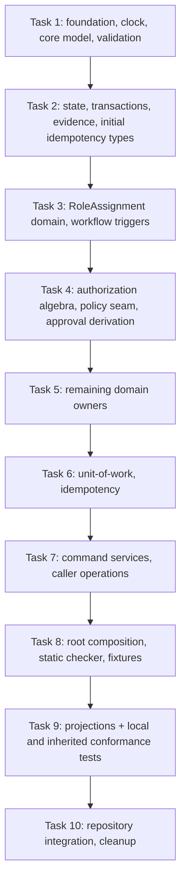

# Implementation Plan: FEATURE-0018 Governance, IAM, Approval and Exception Foundation

# FEATURE-0018 Tasks: Governance, IAM, Approval and Exception Foundation

## 1. Identity and stage

| Field | Value |
|---|---|
| Feature | FEATURE-0018 — Governance, IAM, Approval and Exception Foundation |
| Stage | Tasks (decomposition of approved requirements and design into implementation sequence) |
| Phase / order | Phase 2R / order 8 |
| Baseline | ARCH-2026.08-PHASE2R-CANONICAL |
| Sole architecture authority | `docs/architecture/FEATURE-0018-governance-iam-approval-exception-foundation.md` + ADH-2026-070 package |
| Requirements authority | `.kiro/specs/governance-iam-approval-exception-foundation/requirements.md` (REQ-F18-01..24) |
| Design authority | `.kiro/specs/governance-iam-approval-exception-foundation/design.md` (DD-01..13) |
| Stage boundary | Modifies only this `tasks.md`; generates no requirements, design, source code, schema, route, automation, or architecture |

## 2. Task sequencing principles

Each task below:

- Implements one vertical slice containing model/validation/logic/tests
- Cites exact REQ/AC/DD authorities
- Lists exact writable file paths or directory prefixes
- Declares required tests and verification commands
- States acceptance criteria mapped to approved conformance IDs
- Lists explicit exclusions
- Provides an exact commit message
- Depends only on explicitly listed prior tasks

Tasks are ordered by dependency; independent tasks are marked explicitly.

## 3. Implementation tasks

The nineteen atomic task units (TASK-F18-01..19) are consolidated into ten
executable implementation tasks, Task 1 through Task 10. Each executable task is
a single, independently executable vertical slice with exactly one
Writable-paths, Tests, Verification-commands, Acceptance-criteria, and
Commit-message field, and is the only kind of schedulable unit. Consolidation
changes presentation only; every atomic task unit retains its exact identifier,
authorities, writable paths, tests, verification commands, acceptance criteria,
security/observability impact, exclusions, and commit-message intent, and every
REQ/AC/DD/F18-RD/VS0-CF mapping is unchanged. Each executable task lists, in its
`Implements:` field and its explanatory coverage/dependency detail, the atomic
task units it consolidates and the exact prior atomic units it depends on; the
per-atomic-unit dependency edges are retained as non-schedulable traceability
detail and restated in the Task Dependency Graph adjacency list below. Atomic IDs
are never schedulable units; only Task 1 through Task 10 are scheduled.

The executable tasks are presented in dependency order, not atomic-numeric order:
because `grantintent` (TASK-F18-11) imports `roleassign` (TASK-F18-07), and the
`approval`/`privileged` owners (TASK-F18-08) import the `approvalreq`/`policyseam`
ports (TASK-F18-11), the executable order is TASK-F18-07 (Task 3) →
TASK-F18-06·11 (Task 4) → TASK-F18-08 (Task 5). Consequently TASK-F18-07 and
TASK-F18-08 are not consolidated together (that grouping was mutually cyclic with
TASK-F18-06·11); each is a standalone executable task, so a higher-numbered
atomic unit (TASK-F18-11) may precede a lower-numbered one (TASK-F18-08) in the
topological order. The executable dependency order is Task 1 → Task 2 → Task 3 →
Task 4 → Task 5 → Task 6 → Task 7 → Task 8 → Task 9 → Task 10.

### Task 1: Foundation packages, deterministic clock, core model, and deterministic validation

**Consolidated atomic task units (traceability only; non-schedulable):** TASK-F18-01 (Foundation packages and deterministic clock), TASK-F18-02 (Core model types and reference values), TASK-F18-03 (Deterministic validation foundation)

**Dependencies:** None (foundational). Internal order: TASK-F18-01 → TASK-F18-02 → TASK-F18-03.

**Requirements:** REQ-F18-22 (deterministic foundation), REQ-F18-01 (current-feature-only), REQ-F18-02 (closed contract inventory), REQ-F18-03 (stable principal identity), REQ-F18-04 (direct principal and scoped AccessGroup assignments), REQ-F18-21 (deterministic validation and safe denial)

**Design decisions:** DD-01 (domain package structure), DD-05 (deterministic UTC time supply), DD-13 (compiler + static checker enforcement), DD-03 (reuse inherited base types, four distinct reference values), DD-04 (profile correspondence), design §5.1 (validation precedence), design §5.2 (error mapping)

**Description:**

Create the foundational package structure under `internal/govaccess/` with a deterministic clock abstraction, the neutral leaf packages, the four FEATURE-0018-owned reference values and closed enums, and deterministic structural/semantic validators. Establish the root composition pattern (wiring only, no semantic logic) and the neutral leaf packages (`clock/`, `operation/`) that have no domain dependencies. Implement core model types in `internal/govaccess/model/`: PrincipalRef, AccessGroupRef, RoleHolderRef, EligibilityRef, closed enums, and supporting value types, each with its own canonical semantics per DD-03. Implement deterministic validators in `internal/govaccess/validate/` for each contract, consuming inherited FEATURE-0012 validation stages and emitting only inherited Problem/violation codes.

**Writable paths:**

- `internal/govaccess/` (root package with composition functions only)
- `internal/govaccess/clock/` (Clock interface, FixedClock, manually-advanced fixture clock)
- `internal/govaccess/clock/clock_test.go`
- `internal/govaccess/operation/` (neutral ResultMaterial, AppliedChangeLink, AppliedConclusionLink, CompletionBinding, FinalizationOutcome generic)
- `internal/govaccess/operation/operation_test.go`
- `internal/govaccess/model/` (all model structs, enums, reference types)
- `internal/govaccess/model/principalref.go`
- `internal/govaccess/model/accessgroupref.go`
- `internal/govaccess/model/roleholderref.go`
- `internal/govaccess/model/eligibilityref.go`
- `internal/govaccess/model/enums.go`
- `internal/govaccess/model/actiontargetbinding.go`
- `internal/govaccess/model/model_test.go`
- `internal/govaccess/validate/` (all validators)
- `internal/govaccess/validate/principalref.go`
- `internal/govaccess/validate/accessgroup.go`
- `internal/govaccess/validate/membership.go`
- `internal/govaccess/validate/roledefinition.go`
- `internal/govaccess/validate/roleassignment.go`
- `internal/govaccess/validate/privilegedaccess.go`
- `internal/govaccess/validate/accessreview.go`
- `internal/govaccess/validate/approvalpolicy.go`
- `internal/govaccess/validate/approvalrequest.go`
- `internal/govaccess/validate/exceptiongrant.go`
- `internal/govaccess/validate/governanceprofile.go`
- `internal/govaccess/validate/validate_test.go`

**Tests:**

- Unit tests for FixedClock time supply and manual advancement
- Unit tests for neutral operation types (immutability, nil rejection, sealed construction)
- Property test: FixedClock returns exactly the set time until manually advanced
- Unit tests for each reference type construction and validation
- Unit tests proving PrincipalRef is not a TypedRef
- Unit tests proving RoleHolderRef discriminated union (exactly one variant)
- Unit tests proving EligibilityRef accepts only Human PrincipalRef
- Unit tests for enum Valid() and exhaustive accessor methods
- Property test: cross-type substitution always fails
- Unit tests for each validator happy path
- Unit tests for malformed/missing/invalid inputs
- Unit tests for scope/reference compatibility per F18-RD-02
- Unit tests proving inherited Problem codes are reused
- Property tests for determinism (same input → same output)

**Verification commands:**

```bash
make fmt
make test
go test -v ./internal/govaccess/clock/...
go test -v ./internal/govaccess/operation/...
go test -v ./internal/govaccess/model/...
go test -v ./internal/govaccess/validate/...
```

**Acceptance criteria:**

- Clock abstraction exists with deterministic implementations (REQ-F18-22)
- No `time.Now()` calls in any govaccess package (REQ-F18-22, DD-05)
- Neutral operation types exist with immutability enforced (DD-01)
- Package structure follows approved layout (DD-01, design §3.2)
- Four distinct reference types exist with correct semantics (REQ-F18-03, REQ-F18-04, DD-03)
- PrincipalRef is stable issuer/subject identity, not email (REQ-F18-03)
- RoleHolderRef is closed discriminated union (REQ-F18-04)
- EligibilityRef contains exactly one Human PrincipalRef (REQ-F18-12, SEC-06)
- Closed enums defined per requirements §3.3 (REQ-F18-02)
- Deterministic validation for all contracts (REQ-F18-21)
- Scope applicability validated per registered sets (REQ-F18-02)
- Reference compatibility validated per F18-RD-02 (REQ-F18-02)
- Only inherited FEATURE-0012 Problem codes used (REQ-F18-21, design §5.2)
- Safe denial protects inaccessible resources (REQ-F18-21)

**Security/observability impact:**

- Deterministic time supply enables reproducible tests
- No external time dependency reduces attack surface
- Stable identity prevents email-based authentication bypass
- Closed discriminated union prevents mixed/empty holder injection
- EligibilityRef constraint prevents group-derived workflow bypass
- Deterministic validation prevents timing attacks; safe denial prevents resource enumeration; early validation reduces attack surface

**Exclusions:**

- No UTCClock or production wall-clock implementation (DD-05)
- No domain semantics in neutral packages
- No HTTP server, routes, or external I/O
- No validation logic in the model slice (deferred to the TASK-F18-03 validate slice within this executable task, Task 1)
- No persistence or serialization
- No external identity provider integration
- No authorization logic
- No state mutation
- No external calls

**Commit message:**

```
feat(govaccess): add foundation, core model, and deterministic validation

- Create internal/govaccess root package structure
- Add clock abstraction with FixedClock implementation
- Add neutral operation protocol types
- Establish acyclic package topology
- Add PrincipalRef (stable issuer/subject identity)
- Add AccessGroupRef (UID-pinned AccessGroup reference)
- Add RoleHolderRef (discriminated union)
- Add EligibilityRef (exact Human PrincipalRef only)
- Add closed enums and ActionTargetBinding
- Add structural validators for all contracts
- Validate scope applicability and reference compatibility per F18-RD-02
- Emit only inherited FEATURE-0012 Problem codes
- Implement safe denial for inaccessible resources

Implements: TASK-F18-01, TASK-F18-02, TASK-F18-03
Requirements: REQ-F18-22, REQ-F18-01, REQ-F18-02, REQ-F18-03, REQ-F18-04, REQ-F18-21
Design: DD-01, DD-05, DD-13, DD-03, DD-04, §5.1, §5.2
Addresses: SEC-06
```

---

### Task 2: State aggregate, transaction protocol, evidence construction, and initial idempotency type contract

**Consolidated atomic task units (traceability only; non-schedulable):** TASK-F18-04 (State aggregate and transaction protocol), TASK-F18-05 (Evidence construction and validation). This executable task additionally delivers the initial sealed `internal/govaccess/idempotency` value-type contract required by the already-approved `state -> idempotency` import edge (design §3.4; DD-11): it is the type-shape portion of the idempotency package that TASK-F18-10 (Task 6) extends, delivered here as a compile-order prerequisite so the Task-2 `state` aggregate compiles. It mirrors the existing `model/decisionfacts.go` precedent (a Task-2-owned subset of an otherwise Task-1-owned package), reassigns no atomic ID, and creates no new one; TASK-F18-10 retains its identifier and its behavioral idempotency ownership in Task 6.

**Dependencies:** TASK-F18-01, TASK-F18-02. Internal order: initial idempotency value-type contract (imports only `model`/`apivalid`/`operation`, all delivered by Task 1) → TASK-F18-04 (state, which imports the idempotency value types per design §3.4) → TASK-F18-05 (evidence).

**Requirements:** REQ-F18-20 (audit before authorization-changing publication), REQ-F18-21 (deterministic behavior), REQ-F18-22 (in-memory foundation), REQ-F18-19 (FEATURE-0013 adoption)

**Design decisions:** DD-01 (sealed interfaces, acyclic topology; evidence ownership), DD-02 (deterministic in-process foundation), DD-09 (three profiles), DD-10 (in-memory publication protocol), DD-11 (idempotency value-type shapes; `state` stores them per design §3.4), DD-12 (audited evaluation service), design §5.4 (atomic publication), design §3.3 (VS0-WRITER-011), design §3.4 (acyclic `state -> idempotency` edge)

**Description:**

Implement the neutral state aggregate in `internal/govaccess/state/` with sealed transaction interfaces (CallerMutationTransaction, ControllerMutationTransaction, EvidenceTransaction), MutationFinalizationPermit, PermitBinding, and AppliedChangeReceipt. State owns root/shadows, locks, dependency-version sets, currentness claims, and the permit-issuance registry. Implement evidence construction in `internal/govaccess/evidence/`: AuthorizationCandidateDescriptor, FinalizedAuthorizationCandidate, CurrentAllowProof, CompletedAuthorizationEvaluation, DomainDecisionMaterial, MutationDescriptor, DomainConclusionDescriptor, carrier plans, and PreparedEvidenceChange. The evidence constructors consume, as their exact existing design §3.2 evidence-carrier inputs, the immutable deep-copied model types `model.ApprovalDecisionFacts`, `model.ExceptionDecisionFacts`, and `model.MutationEventFacts` defined in the Task-2-owned `internal/govaccess/model/decisionfacts.go`. Each of these three carrier-input types is constructed by value, deep-copies every reference-typed field on construction and on every accessor return so no post-construction mutation of caller-held or evidence-held data is possible, exposes no setter, and is byte-stable for deterministic evidence assembly. These three types are evidence-carrier inputs only: they are not resources, not decisions, not DecisionRecords, not writers, not routes, and not public contracts, they introduce no new schema/writer/state/error ID, and they are consumed exclusively by the FEATURE-0018 evidence constructors. Evidence imports no state/uow/authzeval package. Evidence is also the sole FEATURE-0018 owner of the strict local `DecisionProfileBundle` bytes (`evidence/profiles.go`) containing exactly the three existing FEATURE-0013 carrier profiles `authorization-decision/v1`, `approval-decision/v1`, and `exception-decision/v1` with F18-RD-19 semantics; it constructs and validates those profile bytes but never registers them (root composition performs the sole `decision/bundle.Load` registration) and never creates a second registry, global mutable registry, network lookup, fallback version, or competing envelope.

This task additionally delivers the initial sealed idempotency value-type contract in `internal/govaccess/idempotency/` required by the approved acyclic edge (design §3.4: `state -> model, operation, idempotency, decision, evidence, clock`; `idempotency -> model, apivalid, operation`; DD-11: the typed shapes live in the neutral child package that `state` stores). It defines exactly the sealed value types `IdempotencyLookupKey` (actor/operation/clientIdempotencyKey), `RequestBinding` (exactTarget/scopeRef/canonicalRequestDigest), `InFlightReservation`, `PreparedCompletedResult`, and `CompletedRecord`, together with their pure deterministic structural validation and read-only accessors only. It owns no `InFlightTable` reservation-table operation, no replay-recheck handling, no reservation/completed lifecycle transition, no `PrepareCompletedResult` construction, and no UOW coordination — those remain owned by Task 6 (TASK-F18-10), which extends rather than recreates these exact types. The value-type files are the sole `internal/govaccess/idempotency/` paths owned by Task 2; the behavioral files in the same package are Task-6-owned and are neither created nor modified here.

Bounded Task 2 compile-time dependency audit — every `state` or `evidence` leaf import is delivered by Task 1 or writable in Task 2: `state -> {model (Task 1, plus Task-2 `model/decisionfacts.go`), operation (Task 1), idempotency (Task 2, initial value-type contract), decision (FEATURE-0013, merged), evidence (Task 2), clock (Task 1)}`; `evidence -> {model (Task 1, plus Task-2 `model/decisionfacts.go`), decision (FEATURE-0013, merged), operation (Task 1)}`; `idempotency -> {model (Task 1), apivalid (FEATURE-0012, merged), operation (Task 1)}`. Every leaf import resolves to Task 1, this Task 2, or an already-merged external feature (FEATURE-0012/0013); no `state` or `evidence` leaf import is unresolved. The audit specifically closes the previously-omitted `state -> idempotency` compile edge, which was unsatisfiable while the idempotency value types were created only in Task 6 (a later, `state`-dependent task). No cycle is introduced: the Task-2 idempotency value-type contract imports only Task-1 leaves and imports neither `state`, `evidence`, nor `uow`.

**Writable paths:**

- `internal/govaccess/state/` (Store, transactions, permits, receipts, editors)
- `internal/govaccess/state/store.go`
- `internal/govaccess/state/transaction.go`
- `internal/govaccess/state/permit.go`
- `internal/govaccess/state/receipt.go`
- `internal/govaccess/state/editor.go`
- `internal/govaccess/state/versionset.go`
- `internal/govaccess/state/currentness.go`
- `internal/govaccess/state/state_test.go`
- `internal/govaccess/model/decisionfacts.go` (Task-2-owned model evidence-carrier input types `model.ApprovalDecisionFacts`, `model.ExceptionDecisionFacts`, and `model.MutationEventFacts` — the exact existing design §3.2 evidence-carrier inputs consumed by the evidence constructors; immutable and deep-copied; not resources, decisions, or public contracts. Task 1 remains the owner of every other `internal/govaccess/model/` type; these two files are the sole `model/` paths owned by Task 2 and are not created, initialized, or modified by Task 1.)
- `internal/govaccess/model/decisionfacts_test.go` (Task-2-owned tests for the `model.ApprovalDecisionFacts`, `model.ExceptionDecisionFacts`, and `model.MutationEventFacts` evidence-carrier input types)
- `internal/govaccess/evidence/` (all evidence constructors and validators)
- `internal/govaccess/evidence/authzcandidate.go`
- `internal/govaccess/evidence/currentallow.go`
- `internal/govaccess/evidence/completedevaluation.go`
- `internal/govaccess/evidence/decisionmaterial.go`
- `internal/govaccess/evidence/descriptor.go`
- `internal/govaccess/evidence/carrierplan.go`
- `internal/govaccess/evidence/carrierset.go`
- `internal/govaccess/evidence/preparedevidence.go`
- `internal/govaccess/evidence/profiles.go` (sole FEATURE-0018 owner of the deterministic strict local `DecisionProfileBundle` bytes for the exact three profiles `authorization-decision/v1`, `approval-decision/v1`, `exception-decision/v1`, with F18-RD-19 semantics and profile-bundle construction/validation; design §"FEATURE-0013 Adoption")
- `internal/govaccess/evidence/evidence_test.go`
- `internal/govaccess/idempotency/lookupkey.go` (Task-2-owned initial sealed value type `IdempotencyLookupKey` with pure validation/accessors only)
- `internal/govaccess/idempotency/binding.go` (Task-2-owned initial sealed value type `RequestBinding` with pure validation/accessors only)
- `internal/govaccess/idempotency/reservation.go` (Task-2-owned initial sealed value type `InFlightReservation` with pure validation/accessors only)
- `internal/govaccess/idempotency/completedresult.go` (Task-2-owned initial sealed value types `PreparedCompletedResult` and `CompletedRecord` with pure validation/accessors only; the `PrepareCompletedResult` constructor and reservation/completed lifecycle behavior are Task-6-owned and not created here)
- `internal/govaccess/idempotency/idempotencytypes_test.go` (Task-2-owned tests for the initial idempotency value-type contract; the behavioral `idempotency_test.go` is Task-6-owned. These value-type files and this test are the sole `internal/govaccess/idempotency/` paths owned by Task 2 and are not created or modified by Task 6.)

**Tests:**

- Unit tests for sealed transaction lifecycle
- Unit tests for permit issuance and binding verification
- Unit tests for receipt construction
- Unit tests for lock ordering (reservationMu → stateMu)
- Unit tests for dependency version revalidation
- Property test: permit binding is unforgeable
- Property test: transaction seal enforces commit/abort once
- Unit tests for each sealed evidence type construction
- Unit tests proving `model.ApprovalDecisionFacts`, `model.ExceptionDecisionFacts`, and `model.MutationEventFacts` construct only by value with every reference-typed field deep-copied on construction
- Unit tests proving each carrier-input accessor returns a deep copy so caller-held or evidence-held data cannot be mutated after construction (immutability)
- Unit tests proving the evidence constructors consume `model.ApprovalDecisionFacts`, `model.ExceptionDecisionFacts`, and `model.MutationEventFacts` as their exact design §3.2 evidence-carrier inputs
- Property test: mutating a caller's source slice/map after constructing a carrier-input type does not change the constructed value (deep-copy isolation)
- Unit tests for RequireCurrentAllow (Allow → proof, Deny → RouteDenyToEvidenceOnly)
- Unit tests for mutation descriptor ordering and validation
- Unit tests for terminal-exception descriptor validation (ADH-2026-073)
- Unit tests for carrier plan construction (authorized/automatic/domain-conclusion)
- Unit tests proving `evidence/profiles.go` strict local load succeeds with exactly the three `(id, version)` entries and no fourth profile
- Unit tests proving each exact lookup returns the F18-RD-19 authority, input/result, validity, obligation, projection, and audit-linkage semantics
- Unit tests proving duplicate `(id, version)`, unknown version, malformed profile, or missing required registry entry fails through existing FEATURE-0013 validation
- Unit tests proving evidence constructs the profile bytes but performs no registration (no second registry, no global mutable registry, no network lookup, no fallback version)
- Property test: evidence never imports state/uow/authzeval
- Unit tests for `IdempotencyLookupKey` construction (actor/operation/clientIdempotencyKey) and pure structural validation
- Unit tests for `RequestBinding` (exactTarget/scopeRef/canonicalRequestDigest) construction, validation, and accessors, proving it is a distinct value type from `IdempotencyLookupKey`
- Unit tests for `InFlightReservation`, `PreparedCompletedResult`, and `CompletedRecord` value-type construction and accessors, proving each carries the full `RequestBinding`
- Property test: idempotency value types validate deterministically (same input → same result) and expose no reservation-table, replay, lifecycle-transition, `PrepareCompletedResult`, or coordination behavior
- Property test: the idempotency value-type contract imports only `model`/`apivalid`/`operation` and never `state`/`evidence`/`uow`

**Verification commands:**

```bash
make fmt
make test
go test -v ./internal/govaccess/state/...
go test -race ./internal/govaccess/state/...
go test -v ./internal/govaccess/model/... -run 'DecisionFacts|ApprovalDecisionFacts|ExceptionDecisionFacts|MutationEventFacts'
go test -v ./internal/govaccess/evidence/...
go test -v ./internal/govaccess/idempotency/... -run 'IdempotencyLookupKey|RequestBinding|InFlightReservation|PreparedCompletedResult|CompletedRecord'
```

**Acceptance criteria:**

- Sealed transaction interfaces prevent external construction (DD-01, DD-10)
- MutationFinalizationPermit with unforgeable PermitBinding (DD-01, design §5.4)
- Authorization-bearing transaction issues no permit before AcceptCurrentAllow (REQ-F18-20, design §5.4)
- AppliedChangeReceipt proves applied state (DD-10)
- Dependency version revalidation at stage 10 (REQ-F18-21, design §5.4)
- Thread-safe with correct lock ordering (DD-02)
- Evidence types sealed and constructible only by evidence package (DD-01, DD-13)
- `model.ApprovalDecisionFacts`, `model.ExceptionDecisionFacts`, and `model.MutationEventFacts` exist in the Task-2-owned `internal/govaccess/model/decisionfacts.go` as immutable, deep-copied evidence-carrier input types and are the exact existing design §3.2 evidence-carrier inputs consumed by the evidence constructors (REQ-F18-19, DD-01, design §3.2)
- Each carrier-input type deep-copies every reference-typed field on construction and on accessor return, exposes no setter, and cannot be mutated after construction (REQ-F18-21, DD-01)
- The three carrier-input types are evidence-carrier inputs only — not resources, decisions, DecisionRecords, writers, routes, or public contracts — and introduce no new schema/writer/state/error ID (REQ-F18-19, DD-01)
- Task 1 remains the owner of all other `internal/govaccess/model/` types; `decisionfacts.go` and `decisionfacts_test.go` are the sole `model/` paths owned by Task 2 and are not created or modified by Task 1 (DD-01, design §3.2)
- RequireCurrentAllow converts finalized Allow to CurrentAllowProof (DD-12, design §5.5)
- Terminal-exception descriptors validated per ADH-2026-073 (REQ-F18-19, REQ-F18-20)
- Carrier plans enforce mandatory domain DecisionRecords per F18-RD-19 (REQ-F18-19)
- `evidence/profiles.go` owns the strict local `DecisionProfileBundle` bytes with exactly the three FEATURE-0013 profiles and no fourth, with F18-RD-19 semantics (REQ-F18-19, DD-09)
- Evidence constructs profile bytes but performs no registration; root composition is the sole `decision/bundle.Load` registration point (REQ-F18-19, DD-01)
- Evidence imports no state/uow/authzeval (DD-01, DD-13 Rule 003)
- The initial sealed idempotency value-type contract exists in the Task-2-owned `internal/govaccess/idempotency/` files (`lookupkey.go`, `binding.go`, `reservation.go`, `completedresult.go`) with exactly `IdempotencyLookupKey`, `RequestBinding`, `InFlightReservation`, `PreparedCompletedResult`, and `CompletedRecord` plus pure validation/accessors only (DD-11, design §3.4)
- `IdempotencyLookupKey` is a distinct value type from `RequestBinding`, and every reservation/completed value carries the full `RequestBinding` (DD-11, design §5.4)
- The idempotency value-type contract satisfies the acyclic `idempotency -> model, apivalid, operation` edge and imports no `state`/`evidence`/`uow` (DD-01, design §3.4)
- Task 2 owns no `InFlightTable` reservation-table operation, replay handling, lifecycle transition, `PrepareCompletedResult` construction, or UOW coordination; those remain Task-6-owned and extend rather than recreate these types (DD-11)
- The bounded Task-2 compile-time dependency audit holds: every `state` and `evidence` leaf import is delivered by Task 1, this Task 2, or a merged external feature, closing the previously-omitted `state -> idempotency` compile edge with no cycle (DD-01, design §3.4)

**Security/observability impact:**

- Unforgeable permit binding prevents unauthorized finalization
- Authorization gate prevents privilege escalation
- Dependency revalidation prevents TOCTOU attacks
- CurrentAllowProof prevents privilege bypass
- Mandatory decision evidence ensures auditability
- Sealed construction prevents evidence forgery

**Exclusions:**

- No domain semantics (state is neutral coordinator)
- No persistence (in-memory only per DD-02)
- No public routes
- No state mutation or transaction coordination (evidence is pure constructor)
- No FEATURE-0013 carrier publication (state transaction owns physical publication)
- No FEATURE-0013 bundle registration, `decision/bundle.Load` invocation, or `BundleView` distribution (owned by root composition per design §"FEATURE-0013 Adoption")
- No `InFlightTable` reservation-table operations, replay-recheck handling, reservation/completed lifecycle transitions, `PrepareCompletedResult` construction, retention-horizon logic, or UOW coordination in the idempotency package (owned by Task 6, which extends the Task-2 value types)
- No policy evaluation

**Commit message:**

```
feat(govaccess): add state aggregate, transaction protocol, and evidence

- Add sealed CallerMutation/ControllerMutation/Evidence transactions
- Add MutationFinalizationPermit with unforgeable PermitBinding
- Add AppliedChangeReceipt and CommitReceipt
- Add dependency-version revalidation
- Add lock-based atomic publication protocol
- Add sealed authorization-candidate descriptors
- Add CurrentAllowProof and CompletedAuthorizationEvaluation
- Add DomainDecisionMaterial for approval/exception
- Add MutationDescriptor and DomainConclusionDescriptor
- Add carrier plans (authorized/automatic/domain-conclusion)
- Add PreparedEvidenceChange construction
- Add model/decisionfacts.go carrier-input types (ApprovalDecisionFacts, ExceptionDecisionFacts, MutationEventFacts)
- Enforce immutable deep-copied carrier inputs consumed by evidence constructors (design §3.2; not resources/decisions/public contracts)
- Add evidence/profiles.go strict local DecisionProfileBundle (exact three profiles)
- Add initial sealed idempotency value-type contract (IdempotencyLookupKey, RequestBinding, InFlightReservation, PreparedCompletedResult, CompletedRecord) with pure validation/accessors only
- Close approved state -> idempotency compile edge (design §3.4); Task 6 extends these types without recreating them

Implements: TASK-F18-04, TASK-F18-05
Requirements: REQ-F18-20, REQ-F18-21, REQ-F18-22, REQ-F18-19
Design: DD-01, DD-02, DD-09, DD-10, DD-11, DD-12, §5.4, §3.3, §3.4
Addresses: ADH-2026-073
```

---

### Task 3: RoleAssignment domain and workflow triggers

**Consolidated atomic task units (traceability only; non-schedulable):** TASK-F18-07 (RoleAssignment domain and workflow triggers)

**Dependencies:** TASK-F18-02, TASK-F18-03, TASK-F18-04, TASK-F18-05. Executes before Task 4 (the consolidated TASK-F18-06·11 units) because `grantintent` (TASK-F18-11) imports `roleassign` and submits to `roleassign.GrantPort` (design §3.4).

**Requirements:** REQ-F18-08 (scoped RoleAssignment), REQ-F18-13 (immutable terminal approval), REQ-F18-14 (JIT privileged access), REQ-F18-16 (snapshot-based AccessReview)

**Design decisions:** DD-01 (sealed intent/finalized change per owner, three workflow triggers), design §3.3 (VS0-WRITER-008), design §3.2 (component layout)

**Description:**

Implement the sole RoleAssignment writer in `internal/govaccess/roleassign/`: PreparedRoleAssignmentIntent, FinalizedRoleAssignmentChange, three workflow-trigger ports (GrantPort, ActivationPort, ReviewRemediationPort), and DirectRevokePort. The RoleAssignment controller never derives approval or imports approvalreq. This task creates only `roleassign`; its workflow-trigger callers (`grantintent` in TASK-F18-11; `privileged` and `review` in TASK-F18-08) and the RD-08 caller ingress (`command` in TASK-F18-12) are wired in their own tasks.

**Writable paths:**

- `internal/govaccess/roleassign/` (sole RoleAssignment writer)
- `internal/govaccess/roleassign/intent.go`
- `internal/govaccess/roleassign/finalization.go`
- `internal/govaccess/roleassign/grantport.go`
- `internal/govaccess/roleassign/activationport.go`
- `internal/govaccess/roleassign/reviewport.go`
- `internal/govaccess/roleassign/revokeport.go`
- `internal/govaccess/roleassign/roleassign_test.go`

**Tests:**

- Unit tests for PreparedRoleAssignmentIntent construction
- Unit tests for FinalizeAt with MutationFinalizationPermit
- Unit tests for sealed FinalizedRoleAssignmentChange
- Unit tests for three workflow-trigger ports
- Unit tests for DirectRevokePort semantic preparation
- Unit tests proving roleassign never constructs ApprovalRequirement
- Property test: only roleassign constructs RoleAssignment intent/change

**Verification commands:**

```bash
make fmt
make test
go test -v ./internal/govaccess/roleassign/...
```

**Acceptance criteria:**

- Sealed PreparedRoleAssignmentIntent (publication-time-free) (DD-01)
- FinalizeAt uses permit's PublicationContext (DD-01, design §5.4)
- FinalizedRoleAssignmentChange embeds PermitBinding (DD-01, DD-13 Rule 009)
- Three distinct workflow triggers for RD-13/14/16 (DD-01, design §3.3)
- DirectRevokePort for RD-08 caller operation (design §3.3)
- RoleAssignment controller never imports approvalreq (DD-01, DD-13 Rule 007)

**Security/observability impact:**

- Sealed construction prevents unauthorized RoleAssignment publication
- Separate triggers enforce workflow boundaries
- Unforgeable permit binding prevents context forgery

**Exclusions:**

- No approval derivation by roleassign (owned by grantintent/membership/privileged/exception)
- No transaction coordination (owned by uow)
- No policy evaluation
- No remaining domain owners (owned by TASK-F18-08)
- No external calls

**Commit message:**

```
feat(govaccess): add RoleAssignment domain and workflow triggers

- Add sealed PreparedRoleAssignmentIntent (publication-time-free)
- Add FinalizedRoleAssignmentChange with permit binding
- Add GrantPort for RD-13 workflow trigger
- Add ActivationPort for RD-14 workflow trigger
- Add ReviewRemediationPort for RD-16 workflow trigger
- Add DirectRevokePort for RD-08 caller operation
- Enforce no roleassign approval derivation or approvalreq import

Implements: TASK-F18-07
Requirements: REQ-F18-08, REQ-F18-13, REQ-F18-14, REQ-F18-16
Design: DD-01, §3.2, §3.3 (VS0-WRITER-008)
```

---

### Task 4: Authorization evaluation algebra, policy seam, and approval-requirement derivation

**Consolidated atomic task units (traceability only; non-schedulable):** TASK-F18-06 (Authorization evaluation algebra), TASK-F18-11 (Policy seam and approval-requirement derivation)

**Dependencies:** TASK-F18-02, TASK-F18-04, TASK-F18-05, TASK-F18-07. Internal order: TASK-F18-06 → TASK-F18-11. TASK-F18-11 (policyseam, approvalreq, grantintent) additionally requires TASK-F18-07 because `grantintent` imports `roleassign` and submits to `roleassign.GrantPort` (design §3.4); TASK-F18-06 (authzeval) requires only TASK-F18-02, TASK-F18-04, TASK-F18-05.

**Requirements:** REQ-F18-09 (deterministic scoped authorization composition), REQ-F18-10 (FEATURE-0017 adoption), REQ-F18-11 (bounded FEATURE-0017 use), REQ-F18-12 (bounded ApprovalPolicy)

**Design decisions:** DD-08 (pure authorization algebra), DD-12 (audited evaluation service), DD-01 (privileged as sole FEATURE-0017 caller; grantintent as sole GrantPort caller), DD-13 (compiler + static checker enforcement, Rule F18-ARCH-006 trigger-caller), design §5.5 (authorization flows), design §3.2 (component layout, grantintent responsibility), design §3.3 (VS0-WRITER-008 sole RoleAssignment publisher), design §3.4 (compile-enforced seam and typed workflow-trigger ports)

**Description:**

Implement the pure authorization evaluator in `internal/govaccess/authzeval/`: Evaluator produces a sealed AuthorizationCandidate; FinalizeCandidateAt revalidates publication-time predicates; ReleaseAfterPublication constructs AuthorizationResult only after commit. Evaluator never imports uow or domain mutation owners. Implement the FEATURE-0017 seam in `internal/govaccess/policyseam/` and approval-requirement derivation ports in `internal/govaccess/approvalreq/`. Policyseam is the sole importer of policyeval; privileged is its sole wired caller. Approval derivation is independently implemented by each originating owner. Implement the `grantintent` workflow-trigger caller (design §3.2, §3.4): it admits the direct non-delegable RoleAssignment grant and the single `RoleAssignmentProposal`, derives the RoleGrant `ApprovalRequirement` through `RoleGrantRequirementDeriver.DeriveForRoleGrant`, and, when a grant is to be published, submits an exact immutable trigger intent to `roleassign.GrantPort` (RD-13). `grantintent` never constructs `PreparedRoleAssignmentIntent` or `FinalizedRoleAssignmentChange` and owns no activation/revocation/replacement/due-advancement trigger, so `roleassign` remains the sole RoleAssignment publisher and the finalized RoleAssignment change is published only through the `uow`-coordinated stage-10/11/12 transaction boundary; only `grantintent` may invoke `GrantPort` (design §3.2, §3.3, §3.4, DD-01, DD-13 Rule F18-ARCH-006).

**Writable paths:**

- `internal/govaccess/authzeval/` (pure evaluator, candidate finalization, result release)
- `internal/govaccess/authzeval/evaluator.go`
- `internal/govaccess/authzeval/candidate.go`
- `internal/govaccess/authzeval/finalization.go`
- `internal/govaccess/authzeval/release.go`
- `internal/govaccess/authzeval/eligibility.go`
- `internal/govaccess/authzeval/authzeval_test.go`
- `internal/govaccess/policyseam/` (sole FEATURE-0017 importer)
- `internal/govaccess/policyseam/port.go`
- `internal/govaccess/policyseam/policyseam_test.go`
- `internal/govaccess/approvalreq/` (typed deriver ports)
- `internal/govaccess/approvalreq/port.go`
- `internal/govaccess/grantintent/` (direct grant/`RoleAssignmentProposal` admission, `RoleGrantRequirementDeriver` derivation, and the `roleassign.GrantPort` submission path per design §3.2/§3.4)
- `internal/govaccess/grantintent/deriver.go` (`RoleGrantRequirementDeriver.DeriveForRoleGrant`; derives the RoleGrant `ApprovalRequirement`)
- `internal/govaccess/grantintent/admission.go` (admits the direct non-delegable RoleAssignment grant and the single `RoleAssignmentProposal` per design §3.2)
- `internal/govaccess/grantintent/submission.go` (submits the exact immutable trigger intent to `roleassign.GrantPort` (RD-13); constructs no `PreparedRoleAssignmentIntent`/`FinalizedRoleAssignmentChange`, preserving `roleassign` as sole publisher per design §3.2/§3.3)
- `internal/govaccess/grantintent/grantintent_test.go`

**Tests:**

- Unit tests for grant union + guardrail intersection (REQ-F18-09)
- Unit tests for independent grant applicability
- Unit tests for membership/validity/lifecycle constraints
- Unit tests for privileged role constraint (no Standing/AccessGroup)
- Unit tests for FinalizeCandidateAt predicate revalidation
- Unit tests proving ReleaseAfterPublication requires CommitReceipt
- Property test: candidate is not AuthorizationResult until released
- Unit tests proving policyseam is sole policyeval importer
- Unit tests for Indeterminate → Deny mapping (REQ-F18-11)
- Unit tests for each ApprovalRequirementDeriver implementation
- Unit tests for grantintent RoleGrantRequirementDeriver (`DeriveForRoleGrant` derives the RoleGrant `ApprovalRequirement`)
- Unit tests for grantintent direct-grant and single `RoleAssignmentProposal` admission
- Unit tests proving grantintent submits the exact immutable trigger intent through `roleassign.GrantPort` (RD-13)
- Unit tests proving grantintent constructs no `PreparedRoleAssignmentIntent`/`FinalizedRoleAssignmentChange` (roleassign remains sole publisher)
- Unit tests proving only grantintent invokes `roleassign.GrantPort` and RoleAssignment publication occurs only through the `uow`-coordinated boundary (no bypass; F18-ARCH-006)
- Property test: roleassign never derives approval

**Verification commands:**

```bash
make fmt
make test
go test -v ./internal/govaccess/authzeval/...
go test -v ./internal/govaccess/policyseam/...
go test -v ./internal/govaccess/approvalreq/...
go test -v ./internal/govaccess/grantintent/...
```

**Acceptance criteria:**

- Grant union + guardrail intersection implemented (REQ-F18-09)
- Independent assignment applicability (REQ-F18-09)
- FinalizeCandidateAt revalidates time/membership/lifecycle (DD-12)
- ReleaseAfterPublication requires sealed CommitReceipt (DD-12, design §5.5)
- Evaluator never imports uow/domain-owner (DD-01, DD-13)
- Privileged roles require TimeBound direct-PrincipalRef (REQ-F18-07, REQ-F18-08)
- Policyseam is sole policyeval importer (DD-01, DD-13 Rule 007)
- Indeterminate mapped to Deny (REQ-F18-11)
- Each originating owner implements its ApprovalRequirementDeriver (REQ-F18-12)
- grantintent admits the direct grant and single `RoleAssignmentProposal` and derives the RoleGrant `ApprovalRequirement` via `RoleGrantRequirementDeriver.DeriveForRoleGrant` (REQ-F18-12, design §3.2)
- grantintent submits the exact immutable trigger intent to `roleassign.GrantPort` (RD-13) and constructs no RoleAssignment intent/change, preserving roleassign as sole publisher (design §3.2, §3.3, DD-01)
- Only grantintent invokes `GrantPort`; no caller bypass and no direct RoleAssignment publication outside the `uow`-coordinated boundary (DD-01, DD-13 Rule F18-ARCH-006)
- RoleAssignment controller never derives approval (DD-01, DD-13 Rule 007)

**Security/observability impact:**

- Pure evaluation prevents state-dependent race conditions
- Publication-time revalidation prevents TOCTOU bypass
- Post-commit release ensures authorization matches committed state
- Compile-enforced seam prevents policy bypass
- Indeterminate → Deny fails closed
- Independent derivation preserves workflow boundaries

**Exclusions:**

- No authorization result before successful commit and evidence publication
- No policy evaluation before the FEATURE-0017 seam (the seam is separate)
- No domain semantics
- No real policy engine (uses FEATURE-0017 deterministic fake)
- No policy authoring or versioning
- No policy conflict resolution

**Commit message:**

```
feat(govaccess): add authorization algebra, policy seam, and approval derivation

- Add pure Evaluator for grant union + guardrail intersection
- Add FinalizeCandidateAt for publication-time revalidation
- Add ReleaseAfterPublication for post-commit result construction
- Enforce privileged role constraints
- Implement eligibility evaluation
- Add policyseam as sole FEATURE-0017 importer
- Reserve policyseam for privileged-only calling (wiring proven in TASK-F18-08)
- Add Indeterminate → Deny mapping
- Add ApprovalRequirementDeriver typed ports
- Add grantintent RoleGrantRequirementDeriver
- Add grantintent direct-grant/RoleAssignmentProposal admission
- Submit sealed RoleGrant trigger intent via roleassign.GrantPort (RD-13)
- Enforce grantintent constructs no RoleAssignment intent/change (roleassign sole publisher)
- Enforce no roleassign approval derivation

Implements: TASK-F18-06, TASK-F18-11
Requirements: REQ-F18-09, REQ-F18-10, REQ-F18-11, REQ-F18-12
Design: DD-08, DD-12, DD-01, DD-13, §3.2, §3.3, §3.4, §5.5
```

---

### Task 5: Remaining domain owners

**Consolidated atomic task units (traceability only; non-schedulable):** TASK-F18-08 (Remaining domain owners — 8 packages)

**Dependencies:** TASK-F18-02, TASK-F18-03, TASK-F18-04, TASK-F18-05, TASK-F18-11. TASK-F18-11 is required because the `approval` owner consumes the `approvalreq` `ApprovalRequirementDeriver` ports and the `privileged` owner is the sole wired caller of `policyseam.Port` (design §3.4); TASK-F18-11 is delivered by Task 4 (the consolidated TASK-F18-06·11 units), so the TASK-F18-08 unit (Task 5) executes after it.

**Requirements:** REQ-F18-13 (immutable terminal approval), REQ-F18-14 (JIT privileged access), REQ-F18-16 (snapshot-based AccessReview), REQ-F18-02 (closed inventory), REQ-F18-05 (Membership), REQ-F18-07 (RoleDefinition), REQ-F18-12 (ApprovalPolicy), REQ-F18-15 (break-glass), REQ-F18-17 (ExceptionGrant), REQ-F18-18 (GovernanceProfile v1)

**Design decisions:** DD-01 (sealed intent/finalized change per owner; privileged as sole policyseam caller), design §3.3 (VS0-WRITER-008), design §3.2 (component layout), design §3.4 (compile-enforced seam)

**Description:**

Implement the remaining domain owners: membership, roledefinition, accessgroup, approval, privileged, review, exception, governanceprofile. Each owns a sealed PreparedIntent and FinalizedChange, implements FinalizeAt, and follows DD-01 topology. The `approval` owner consumes its `approvalreq` deriver ports and the `privileged` owner is wired as the sole `policyseam.Port` caller; both ports are constructed in TASK-F18-11, and this task supplies and proves the privileged-caller wiring now that `privileged` exists. The `privileged` owner submits activation and privileged revocation trigger intents to `roleassign.ActivationPort` (RD-14) only, and the `review` owner submits revocation/replacement/due-advancement trigger intents to `roleassign.ReviewRemediationPort` (RD-16) only. Neither owner constructs `PreparedRoleAssignmentIntent` or `FinalizedRoleAssignmentChange`; `roleassign` remains the sole RoleAssignment publisher and every RoleAssignment finalized change is published only through the `uow`-coordinated stage-10/11/12 transaction boundary. No caller other than `privileged` invokes `ActivationPort`, no caller other than `review` invokes `ReviewRemediationPort`, and `membership` submits no RoleAssignment trigger intent (design §3.2, §3.3, §3.4, DD-01, DD-13 Rules F18-ARCH-006/007).

**Writable paths:**

- `internal/govaccess/membership/` (Membership writer, VS0-WRITER-022)
- `internal/govaccess/roledefinition/` (RoleDefinition writer)
- `internal/govaccess/accessgroup/` (AccessGroup writer)
- `internal/govaccess/approval/` (ApprovalPolicy/ApprovalRequest writer)
- `internal/govaccess/privileged/` (PrivilegedAccessRequest writer; sole `policyseam.Port` caller; submits activation and privileged revocation intents to `roleassign.ActivationPort` (RD-14) per design §3.2/§3.4)
- `internal/govaccess/privileged/activation.go` (ActivationPort caller: submits activation and privileged revocation trigger intents to `roleassign.ActivationPort` (RD-14); constructs no RoleAssignment intent/change)
- `internal/govaccess/review/` (AccessReview writer; submits revocation/replacement/due-advancement intents to `roleassign.ReviewRemediationPort` (RD-16) per design §3.2/§3.4)
- `internal/govaccess/review/remediation.go` (ReviewRemediationPort caller: submits revocation/replacement/due-advancement trigger intents to `roleassign.ReviewRemediationPort` (RD-16); constructs no RoleAssignment intent/change)
- `internal/govaccess/exception/` (ExceptionGrant writer)
- `internal/govaccess/governanceprofile/` (GovernanceProfile writer)
- Each remaining owner: `intent.go`, `finalization.go`, `<package>_test.go`

**Tests:**

- Unit tests for each owner's sealed intent/finalized change
- Unit tests for FinalizeAt using permit's PublicationContext
- Unit tests for Membership assignment-effect expansion (REQ-F18-05, REQ-F18-09)
- Unit tests for RoleDefinition classification and supersession (REQ-F18-07)
- Unit tests for approval stages/quorum/SoD (REQ-F18-12)
- Unit tests for JIT/break-glass activation floor (REQ-F18-14, REQ-F18-15)
- Unit tests for review beneficiary conflict (REQ-F18-16)
- Unit tests for terminal-exception descriptors (REQ-F18-17, ADH-2026-073)
- Unit tests proving privileged is sole policyseam caller (DD-01, DD-13 Rule 007)
- Unit tests proving privileged submits activation and privileged revocation trigger intents through `roleassign.ActivationPort` (RD-14)
- Unit tests proving review submits revocation/replacement/due-advancement trigger intents through `roleassign.ReviewRemediationPort` (RD-16)
- Unit tests proving privileged and review construct no `PreparedRoleAssignmentIntent`/`FinalizedRoleAssignmentChange` (roleassign remains sole publisher)
- Unit tests proving only privileged invokes `ActivationPort`, only review invokes `ReviewRemediationPort`, and membership submits no RoleAssignment trigger intent (no bypass; F18-ARCH-006)
- Unit tests proving RoleAssignment publication occurs only through the `uow`-coordinated stage-10/11/12 boundary (no direct-publication bypass)
- Property test: each owner constructs only its own sealed types

**Verification commands:**

```bash
make fmt
make test
go test -v ./internal/govaccess/membership/...
go test -v ./internal/govaccess/roledefinition/...
go test -v ./internal/govaccess/accessgroup/...
go test -v ./internal/govaccess/approval/...
go test -v ./internal/govaccess/privileged/...
go test -v ./internal/govaccess/review/...
go test -v ./internal/govaccess/exception/...
go test -v ./internal/govaccess/governanceprofile/...
```

**Acceptance criteria:**

- Each owner implements sealed PreparedIntent and FinalizedChange (DD-01)
- Each owner's FinalizeAt uses the permit's PublicationContext (DD-01, design §5.4)
- Membership publishes assignment-effect expansion within itself (REQ-F18-05, design §3.3)
- RoleDefinition effective classification correct (REQ-F18-07)
- Approval stages/quorum/SoD enforced (REQ-F18-12)
- Privileged activation floor AAL2+ phishing-resistant (REQ-F18-14)
- Privileged is sole policyseam caller (DD-01, DD-13 Rule 007)
- Privileged submits activation and privileged revocation trigger intents to `roleassign.ActivationPort` (RD-14) and constructs no RoleAssignment intent/change (REQ-F18-14, design §3.2, §3.3, DD-01)
- Review submits revocation/replacement/due-advancement trigger intents to `roleassign.ReviewRemediationPort` (RD-16) and constructs no RoleAssignment intent/change (REQ-F18-16, design §3.2, §3.3, DD-01)
- Only privileged invokes `ActivationPort`, only review invokes `ReviewRemediationPort`, and membership submits no RoleAssignment trigger intent; roleassign remains sole publisher and RoleAssignment publication occurs only through the `uow`-coordinated stage-10/11/12 boundary (DD-01, DD-13 Rules F18-ARCH-006/007)
- Review beneficiary conflict prevents self-certification (REQ-F18-16, SEC-06)
- Exception terminal descriptors per ADH-2026-073 (REQ-F18-17, REQ-F18-19)
- GovernanceProfile v1 components validated (REQ-F18-18)

**Security/observability impact:**

- Sealed construction prevents unauthorized owner publication
- Unforgeable permit binding prevents context forgery
- Membership assignment-effect ceiling prevents privilege escalation
- Privileged activation floor prevents weak authentication bypass
- Compile-enforced privileged-only policyseam calling prevents policy bypass
- Review conflict detection prevents self-dealing
- Exception terminal descriptors ensure auditability

**Exclusions:**

- No approval derivation by roleassign (owned by grantintent/membership/privileged/exception)
- No transaction coordination (owned by uow)
- No policy evaluation (except privileged via policyseam)
- No RoleAssignment writer (owned by TASK-F18-07)
- No external calls

**Commit message:**

```
feat(govaccess): add remaining domain owners

- Add membership (VS0-WRITER-022, assignment-effect expansion)
- Add roledefinition (classification, supersession)
- Add accessgroup (lifecycle, owner resolution)
- Add approval (ApprovalPolicy/Request, stages/quorum/SoD)
- Add privileged (JIT/break-glass, activation floor)
- Wire privileged as sole policyseam caller
- Submit privileged activation/revocation via roleassign.ActivationPort (RD-14)
- Add review (snapshot, beneficiary conflict)
- Submit review remediation/due-advancement via roleassign.ReviewRemediationPort (RD-16)
- Enforce no RoleAssignment intent/change construction outside roleassign (sole publisher)
- Add exception (terminal descriptors per ADH-2026-073)
- Add governanceprofile (v1 component validation)

Implements: TASK-F18-08
Requirements: REQ-F18-13, REQ-F18-14, REQ-F18-16, REQ-F18-02, REQ-F18-05, REQ-F18-07, REQ-F18-12, REQ-F18-15, REQ-F18-17, REQ-F18-18
Design: DD-01, §3.2, §3.3 (VS0-WRITER-008), §3.4
Addresses: ADH-2026-073
```

---

### Task 6: Unit-of-work coordinator and idempotency coordination

**Consolidated atomic task units (traceability only; non-schedulable):** TASK-F18-09 (Unit-of-work coordinator and stage-10/11/12 mechanics), TASK-F18-10 (Idempotency and completed-result coordination)

**Dependencies:** TASK-F18-01, TASK-F18-02, TASK-F18-04, TASK-F18-05, TASK-F18-06, TASK-F18-07, TASK-F18-08. Internal order: TASK-F18-09 alongside TASK-F18-10 (idempotency is a neutral coordinator). TASK-F18-10 extends the Task-2-owned initial idempotency value-type contract delivered by TASK-F18-04/TASK-F18-05 and never recreates those types.

**Requirements:** REQ-F18-20 (audit before publication), REQ-F18-21 (deterministic behavior, concurrency), REQ-F18-13 (approval immutability)

**Design decisions:** DD-01 (uow as sole coordinator), DD-10 (publication protocol), DD-12 (audited evaluation), DD-11 (idempotency reuse with FEATURE-0018 replay rechecks), design §5.4 (stage-10/11/12; idempotency protocol)

**Description:**

Implement the unit-of-work coordinator in `internal/govaccess/uow/`: it carries sealed intents and candidates to stage 10; manages leases/transactions; coordinates FinalizeCandidateAt, RequireCurrentAllow, AcceptCurrentAllow, FinalizationPermit, ApplyFinalized, evidence acceptance, and commit. UOW constructs no semantic value and performs no semantic revalidation. Extend the neutral idempotency package in `internal/govaccess/idempotency/` with its behavioral coordination, building on the Task-2-owned initial value-type contract (`IdempotencyLookupKey`, `RequestBinding`, `InFlightReservation`, `PreparedCompletedResult`, `CompletedRecord`) and never recreating those types: add the `InFlightTable` reservation-table operations, replay-recheck handling, reservation/completed lifecycle transitions (including `PrepareCompletedResult` construction over the owner-supplied neutral `operation.ResultMaterial` and evidence-validated `operation.CompletionBinding`, plus the 24h retention horizon computed from the injected clock), and the UOW lifecycle coordination. Idempotency applies only to caller-keyed mutations; controller operations use CAS. Preserving DD-11 ownership, Task 6 remains the sole owner of reservation-table operations, replay handling, lifecycle transitions, and UOW coordination.

**Writable paths:**

- `internal/govaccess/uow/` (sole stage-10/11/12 coordinator)
- `internal/govaccess/uow/coordinator.go`
- `internal/govaccess/uow/callermutation.go`
- `internal/govaccess/uow/controllermutation.go`
- `internal/govaccess/uow/evidenceonly.go`
- `internal/govaccess/uow/port.go` (MutationCoordinatorPort)
- `internal/govaccess/uow/uow_test.go`
- `internal/govaccess/idempotency/` (neutral idempotency coordinator behavior; extends the Task-2-owned value-type contract, never recreates it)
- `internal/govaccess/idempotency/table.go` (`InFlightTable` reservation-table operations over the Task-2-owned `IdempotencyLookupKey`/`InFlightReservation`/`CompletedRecord` values)
- `internal/govaccess/idempotency/replay.go` (replay-recheck handling and ports comparing `RequestBinding` after lookup)
- `internal/govaccess/idempotency/lifecycle.go` (reservation/completed lifecycle transitions, `PrepareCompletedResult` construction over neutral `operation.ResultMaterial`/`operation.CompletionBinding`, and the 24h retention horizon)
- `internal/govaccess/idempotency/idempotency_test.go` (Task-6-owned behavioral tests; the Task-2-owned value-type files `lookupkey.go`/`binding.go`/`reservation.go`/`completedresult.go` and their `idempotencytypes_test.go` are neither created nor modified here)

**Tests:**

- Unit tests for caller mutation coordination (authorization-bearing)
- Unit tests for controller mutation coordination (authorized/automatic)
- Unit tests for evidence-only transaction coordination
- Unit tests for stage-10 dependency revalidation
- Unit tests for FinalizeCandidateAt orchestration
- Unit tests for RequireCurrentAllow gate (Allow → permit, Deny → abort + evidence-only)
- Unit tests for evidence acceptance ordering
- Unit tests for ReleaseAfterPublication with CommitReceipt
- Property test: uow constructs no semantic value or descriptor
- Unit tests for `InFlightTable` reservation-table operations keyed by the Task-2-owned `IdempotencyLookupKey` (reserve/lookup/complete) that extend, not recreate, the value types
- Unit tests for replay detection (same key, different `RequestBinding`) comparing binding after lookup
- Unit tests for waiting on an in-flight reservation
- Unit tests for reservation/completed lifecycle transitions (retention horizon computed from the injected clock)
- Unit tests for `PrepareCompletedResult` construction staging with neutral `operation.CompletionBinding`
- Property test: idempotency behavior imports no evidence type directly and does not redefine the Task-2-owned value types

**Verification commands:**

```bash
make fmt
make test
go test -v ./internal/govaccess/uow/...
go test -race ./internal/govaccess/uow/...
go test -v ./internal/govaccess/idempotency/...
```

**Acceptance criteria:**

- UOW coordinates stage-10/11/12 without semantic logic (DD-01, DD-12)
- Authorization-bearing transactions require CurrentAllowProof before permit (REQ-F18-20, design §5.4)
- Deny aborts mutation and completes through evidence-only transaction (DD-12, design §5.5)
- Evidence acceptance precedes result release (REQ-F18-20, design §5.4)
- ReleaseAfterPublication requires sealed CommitReceipt (DD-12)
- UOW constructs no descriptor/decision-material/result (DD-01, DD-13 Rule 008)
- Task 6 extends the Task-2-owned idempotency value-type contract with `InFlightTable` reservation-table operations, replay handling, lifecycle transitions, and UOW coordination, and recreates none of those types (DD-11, design §3.4)
- Replay detection compares the `RequestBinding` after `IdempotencyLookupKey` lookup (REQ-F18-21, DD-11)
- In-flight waiting without duplicate publication (REQ-F18-21)
- `PrepareCompletedResult` wraps neutral `operation.ResultMaterial` and `operation.CompletionBinding` over the Task-2-owned `PreparedCompletedResult` type (DD-11)
- Idempotency never imports evidence directly (DD-01, DD-13)
- Controller operations use CAS, not synthetic key (DD-11)

**Security/observability impact:**

- Authorization gate before finalization prevents privilege bypass
- Evidence-before-result ensures auditability
- Post-commit release prevents inconsistent authorization state
- Separate lookup/binding prevents idempotency bypass
- Replay detection prevents request-substitution attacks
- Waiting prevents duplicate mutations

**Exclusions:**

- No semantic validation (owned by domain packages)
- No descriptor/carrier construction (owned by evidence)
- No policy evaluation
- No durable persistence (in-memory only)
- No 24h retention enforcement in this slice (clock-based, verified in integration)
- No redefinition of the Task-2-owned idempotency value types (`IdempotencyLookupKey`, `RequestBinding`, `InFlightReservation`, `PreparedCompletedResult`, `CompletedRecord`) or their value-type files; Task 6 extends them only

**Commit message:**

```
feat(govaccess): add unit-of-work coordinator and idempotency coordination

- Add sole stage-10/11/12 coordinator
- Add caller mutation coordination (authorization-bearing)
- Add controller mutation coordination (authorized/automatic)
- Add evidence-only transaction coordination
- Add RequireCurrentAllow gate (Allow → permit, Deny → abort)
- Add evidence acceptance before result release
- Add ReleaseAfterPublication with CommitReceipt
- Extend Task-2 idempotency value types with InFlightTable reservation-table operations
- Add replay-recheck handling (compare RequestBinding after lookup)
- Add in-flight reservation waiting protocol
- Add reservation/completed lifecycle transitions and PrepareCompletedResult construction
- Add completed-record 24h retention horizon over the Task-2 CompletedRecord type

Implements: TASK-F18-09, TASK-F18-10
Requirements: REQ-F18-20, REQ-F18-21, REQ-F18-13
Design: DD-01, DD-10, DD-11, DD-12, §5.4, §3.4
```

---

### Task 7: Command services and caller operations

**Consolidated atomic task units (traceability only; non-schedulable):** TASK-F18-12 (Command services and caller operations)

**Dependencies:** TASK-F18-06, TASK-F18-07, TASK-F18-09.

**Requirements:** REQ-F18-08 (scoped RoleAssignment), REQ-F18-21 (deterministic behavior)

**Design decisions:** DD-01 (command orchestration), design §3.2 (RoleAssignmentRevokeService)

**Description:**

Implement caller-command orchestration in `internal/govaccess/command/`: RoleAssignmentRevokeService evaluates the RD-08 operation, asks roleassign.DirectRevokePort for a sealed intent, and passes the candidate + intent to uow.MutationCoordinatorPort. Command owns no route, transaction, state, or writer semantics.

**Writable paths:**

- `internal/govaccess/command/` (in-process caller orchestration)
- `internal/govaccess/command/roleassignrevoke.go`
- `internal/govaccess/command/command_test.go`

**Tests:**

- Unit tests for RoleAssignmentRevokeService orchestration
- Unit tests proving command constructs no domain value
- Unit tests proving command owns no writer semantics
- Property test: command never imports state directly

**Verification commands:**

```bash
make fmt
make test
go test -v ./internal/govaccess/command/...
```

**Acceptance criteria:**

- RoleAssignmentRevokeService orchestrates RD-08 operation (REQ-F18-08, design §3.2)
- Command calls roleassign.DirectRevokePort for semantic preparation (design §3.3)
- Command calls uow.MutationCoordinatorPort for stage-10/11/12 (DD-01)
- Command constructs no domain value or transaction (DD-01, DD-13 Rule 005)

**Security/observability impact:**

- Clear separation between semantic preparation and coordination
- No command bypass of authorization/publication protocol

**Exclusions:**

- No HTTP routes (contract-only in design §4.4)
- No state mutation (owned by semantic owners + uow)
- No additional caller operations beyond RD-08 revoke

**Commit message:**

```
feat(govaccess): add command services and caller operations

- Add RoleAssignmentRevokeService for RD-08 operation
- Orchestrate roleassign.DirectRevokePort + uow.MutationCoordinatorPort
- Enforce no command state/transaction/domain construction

Implements: TASK-F18-12
Requirements: REQ-F18-08, REQ-F18-21
Design: DD-01, §3.2
```

---

### Task 8: Root composition, static architecture checker, and deterministic fixtures

**Consolidated atomic task units (traceability only; non-schedulable):** TASK-F18-13 (Root composition and FEATURE-0013 bundle loading), TASK-F18-14 (Static architecture checker and fixtures), TASK-F18-15 (Deterministic synthetic fixtures)

**Dependencies:** TASK-F18-13 (root composition) depends on TASK-F18-01, TASK-F18-02, TASK-F18-04, TASK-F18-05, TASK-F18-06, TASK-F18-07, TASK-F18-08, TASK-F18-09, TASK-F18-10, TASK-F18-11, TASK-F18-12 — it wires clock (01), model (02), state (04), evidence (05), authzeval (06), the unit-of-work coordinator (09), idempotency coordination (10), the policy seam and approval-requirement derivation (11), all domain owners (07, 08), and the command services (12); no producing task it composes is omitted. TASK-F18-14 (static checker) additionally depends on TASK-F18-01 through TASK-F18-13. TASK-F18-15 is independent (depends only on TASK-F18-01, TASK-F18-02). Internal order: TASK-F18-13 → TASK-F18-14; TASK-F18-15 runs in parallel.

**Requirements:** REQ-F18-19 (FEATURE-0013 adoption), REQ-F18-22 (deterministic foundation), REQ-F18-01 (current-feature-only), OPS-02 (zero external effects)

**Design decisions:** DD-01 (root wiring only), DD-09 (three profiles), DD-13 (compiler + static checker enforcement), DD-06 (deterministic synthetic fixtures), design §3.2 (root composition, checker artifact, fixtures package)

**Description:**

Implement root composition in `internal/govaccess/`: wire clock, state, evidence, authzeval, uow, domain owners, and command services. Perform the sole FEATURE-0013 bundle composition: pass the evidence-owned strict local profile bytes (`evidence/profiles.go`) to the existing `decision/bundle.Load` path and distribute the resulting read-only `BundleView`. Root defines, modifies, or directly publishes no profile (that ownership is the evidence package's) and creates no second registry. Root constructs no record, holds no state, and opens no transaction. Implement the named static checker in `scripts/feature0018-architecture-check/`: a standard-library-only tool using go/parser, go/ast, and go/types to enforce 11 architecture rules (imports, typed call sites, sealed-type construction, owner-finalization table) with positive/negative fixtures. Implement deterministic synthetic fixtures in `internal/govaccess/fixtures/`: immutable builders, a graph validator, and a deterministic fake executor that validate before use, perform zero I/O, and simulate no IdP/policy/workflow/CloudProvider.

**Writable paths:**

- `internal/govaccess/root.go` (composition wiring only)
- `internal/govaccess/bundle.go` (root-only FEATURE-0013 bundle composition: `decision/bundle.Load` invocation over evidence-owned profile bytes and `BundleView` distribution; no profile definition/ownership)
- `internal/govaccess/root_test.go`
- `scripts/feature0018-architecture-check/main.go`
- `scripts/feature0018-architecture-check/main_test.go`
- `scripts/feature0018-architecture-check/testdata/valid/` (positive fixtures)
- `scripts/feature0018-architecture-check/testdata/invalid/` (negative fixtures, one per rule)
- `internal/govaccess/fixtures/` (synthetic fixture builders)
- `internal/govaccess/fixtures/builder.go`
- `internal/govaccess/fixtures/validator.go`
- `internal/govaccess/fixtures/executor.go`
- `internal/govaccess/fixtures/prohibited_concept.go` (VS0-CF-F18-50 current-feature/prohibited-concept negative fixture: future-owned/prohibited resource, field, adapter, credential flow, or provider-native IAM object)
- `internal/govaccess/fixtures/prohibited_concept_test.go` (VS0-CF-F18-50 fixture-gate assertion)
- `internal/govaccess/fixtures/fixtures_test.go`
- `Makefile` (add feature-0018-architecture-check target)

**Tests:**

- Unit tests for root composition (all dependencies wired)
- Unit tests for FEATURE-0013 bundle composition (root passes evidence-owned profile bytes to `decision/bundle.Load` and distributes the `BundleView`)
- Unit tests proving root defines/publishes no profile and creates no second registry
- Unit tests proving root holds no state
- Unit tests proving root opens no transaction
- Property test: root constructs no domain value
- Unit tests for each rule (F18-ARCH-001 through F18-ARCH-011)
- Unit tests for positive fixtures (all pass)
- Unit tests for negative fixtures (each fails with expected diagnostic)
- Unit tests proving checker uses only stdlib
- Property test: checker is deterministic
- Unit tests for each fixture builder (immutable, deep-copied)
- Unit tests for graph validation (referential closure, no invalid set)
- Unit tests for deterministic fake executor
- Unit tests proving zero external I/O (externalCallCount stays 0)
- Property test: same fixture → same execution result
- VS0-CF-F18-50 fixture-gate test (TASK-F18-15): a fixture containing a future-owned/prohibited resource, field, adapter, credential flow, or provider-native IAM object is rejected by the graph validator before evaluation/publication with zero external I/O (`externalCallCount==0`)

**Verification commands:**

```bash
make fmt
make test
go test -v ./internal/govaccess/
make feature-0018-architecture-check
go test -v ./scripts/feature0018-architecture-check/...
go test -v ./internal/govaccess/fixtures/...
```

**Acceptance criteria:**

- Root wires clock into state and time-dependent owners (DD-01, DD-05)
- Root composes the FEATURE-0013 bundle through `decision/bundle.Load` over the evidence-owned profile bytes and distributes the `BundleView`; the exact three profiles are owned by `evidence/profiles.go` (REQ-F18-19, DD-09, design §"FEATURE-0013 Adoption")
- Root defines, modifies, or publishes no profile and creates no second registry (REQ-F18-19, DD-01)
- Root constructs no record/state/transaction (DD-01, DD-13 Rule 008)
- All dependencies correctly wired (DD-01, design §3.2)
- Checker enforces 11 architecture rules per DD-13 (REQ-F18-01)
- Positive fixtures prove permitted patterns (DD-13)
- Negative fixtures prove each rule violation detected (DD-13)
- Checker uses only standard library (DD-13)
- Checker Make target `make feature-0018-architecture-check` created (REQ-F18-22); the `ff-feature-gate` hook is owned solely by Task 10
- Fixtures immutable and validated before use (DD-06, REQ-F18-22)
- Zero network/file/external I/O (DD-06, OPS-02)
- externalCallCount sentinel stays 0 (OPS-02, VS0-CF-F18-53)
- Deterministic fake executor (REQ-F18-22)
- No IdP/policy/workflow/CloudProvider simulation (DD-06)
- VS0-CF-F18-50 owned here as a non-runtime fixture gate (TASK-F18-15): the `internal/govaccess/fixtures/prohibited_concept_test.go` negative fixture proves a future-owned/prohibited resource, field, adapter, credential flow, or provider-native IAM object is rejected before evaluation/publication with zero external I/O; run by `make test`/`go test ./internal/govaccess/fixtures/...` and enforced through `make ff-feature-gate FEATURE=FEATURE-0018` (REQ-F18-01, DD-06, OPS-02). It is not a `tests/conformance/feature_0018_*.go` runtime case and not a DD-13 checker diagnostic.

**Security/observability impact:**

- Single composition point reduces misconfiguration risk
- Clear dependency injection enables testing
- Static enforcement prevents architecture drift; compile-time detection reduces runtime attack surface; deterministic checking enables CI/CD integration
- Deterministic fixtures enable reproducible tests; zero I/O prevents external dependencies in tests; validated fixtures prevent invalid test states

**Exclusions:**

- No HTTP server or routes
- No durable storage or persistence
- No external service calls
- No runtime validation from the checker (checked separately by focused tests)
- No dynamic call-path ordering proof
- VS0-CF-F18-50 is owned here as a fixture gate (TASK-F18-15 fixtures/validator), not as a DD-13 checker diagnostic and not as a `tests/conformance/feature_0018_*.go` runtime case
- No real external service integration
- No production data or credentials
- No persistent state

**Commit message:**

```
feat(govaccess): add root composition, static checker, and fixtures

- Add root composition wiring all dependencies
- Compose FEATURE-0013 bundle via decision/bundle.Load over evidence-owned profile bytes
- Inject clock into state and time-dependent owners
- Enforce no root state/transaction/semantic construction
- Add stdlib-only checker for 11 architecture rules
- Add positive fixtures proving permitted patterns
- Add negative fixtures proving violation detection
- Add feature-0018-architecture-check Makefile target (ff-feature-gate hook owned by Task 10)
- Enforce import graph, typed calls, sealed construction
- Add immutable fixture builders (deep-copied)
- Add graph validator (referential closure)
- Add deterministic fake executor (externalCallCount=0)
- Add VS0-CF-F18-50 prohibited-concept negative fixture gate

Implements: TASK-F18-13, TASK-F18-14, TASK-F18-15
Requirements: REQ-F18-19, REQ-F18-22, REQ-F18-01, OPS-02
Design: DD-01, DD-09, DD-13, DD-06, §3.2
Addresses: VS0-CF-F18-53, VS0-CF-F18-50
```

---

### Task 9: Progressive-disclosure projections and local/inherited conformance tests

**Consolidated atomic task units (traceability only; non-schedulable):** TASK-F18-18 (Progressive-disclosure projections), TASK-F18-16 (Local conformance tests VS0-CF-F18-01..37, 39..49, 51..53), TASK-F18-17 (Inherited conformance adoption VS0-CF-F01, F02, X01, X02)

**Dependencies:** TASK-F18-01 through TASK-F18-15, and TASK-F18-06. Internal order: TASK-F18-18 → TASK-F18-16 → TASK-F18-17. The TASK-F18-18 projection unit executes first so that REQ-F18-24 progressive-disclosure projections exist in `internal/govaccess/projection/` before the conformance cases that prove the six user journeys (AC-F18-29, AC-F18-39..43) run; TASK-F18-18 depends only on TASK-F18-02 and TASK-F18-03, both already delivered by Task 1.

**Requirements:** All REQ-F18-01..24, all AC-F18-01..37, 39..49, REQ-F18-09 (authorization composition), REQ-F18-21 (safe denial), REQ-F18-24 (progressive and normally hidden user friction)

**Design decisions:** DD-02 (in-memory foundation), DD-06 (deterministic fixtures), design §7.1 (local conformance; Slice-0 adoption), design §3.2 (projection package), architecture §12 (six journeys)

**Description:**

This executable task runs its consolidated atomic units in sequential internal order, TASK-F18-18 then TASK-F18-16 then TASK-F18-17.

First (TASK-F18-18 internal unit), implement safe progressive-disclosure projections in `internal/govaccess/projection/`: six user journeys hide security machinery from end customers. Users see the smallest risk-proportional projection needed for their task. This projection package must exist before the conformance cases that prove the six journeys (AC-F18-29, AC-F18-39..43) are exercised, so it is built first within this task.

Then (TASK-F18-16 and TASK-F18-17 internal units), implement runtime conformance tests in `tests/conformance/feature_0018_*_test.go`: 48 active AC cases (VS0-CF-F18-01..37, 39..49) plus three requirement-only runtime cases (VS0-CF-F18-51, VS0-CF-F18-52, VS0-CF-F18-53). Each test proves exact inputs, expected state, expected error, and side effects per the VS-000 registry. The two non-runtime gates VS0-CF-F18-50 (architecture fixture, owned by TASK-F18-15) and VS0-CF-F18-54 (CONTRACT_ONLY/NO_TASK standards mapping-matrix gate; see §4 no-task ledger) are not realized here. Implement the four inherited Slice-0 cases: VS0-CF-F01 (authenticated context presence), VS0-CF-F02 (authorization safe denial), VS0-CF-X01 (cross-Organization isolation), VS0-CF-X02 (cross-Project isolation), supplementing the FEATURE-0018-local proof. All six conformance files carry the Go-discoverable `_test.go` suffix and belong to the existing `tests/conformance` package (FEATURE-0015/0016 `feature_0015_test.go` / `feature_0016_test.go` precedent), so `go test` compiles and discovers every `TestVS0_CF_F18_*` and inherited case by package rather than by non-test file glob.

**Writable paths:**

- `internal/govaccess/projection/` (safe projections)
- `internal/govaccess/projection/journey.go`
- `internal/govaccess/projection/redaction.go`
- `internal/govaccess/projection/projection_test.go`
- `tests/conformance/feature_0018_authorization_test.go` (authorization cases)
- `tests/conformance/feature_0018_workflow_test.go` (workflow cases)
- `tests/conformance/feature_0018_lifecycle_test.go` (lifecycle cases)
- `tests/conformance/feature_0018_security_test.go` (security cases)
- `tests/conformance/feature_0018_requirements_test.go` (requirement-only cases)
- `tests/conformance/feature_0018_slice0_test.go` (four inherited cases)

**Tests:**

- Unit tests for six user journey projections
- Unit tests for safe denial redaction
- Unit tests proving sensitive fields hidden
- Property test: end customer sees no controller state
- Each local test proves exact registry inputs, expected state, expected error, and expected side effects (AuditEvents, state changes), mapped to an approved AC or REQ
- Journey conformance cases (AC-F18-29, AC-F18-39..43) exercise the `internal/govaccess/projection/` package built earlier in this task
- VS0-CF-F01: authenticated context presence proves AUTH_REQUIRED/401
- VS0-CF-F02: safe denial prevents resource enumeration
- VS0-CF-X01: cross-Organization isolation enforced
- VS0-CF-X02: cross-Project isolation enforced

**Verification commands:**

```bash
make fmt
make test
go test -v ./internal/govaccess/projection/...
go test -v ./tests/conformance/
go test -race ./tests/conformance/
go test -v -run 'TestVS0_CF_F18' ./tests/conformance/
```

**Acceptance criteria:**

- Six user journeys implemented (REQ-F18-24, architecture §12)
- Security complexity normally hidden (REQ-F18-24)
- Sensitive fields redacted (REQ-F18-21)
- No facade resource created (REQ-F18-24)
- The `internal/govaccess/projection/` package is implemented before the journey conformance cases run, so AC-F18-29 and AC-F18-39..43 are provable within this task's `make test` (REQ-F18-24, design §3.2)
- 48 active AC cases implemented (VS0-CF-F18-01..37, 39..49)
- Three requirement-only runtime cases implemented (VS0-CF-F18-51, VS0-CF-F18-52, VS0-CF-F18-53); the VS0-CF-F18-51..53 range contains exactly three cases
- VS0-CF-F18-38 remains excluded (retired duplicate)
- VS0-CF-F18-50 and VS0-CF-F18-54 are the two non-runtime gates and are not realized as runtime tests here: VS0-CF-F18-50 is the architecture fixture gate owned by TASK-F18-15, and VS0-CF-F18-54 is a CONTRACT_ONLY/NO_TASK standards mapping-matrix gate enforced through the existing feature gate (see §4 no-task ledger)
- Each test proves exact registry semantics
- All conformance tests pass (REQ-F18-22)
- VS0-CF-F01 proves authenticated context check (feature file §6.3)
- VS0-CF-F02 proves safe denial (REQ-F18-21, feature file §6.3)
- VS0-CF-X01 proves Organization isolation (feature file §6.3)
- VS0-CF-X02 proves Project isolation (feature file §6.3)
- FEATURE-0015-owned VS0-CF-X03 remains inherited evidence only

**Security/observability impact:**

- Progressive disclosure reduces user error
- Redaction prevents information leakage
- Journey-based UX improves usability without weakening security
- Conformance tests prove security invariants
- Negative cases prove attack prevention
- Race cases prove concurrency safety
- Authenticated context check prevents unauthenticated access
- Safe denial prevents resource enumeration attacks
- Cross-scope isolation prevents unauthorized access

**Exclusions:**

- No UI implementation (projections for API only)
- No facade resource
- No weakened underlying contracts
- No HTTP server or routes wired (DD-02)
- No repository integration, Makefile change, feature-gate hook, or final verification here (owned by Task 10)
- VS0-CF-F18-38 permanently excluded (retired duplicate)
- VS0-CF-F18-50 is the architecture fixture gate (REQ-F18-01), owned by TASK-F18-15, not a runtime test here
- VS0-CF-F18-54 is the standards mapping-matrix gate (REQ-F18-23), a CONTRACT_ONLY/NO_TASK item enforced through the existing feature gate (see §4 no-task ledger), not a runtime test here
- No authentication implementation (consumes already-authenticated PrincipalRef)
- No IdP integration
- VS0-CF-X03 remains FEATURE-0015 evidence

**Commit message:**

```
feat(govaccess): add projections and local/inherited conformance tests

- Add six user journey projections (implemented before journey conformance)
- Hide security machinery from end customers
- Add safe denial redaction
- Enforce no facade resource creation
- Add 48 active AC cases (VS0-CF-F18-01..37, 39..49)
- Add three requirement-only runtime cases (VS0-CF-F18-51..53)
- Exclude VS0-CF-F18-38 (retired duplicate)
- Map each test to exact registry semantics
- Prove positive, negative, race, security cases
- Add VS0-CF-F01 (authenticated context presence)
- Add VS0-CF-F02 (authorization safe denial)
- Add VS0-CF-X01 (cross-Organization isolation)
- Add VS0-CF-X02 (cross-Project isolation)
- Reference VS0-CF-X03 as inherited evidence

Implements: TASK-F18-18, TASK-F18-16, TASK-F18-17
Requirements: All REQ-F18-01..24, REQ-F18-09, REQ-F18-21, REQ-F18-24
Acceptance: All AC-F18-01..37, 39..49
Design: DD-02, DD-06, §7.1, §3.2
Architecture: §12
Feature file: §6.3, §6.4
```

---

### Task 10: Repository integration and cleanup

**Consolidated atomic task units (traceability only; non-schedulable):** TASK-F18-19 (Repository integration and cleanup)

**Dependencies:** TASK-F18-01 through TASK-F18-18 (all prior atomic units, including the TASK-F18-18 projection unit delivered by Task 9). This executable task runs last, after conformance (Task 9), and carries all final verification obligations.

**Requirements:** REQ-F18-22 (deterministic foundation). REQ-F18-23 (standards-validation gate) is not implemented as a task here; it is a CONTRACT_ONLY/NO_TASK mapping-matrix architecture-gate obligation enforced through the existing `make ff-feature-gate FEATURE=FEATURE-0018` mechanism (see §4 no-task ledger).

**Design decisions:** DD-02 (no live server wiring), DD-13 (feature-gate enforcement), design §7.3 (mandatory verification commands), design §8.2 (VS0-CF-F18-54 / REQ-F18-23 CONTRACT_ONLY/NO_TASK mapping-matrix gate), design verification standard

**Description:**

This executable task consolidates the single atomic unit TASK-F18-19 and runs last, after the Task 9 projection and conformance work.

Perform final repository integration: update the Makefile, integrate feature-0018-architecture-check into the feature gate (this task is the sole `ff-feature-gate` hook owner), verify go.mod, run the full mandatory verification command set, confirm a clean tree, and verify no external dependencies were added beyond gopkg.in/yaml.v3. The `internal/govaccess/projection/` package and all conformance tests are already delivered by Task 9; this task adds no new projection code or conformance test. VS0-CF-F18-54 (REQ-F18-23 standards-validation gate) is a CONTRACT_ONLY/NO_TASK mapping-matrix architecture-gate obligation over the existing `docs/reviews/architecture-readiness/FEATURE-0018-standards-mapping.md` matrix, enforced through the existing `make ff-feature-gate FEATURE=FEATURE-0018` mechanism (design §7.1/§7.3/§8.2); this task introduces no new standards-mapping script, tool, dependency, or Make target for it.

**Writable paths:**

- `Makefile` (feature-0018 targets)
- `go.mod` (verify no new dependencies)
- `.automation/feature-gates/FEATURE-0018-gate.sh` (or integrate into ff-feature-gate)

**Tests:**

- All tests from TASK-F18-01 through TASK-F18-18 (including the Task 9 projection and conformance tests) must pass
- VS0-CF-F18-54 standards-mapping gate: enforced as a CONTRACT_ONLY/NO_TASK mapping-matrix architecture-gate over the existing `docs/reviews/architecture-readiness/FEATURE-0018-standards-mapping.md` matrix through the existing `make ff-feature-gate FEATURE=FEATURE-0018` mechanism; it is not a runtime Go conformance test and introduces no new checker script or Make target

**Verification commands:**

```bash
make fmt
make test
make vet
go test -race ./...
go test -race ./internal/govaccess/...
go test -v ./tests/conformance/
go test -race ./tests/conformance/
make feature-0018-architecture-check
make vs000-contract-check
make phase2r-drift-check
make ff-feature-gate FEATURE=FEATURE-0018
git status --porcelain
```

**Acceptance criteria:**

- All FEATURE-0018 tests pass, including the Task 9 projection and conformance tests (REQ-F18-22)
- Architecture checker (`make feature-0018-architecture-check`, created in Task 8) integrated into the feature gate; this task is the sole `ff-feature-gate` hook owner (DD-13)
- VS0-CF-F18-54 standards-mapping gate satisfied as a CONTRACT_ONLY/NO_TASK mapping-matrix architecture-gate over the existing standards-mapping matrix, enforced and passing through the existing `make ff-feature-gate FEATURE=FEATURE-0018` mechanism, with no new checker script, tool, dependency, or Make target introduced (REQ-F18-23, design §7.1/§7.3/§8.2)
- Full concurrency verification clean: `go test -race ./...` reports no data races (REQ-F18-22, DD-02)
- Architecture drift verification clean: `make vs000-contract-check` and `make phase2r-drift-check` pass (baseline anti-drift)
- No race conditions detected (REQ-F18-22, DD-02)
- Clean git tree (no generated artifacts staged)
- No new external dependencies beyond gopkg.in/yaml.v3 (design §3.1)
- `make ff-feature-gate FEATURE=FEATURE-0018` passes as the mandatory final gate (feature is not complete unless it passes)

**Security/observability impact:**

- Race-free implementation prevents concurrency bugs
- Feature gate enforces all invariants before merge

**Exclusions:**

- No projection implementation here (owned by Task 9)
- No new conformance tests here (owned by Task 9)
- No HTTP server or routes wired (DD-02)
- No durable persistence (DD-02)
- No external service calls

**Commit message:**

```
feat(govaccess): repository integration and cleanup

- Integrate feature-0018-architecture-check into the feature gate (sole ff-feature-gate hook)
- Enforce VS0-CF-F18-54 standards mapping-matrix gate via existing ff-feature-gate (no new script)
- Verify go.mod (no new dependencies beyond yaml.v3)
- Run mandatory verification: fmt/test/vet, go test -race ./...,
  vs000-contract-check, phase2r-drift-check
- Confirm clean tree
- Pass full feature gate

Implements: TASK-F18-19
Requirements: REQ-F18-22 (REQ-F18-23 enforced as CONTRACT_ONLY/NO_TASK gate)
Design: DD-02, DD-13, §7.3, §8.2, §3.1
Addresses: VS0-CF-F18-54 (CONTRACT_ONLY/NO_TASK mapping-matrix gate)
```

---

## 4. No-task ledger (contract-only, invariant, governance, excluded elements)

The following approved design elements produce no implementation task:

| Design element | Classification | Rationale |
|---|---|---|
| Literal HTTP path ledger (design §4.4) | CONTRACT_ONLY/NO_TASK | No public route authorized this phase; paths documented for future transport feature |
| VS-000 registry entries VS0-SCHEMA-020..024, 062..068 | CONTRACT reference | Owned by VS-000 registry and finalized data model; consumed by reference, not created |
| FEATURE-0013 DecisionRecord/AuditEvent carriers | REUSED unchanged | Owned by FEATURE-0013; FEATURE-0018 registers profiles and adopts envelope |
| FEATURE-0016 ExecutionTarget actions | REUSED unchanged | Owned by FEATURE-0016; FEATURE-0018 consumes exact registrations |
| FEATURE-0017 PolicyEvaluationRequest/Result | REUSED unchanged | Owned by FEATURE-0017; FEATURE-0018 adopts seam through policyseam boundary |
| Real IdP/SCIM/WebAuthn integration | DEFERRED/EXCLUDED | Future adapter requires fresh FEATURE-0011 assessment per F18-RD-23 |
| Real policy engine adapter | DEFERRED/EXCLUDED | FEATURE-0017 owns adapter selection; no production engine in Phase 2R |
| Real workflow engine adapter | DEFERRED/EXCLUDED | No external workflow runtime selected per F18-RD-01 |
| UTCClock / production wall-clock implementation | DEFERRED/EXCLUDED | Phase 2R uses deterministic FixedClock only per DD-05 |
| Durable persistence / database integration | DEFERRED/EXCLUDED | Phase 2R in-memory only per DD-02 |
| HTTP server / route registration | DEFERRED/EXCLUDED | No public routes authorized per requirements §1 |
| ProfileAssignment / EffectiveGovernanceContext | EXCLUDED/FEATURE-0020 | Owned by FEATURE-0020 per F18-RD-01 |
| Sovereignty profiles/facts/evidence | EXCLUDED/FEATURE-0019 | Owned by FEATURE-0019 per F18-RD-01 |
| CloudEnrollment / entitlement / quota | EXCLUDED/FEATURE-0021 | Owned by FEATURE-0021 per F18-RD-01 |
| Service / placement / plugin execution | EXCLUDED/later features | Owned by FEATURE-0022..26 per F18-RD-01 |
| Production UI / portal | EXCLUDED | Not authorized for Phase 2R |
| VS0-CF-F18-54 standards-mapping gate (REQ-F18-23; design §7.1/§7.3/§8.2) | CONTRACT_ONLY/NO_TASK | Standards mapping-matrix architecture-gate over the existing `docs/reviews/architecture-readiness/FEATURE-0018-standards-mapping.md`; enforced through the existing `make ff-feature-gate FEATURE=FEATURE-0018` mechanism; not a runtime Go test and introduces no new script, tool, dependency, or Make target |
| VS0-CF-F18-38 | RETIRED duplicate | Excluded per feature file §6.2 |

Note: VS0-CF-F18-50 remains an active non-runtime proof owned by a task, whereas
VS0-CF-F18-54 is a CONTRACT_ONLY/NO_TASK mapping-matrix gate. VS0-CF-F18-50 is
the architecture fixture gate owned by Task 8 (its TASK-F18-15 fixtures unit,
`internal/govaccess/fixtures/` prohibited-concept negative fixture). VS0-CF-F18-54
is the standards mapping-matrix architecture-gate over the existing
`docs/reviews/architecture-readiness/FEATURE-0018-standards-mapping.md` matrix; it
is not owned by any implementation task and introduces no script, tool, dependency,
or Make target, and is enforced only through the existing `make ff-feature-gate
FEATURE=FEATURE-0018` mechanism (design §7.1/§7.3/§8.2). Neither VS0-CF-F18-50 nor
VS0-CF-F18-54 is realized as a `tests/conformance/feature_0018_*.go` runtime case;
both are enforced through `make ff-feature-gate FEATURE=FEATURE-0018`.

---

## 5. Canonical coverage ledger

### 5.1 REQ to task mapping

| Requirement | Exact task(s) |
|---|---|
| REQ-F18-01 | Task 1, Task 8 (VS0-CF-F18-50 fixture gate) |
| REQ-F18-02 | Task 1, Task 5 |
| REQ-F18-03 | Task 1 |
| REQ-F18-04 | Task 1, Task 5 |
| REQ-F18-05 | Task 5 (membership) |
| REQ-F18-06 | Task 1 (ActionTargetBinding), Task 4 |
| REQ-F18-07 | Task 5 (roledefinition) |
| REQ-F18-08 | Task 3, Task 7 |
| REQ-F18-09 | Task 4, Task 5 (membership), Task 9 |
| REQ-F18-10 | Task 4 |
| REQ-F18-11 | Task 4 |
| REQ-F18-12 | Task 5 (approval), Task 4 |
| REQ-F18-13 | Task 3, Task 5 (approval), Task 6 |
| REQ-F18-14 | Task 3, Task 5 (privileged) |
| REQ-F18-15 | Task 5 (privileged) |
| REQ-F18-16 | Task 3, Task 5 (review) |
| REQ-F18-17 | Task 5 (exception) |
| REQ-F18-18 | Task 5 (governanceprofile) |
| REQ-F18-19 | Task 2, Task 5, Task 8 |
| REQ-F18-20 | Task 2, Task 6 |
| REQ-F18-21 | Task 1, Task 2, Task 4, Task 6, Task 7, Task 9 |
| REQ-F18-22 | Task 1, Task 2, Task 8, Task 9, Task 10 |
| REQ-F18-23 | No-task ledger (VS0-CF-F18-54 CONTRACT_ONLY/NO_TASK standards mapping-matrix gate; enforced via existing feature gate run in Task 10) |
| REQ-F18-24 | Task 9 |

### 5.2 AC to task mapping

| Acceptance ID | Exact task(s) |
|---|---|
| AC-F18-01 | Task 9 (local conformance) |
| AC-F18-02 | Task 9 (local conformance) |
| AC-F18-03 | Task 9 (local conformance) |
| AC-F18-04 | Task 9 (local conformance) |
| AC-F18-05 | Task 9 (local conformance) |
| AC-F18-06 | Task 9 (local conformance) |
| AC-F18-07 | Task 9 (local conformance) |
| AC-F18-08 | Task 9 (local conformance) |
| AC-F18-09 | Task 9 (local conformance) |
| AC-F18-10 | Task 9 (local conformance) |
| AC-F18-11 | Task 9 (local conformance) |
| AC-F18-12 | Task 9 (local conformance) |
| AC-F18-13 | Task 9 (local conformance) |
| AC-F18-14 | Task 9 (local conformance) |
| AC-F18-15 | Task 9 (local conformance) |
| AC-F18-16 | Task 9 (local conformance) |
| AC-F18-17 | Task 9 (local conformance) |
| AC-F18-18 | Task 9 (local conformance) |
| AC-F18-19 | Task 9 (local conformance) |
| AC-F18-20 | Task 9 (local conformance) |
| AC-F18-21 | Task 9 (local conformance) |
| AC-F18-22 | Task 9 (local conformance) |
| AC-F18-23 | Task 9 (local conformance) |
| AC-F18-24 | Task 9 (local conformance) |
| AC-F18-25 | Task 9 (local conformance) |
| AC-F18-26 | Task 9 (local conformance) |
| AC-F18-27 | Task 9 (local conformance) |
| AC-F18-28 | Task 9 (local conformance) |
| AC-F18-29 | Task 9 (local conformance) |
| AC-F18-30 | Task 9 (local conformance) |
| AC-F18-31 | Task 9 (local conformance) |
| AC-F18-32 | Task 9 (local conformance) |
| AC-F18-33 | Task 9 (local conformance) |
| AC-F18-34 | Task 9 (local conformance) |
| AC-F18-35 | Task 9 (local conformance) |
| AC-F18-36 | Task 9 (local conformance) |
| AC-F18-37 | Task 9 (local conformance) |
| AC-F18-38 | No-task ledger (retired duplicate) |
| AC-F18-39 | Task 9 (local conformance) |
| AC-F18-40 | Task 9 (local conformance) |
| AC-F18-41 | Task 9 (local conformance) |
| AC-F18-42 | Task 9 (local conformance) |
| AC-F18-43 | Task 9 (local conformance) |
| AC-F18-44 | Task 9 (local conformance) |
| AC-F18-45 | Task 9 (local conformance) |
| AC-F18-46 | Task 9 (local conformance) |
| AC-F18-47 | Task 9 (local conformance) |
| AC-F18-48 | Task 9 (local conformance) |
| AC-F18-49 | Task 9 (local conformance) |

### 5.3 DD to task mapping

| Design decision | Exact task(s) |
|---|---|
| DD-01 | Task 1, Task 2, Task 3, Task 4, Task 5, Task 6, Task 7, Task 8 |
| DD-02 | Task 2, Task 8, Task 9, Task 10 |
| DD-03 | Task 1 |
| DD-04 | Task 1 |
| DD-05 | Task 1, Task 8 |
| DD-06 | Task 8, Task 9 |
| DD-07 | No-task ledger (contract-only paths) |
| DD-08 | Task 4 |
| DD-09 | Task 2, Task 8 |
| DD-10 | Task 2, Task 6 |
| DD-11 | Task 2, Task 6 |
| DD-12 | Task 2, Task 4, Task 6 |
| DD-13 | Task 1, Task 2, Task 3, Task 4, Task 5, Task 6, Task 7, Task 8, Task 10 |

### 5.4 Architecture decision group to task mapping

| F18-RD decision | Exact task(s) |
|---|---|
| F18-RD-01 | Task 1, Task 8 (VS0-CF-F18-50 fixture gate), no-task ledger (exclusions) |
| F18-RD-02 | Task 1, Task 3, Task 5 |
| F18-RD-03 | Task 1 |
| F18-RD-04 | Task 1, Task 5 (accessgroup) |
| F18-RD-05 | Task 5 (membership) |
| F18-RD-06 | Task 1 (ActionTargetBinding), Task 4 |
| F18-RD-07 | Task 5 (roledefinition) |
| F18-RD-08 | Task 3, Task 7 |
| F18-RD-09 | Task 4, Task 5 (membership) |
| F18-RD-10 | Task 4 |
| F18-RD-11 | Task 4 |
| F18-RD-12 | Task 5 (approval), Task 4 |
| F18-RD-13 | Task 3, Task 5 (approval) |
| F18-RD-14 | Task 3, Task 5 (privileged) |
| F18-RD-15 | Task 5 (privileged) |
| F18-RD-16 | Task 3, Task 5 (review) |
| F18-RD-17 | Task 5 (exception) |
| F18-RD-18 | Task 5 (governanceprofile) |
| F18-RD-19 | Task 2, Task 5, Task 8 |
| F18-RD-20 | Task 2, Task 6 |
| F18-RD-21 | Task 1, Task 2, Task 4, Task 6, Task 9 |
| F18-RD-22 | Task 1, Task 2, Task 8, Task 9, Task 10 |
| F18-RD-23 | No-task ledger (VS0-CF-F18-54 CONTRACT_ONLY/NO_TASK standards mapping-matrix gate; enforced via existing feature gate run in Task 10) |
| F18-RD-24 | Task 9 |

### 5.5 Risk to task mapping

All applicable architecture risks (REQ §8, architecture §9.1) are addressed through the following tasks:

| Risk | Preventive/detective controls | Task(s) |
|---|---|---|
| Privilege escalation | Closed action/target/scope, grantor ceiling, EligibilityRef | Task 1, Task 3, Task 4, Task 5, Task 9 |
| Stale identity/authority | Explicit provenance/freshness/expiry/review | Task 5, Task 9 |
| Multiple writers | Sole controllers, audit-before-publication | Task 2, Task 3, Task 5, Task 6 |
| Privileged self-dealing | AAL2+ activation floor, beneficiary conflict | Task 5 (privileged/review), Task 9 |
| Provider-native leakage | Canonical/native intersection, no native types | Task 1, Task 8 |
| User complexity | Progressive disclosure, six journeys | Task 9 |
| Future-feature leakage | Closed exclusions, architecture checker | Task 1, Task 8, no-task ledger |

---

## 6. Orphan and unresolved report

### 6.1 Orphan verification

All 24 approved requirements (REQ-F18-01..24) are mapped to at least one task or no-task ledger entry. No orphan requirements exist.

All 48 active acceptance criteria (AC-F18-01..37, 39..49) are mapped to Task 9
(progressive-disclosure projections plus local and inherited conformance tests,
consolidating TASK-F18-18, TASK-F18-16, and TASK-F18-17). AC-F18-38 is explicitly
excluded in no-task ledger.

All 13 design decisions (DD-01..13) are mapped to at least one task or no-task ledger entry. No orphan design decisions exist.

All 24 architecture decision groups (F18-RD-01..24) are mapped to at least one task or no-task ledger entry. No orphan architecture decisions exist.

### 6.2 Unresolved semantic choices

No unresolved semantic choices remain. All architecture decisions are closed by:

- ADH-2026-070 (F18-RD-01..24 core authority)
- ADH-2026-071 (conformance IDs and mappings)
- ADH-2026-072 (design-authority and audited-evaluation clarification)
- ADH-2026-073 (terminal-exception audit-event taxonomy)
- DEC-0060 (accepted decision)
- ACR-2026-002 (accepted change request)

The previously ambiguous candidate/evaluation boundary and FEATURE-0013/local-publication ownership were closed by ADH-2026-072.

### 6.3 Dependency validation

All executable-task dependencies reference only executable tasks that precede
them in the Task 1 → Task 10 topological order, or approved external features.
The schedulable units are Task 1 through Task 10; the atomic detail below is
non-schedulable traceability:

- External dependencies: FEATURE-0012, FEATURE-0013, FEATURE-0016, FEATURE-0017 (all merged)
- Internal dependencies: every executable-task edge points to an earlier
  executable task in the Task 1 → Task 10 order (each task depends on the
  immediately prior task): Task 1 → Task 2 → Task 3 → Task 4 → Task 5 → Task 6 →
  Task 7 → Task 8 → Task 9 → Task 10
- Atomic traceability (non-schedulable): the executable order preserves
  TASK-F18-07 (Task 3) → TASK-F18-06·11 (Task 4, whose TASK-F18-11 unit imports
  `roleassign` from TASK-F18-07 and so requires it) → TASK-F18-08 (Task 5, whose
  `approval`/`privileged` owners consume the `approvalreq`/`policyseam` ports
  built in TASK-F18-11 and so requires it); these are the direct atomic
  dependency corrections for TASK-F18-07, TASK-F18-08, and TASK-F18-11
- Because the TASK-F18-07 and TASK-F18-08 units are consolidated into separate
  executable tasks (Task 3 and Task 5), a higher-numbered atomic unit
  (TASK-F18-11, in Task 4) may precede a lower-numbered one (TASK-F18-08, in
  Task 5); atomic-number order is therefore not the execution order, and this is
  the only place where the two diverge
- No circular dependencies exist: consolidating the TASK-F18-07 and TASK-F18-08
  units into separate executable tasks removes the prior `[06·11] ⇄ [07·08]`
  cycle (TASK-F18-11 needed TASK-F18-07 while TASK-F18-08 needed TASK-F18-11)
- Within Task 9, the internal atomic order TASK-F18-18 → TASK-F18-16 →
  TASK-F18-17 ensures the REQ-F18-24 progressive-disclosure projection unit
  (`internal/govaccess/projection/`) is implemented before the conformance cases
  that prove the six user journeys (AC-F18-29, AC-F18-39..43); TASK-F18-18
  depends only on TASK-F18-02 and TASK-F18-03, both delivered by Task 1, so no
  forward or out-of-order dependency is introduced. Final integration and cleanup
  (TASK-F18-19) remain last, in Task 10, after conformance
- No forward reference exists in the topological order: no executable-task
  dependency references a task that follows it in the wave sequence defined by
  the diagram, waves, and dependency basis above
- The approved `state -> idempotency` import edge (design §3.4) is satisfied
  intra-Task-2: Task 2 delivers the initial sealed idempotency value-type contract
  (imports only Task-1 `model`/`apivalid`/`operation`) before its `state`
  aggregate, and Task 6 extends those exact types with reservation-table, replay,
  lifecycle, and UOW-coordination behavior. This closes the prior compile-order
  omission — the idempotency value types were previously created only in the
  later, `state`-dependent Task 6 — without adding any cross-executable-task
  edge, cycle, or wave change; the Task 1 → Task 10 order and the ten-wave
  schedule are unchanged

---

## 7. Model execution report

```text
Model Execution Report:
- Tool: kiro
- Stage or task: tasks
- Recommended priority list: 1. Task decomposition (claude-sonnet-4.5) medium, 2. Complex fallback (claude-opus-4.8) high
- Selected model: claude-sonnet-4.5
- Effort/reasoning setting: medium (structured implementation sequencing)
- Fallback used: no
- Fallback reason: none
```

---

## Overview

This section is a thin pointer to the normative content already stated above; it
introduces no new task, ID, dependency, or mapping.

- Feature identity, stage, phase/order, and authorities: see §1 (Identity and stage).
- Task sequencing principles (one vertical slice per task, exact REQ/AC/DD
  citations, writable paths, tests, acceptance criteria, exclusions, dependency
  ordering): see §2 (Task sequencing principles).

## Tasks

This section is a thin pointer; the authoritative implementation tasks are the
ten executable tasks (Task 1 through Task 10) in §3 (Implementation tasks), which
consolidate the nineteen atomic task units TASK-F18-01..19 without dropping any
identifier, authority, writable path, test, verification command, acceptance
criterion, exclusion, or commit-message intent (presented in dependency order).
The atomic-unit sets in parentheses are non-schedulable traceability only; only
Task 1 through Task 10 are scheduled:

- Task 1 — foundation, clock, core model, deterministic validation (consolidates TASK-F18-01, TASK-F18-02, TASK-F18-03).
- Task 2 — state aggregate, transaction protocol, evidence, and the initial idempotency value-type contract (consolidates TASK-F18-04, TASK-F18-05; additionally delivers the DD-11 idempotency value-type shapes required by the `state -> idempotency` edge, extended by Task 6).
- Task 3 — RoleAssignment domain and workflow triggers (consolidates TASK-F18-07).
- Task 4 — authorization algebra, policy seam, approval derivation (consolidates TASK-F18-06, TASK-F18-11).
- Task 5 — remaining domain owners (consolidates TASK-F18-08).
- Task 6 — unit-of-work coordinator, idempotency coordination extending the Task-2 value-type contract (consolidates TASK-F18-09, TASK-F18-10).
- Task 7 — command services and caller operations (consolidates TASK-F18-12).
- Task 8 — root composition, static checker, deterministic fixtures (consolidates TASK-F18-13, TASK-F18-14, TASK-F18-15).
- Task 9 — progressive-disclosure projections and local/inherited conformance tests (consolidates TASK-F18-18, TASK-F18-16, TASK-F18-17).
- Task 10 — repository integration and cleanup (consolidates TASK-F18-19).

## Notes

This section is a thin pointer to existing ledgers and reports; it adds no new
normative content and no new IDs:

- Contract-only, invariant, governance, and excluded elements that produce no
  implementation task: see §4 (No-task ledger).
- Complete REQ/AC/DD/F18-RD/risk traceability: see §5 (Canonical coverage
  ledger), including the AC-to-task mapping in §5.2.
- Orphan verification, unresolved semantic choices, and dependency validation:
  see §6 (Orphan and unresolved report).

## Task Dependency Graph

Only Task 1 through Task 10 are schedulable. The per-atomic-unit adjacency list
below is non-schedulable traceability detail: it restates every dependency edge
already declared for each consolidated atomic task unit in §3 (Implementation
tasks) and introduces no new dependency and no new task heading. The Mermaid
diagram that follows shows the schedulable Task 1 → Task 10 dependency order; the
adjacency list is retained only to trace how each executable task's atomic units
map onto that order. Atomic IDs are never scheduled.

Non-schedulable atomic-unit adjacency list (each atomic task unit and its
declared dependencies, verbatim; traceability only, never scheduled):

- TASK-F18-01 — None
- TASK-F18-02 — TASK-F18-01
- TASK-F18-03 — TASK-F18-02
- TASK-F18-04 — TASK-F18-01, TASK-F18-02 (plus the Task-2-delivered initial idempotency value-type contract per design §3.4 `state -> idempotency`; that contract imports only `model`/`apivalid`/`operation` from Task 1, so it is delivered within Task 2 before `state` and introduces no cross-executable-task edge or cycle)
- TASK-F18-05 — TASK-F18-01, TASK-F18-02, TASK-F18-04
- TASK-F18-06 — TASK-F18-02, TASK-F18-04, TASK-F18-05
- TASK-F18-07 — TASK-F18-02, TASK-F18-03, TASK-F18-04, TASK-F18-05
- TASK-F18-08 — TASK-F18-02, TASK-F18-03, TASK-F18-04, TASK-F18-05, TASK-F18-11
- TASK-F18-09 — TASK-F18-04, TASK-F18-05, TASK-F18-06, TASK-F18-07, TASK-F18-08
- TASK-F18-10 — TASK-F18-01, TASK-F18-02, TASK-F18-04, TASK-F18-05 (extends, and never recreates, the Task-2-delivered initial idempotency value-type contract with the `InFlightTable` reservation-table operations, replay handling, lifecycle transitions, and UOW coordination)
- TASK-F18-11 — TASK-F18-02, TASK-F18-06, TASK-F18-07
- TASK-F18-12 — TASK-F18-06, TASK-F18-07, TASK-F18-09
- TASK-F18-13 — TASK-F18-01, TASK-F18-02, TASK-F18-04, TASK-F18-05, TASK-F18-06, TASK-F18-07, TASK-F18-08, TASK-F18-09, TASK-F18-10, TASK-F18-11, TASK-F18-12
- TASK-F18-14 — TASK-F18-01 through TASK-F18-13
- TASK-F18-15 — TASK-F18-01, TASK-F18-02
- TASK-F18-16 — TASK-F18-01 through TASK-F18-15, TASK-F18-18 (journey conformance cases AC-F18-29, AC-F18-39..43 require the projection unit; TASK-F18-18 is delivered earlier in the same executable Task 9)
- TASK-F18-17 — TASK-F18-06, TASK-F18-16
- TASK-F18-18 — TASK-F18-02, TASK-F18-03
- TASK-F18-19 — TASK-F18-01 through TASK-F18-18

Atomic-unit-to-executable-task mapping (traceability only; the right column lists
the schedulable executable task that consolidates each atomic unit):

- TASK-F18-01, TASK-F18-02, TASK-F18-03 → Task 1
- TASK-F18-04, TASK-F18-05 → Task 2
- TASK-F18-07 → Task 3
- TASK-F18-06, TASK-F18-11 → Task 4
- TASK-F18-08 → Task 5
- TASK-F18-09, TASK-F18-10 → Task 6
- TASK-F18-12 → Task 7
- TASK-F18-13, TASK-F18-14, TASK-F18-15 → Task 8
- TASK-F18-18, TASK-F18-16, TASK-F18-17 → Task 9
- TASK-F18-19 → Task 10

Schedulable dependency diagram (nodes are the ten executable tasks; edges point
from a dependency to the executable task that requires it; this is the only
scheduled graph, preserving the Task 1 → Task 10 dependency order):



Machine-readable execution waves. To keep every scheduled unit independently
executable, waves schedule **executable tasks only** (the ten executable tasks
Task 1 through Task 10 defined in §3), never individual atomic task-unit IDs.
Each executable task is the single schedulable unit and carries exactly one
Writable-paths, Tests, Verification-commands, Acceptance-criteria, exclusions,
and dependency block, so Cursor can execute a wave without needing
per-atomic-unit scope. Waves preserve the Task 1 → Task 10 dependency order from
§3 and the diagram above: each executable task depends on the immediately prior
one, so each wave contains exactly one executable task, which trivially satisfies
`execution.tasks_per_run = 2` (no wave exceeds two tasks). Wave `id` values are
zero-based and contiguous; each of the ten executable tasks appears exactly once
and no wave lists more than two executable tasks:

```json
{
  "execution": { "tasks_per_run": 2, "scheduling_unit": "executable_task" },
  "waves": [
    { "id": 0, "tasks": ["Task 1"] },
    { "id": 1, "tasks": ["Task 2"] },
    { "id": 2, "tasks": ["Task 3"] },
    { "id": 3, "tasks": ["Task 4"] },
    { "id": 4, "tasks": ["Task 5"] },
    { "id": 5, "tasks": ["Task 6"] },
    { "id": 6, "tasks": ["Task 7"] },
    { "id": 7, "tasks": ["Task 8"] },
    { "id": 8, "tasks": ["Task 9"] },
    { "id": 9, "tasks": ["Task 10"] }
  ]
}
```

Executable-task dependency basis (the topological ordering the waves preserve;
each edge is entailed by the per-atomic-unit adjacency list above and the
atomic-unit-to-executable-task mapping):

- `Task 1` — no executable-task dependency (wave 0)
- `Task 2` — depends on Task 1 (wave 1)
- `Task 3` — depends on Task 2 (wave 2)
- `Task 4` — depends on Task 3 (wave 3)
- `Task 5` — depends on Task 4 (wave 4)
- `Task 6` — depends on Task 5 (wave 5)
- `Task 7` — depends on Task 6 (wave 6)
- `Task 8` — depends on Task 7 (wave 7)
- `Task 9` — depends on Task 8 (wave 8); its internal atomic order is TASK-F18-18 → TASK-F18-16 → TASK-F18-17, so the projection unit precedes the journey conformance cases
- `Task 10` — depends on Task 9 (wave 9); consolidates TASK-F18-19 (final repository integration and cleanup) and is the sole `ff-feature-gate` hook owner

## 8. Stage status

All requirements, acceptance criteria, and design decisions are decomposed into
ten executable implementation tasks (Task 1 through Task 10) — consolidating the
nineteen atomic task units TASK-F18-01..19 as non-schedulable traceability — plus
one no-task ledger. Each executable task cites exact authorities, lists writable
paths, declares tests and verification commands, states acceptance criteria,
identifies security/observability impact, lists exclusions, and provides a commit
message. Only Task 1 through Task 10 are schedulable. The canonical coverage
ledger proves complete traceability. No orphan IDs or unresolved semantic choices
remain.

`STAGE_STATUS: COMPLETE`
