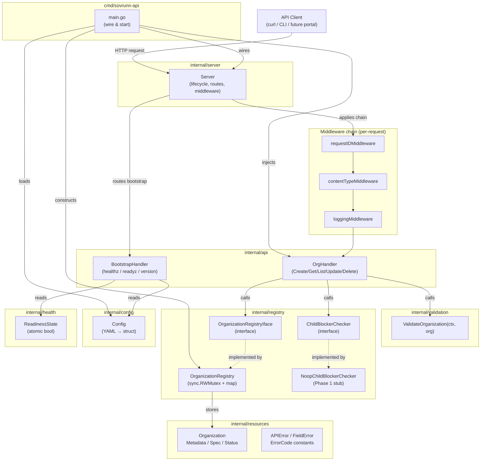

# Design Document — FEATURE-0001 Organization Resource and Registry

## Overview

FEATURE-0001 implements the `Organization` resource as the top-level governance and ownership boundary
in Sovrunn. It also bootstraps the full Go project skeleton — the Go module, the `cmd/sovrunn-api`
entrypoint, the `net/http`-based API server, the health/readiness/version endpoints, and the
in-memory thread-safe registry — so that the project compiles, all Makefile targets succeed, and the
API server is reachable at the configured host and port.

**Scope boundary.** This feature covers `Organization` only. `OrganizationUnit`, `Tenant`, `Project`,
`ServiceClass`, `ServicePlan`, `Plugin`, `Capability`, `ServiceInstance`, `ServiceBinding`, the
Operation framework implementation, persistent storage, Kubernetes CRDs, GitOps, and all other Phase 1
features are explicitly out of scope.

**Key design decisions:**
- `stdlib net/http` only — no third-party HTTP router or framework.
- In-memory registry protected by `sync.RWMutex`; storage is replaceable via interface design.
- `context.Context` as the first parameter on all registry and validation methods.
- DNS-label validation via a package-level precompiled `*regexp.Regexp`.
- Safe JSON decoding with `http.MaxBytesReader` (1 MiB limit) applied inside `safeDecodeOrganization`; explicit `status` field rejection; `json.Decoder.DisallowUnknownFields()` used to reject unrecognised fields.
- Structured `APIError` responses with stable, versioned error codes.
- Request ID propagation via `X-Sovrunn-Request-ID` header on every request/response.
- Graceful shutdown with a 30-second timeout on `SIGINT`/`SIGTERM`.
- No secret logging — log fields are bounded to `request_id`, `method`, `path`, `status_code`,
  `latency_ms`, and on failure `error_code`.

---

## Architecture

### Component Interaction Diagram



### Startup Sequence

```
main()
  1. Parse --config flag (default: configs/sovrunn-api.local.yaml)
  2. config.Load(path)           → Config or fatal exit
  3. registry.NewOrganizationRegistry()
  4. validation package init     → compiles dnsLabelRe regexp
  5. api.NewOrgHandler(registry, NoopChildBlockerChecker)
  6. api.NewBootstrapHandler(cfg, readinessState)
  7. server.New(cfg, orgHandler, bootstrapHandler)
  8. server.Start()
       a. Register routes on http.ServeMux
       b. http.Server.ListenAndServe() in goroutine
       c. readinessState.SetReady(true)
       d. Block on os.Signal channel (SIGINT, SIGTERM)
  9. On signal: server.Shutdown(30s context)
 10. Exit 0
```

---

## Components and Interfaces

### Package Responsibility Table

| Package | Responsibility | Key Exports |
|---|---|---|
| `cmd/sovrunn-api` | Dependency wiring and server startup only; no business logic | `main()` |
| `internal/config` | YAML config loading, validation, and `Config` struct | `Config`, `Load()` |
| `internal/resources` | Resource structs with JSON tags; error types and error code constants | `Organization`, `Metadata`, `OrganizationSpec`, `OrganizationStatus`, `APIError`, `FieldError`, `ErrorCode` |
| `internal/registry` | Thread-safe in-memory storage; `OrganizationRegistry` and its interface; `ChildBlockerChecker` interface | `OrganizationRegistryIface`, `OrganizationRegistry`, `ChildBlockerChecker`, `NoopChildBlockerChecker` |
| `internal/validation` | Pure validation logic; DNS-label regexp; field-error accumulation | `ValidateOrganization()`, `ValidateNamePath()` |
| `internal/api` | HTTP handler functions; request decode/validate/respond; no business logic | `OrgHandler`, `BootstrapHandler` |
| `internal/server` | HTTP server construction, route registration, middleware chain, graceful shutdown | `Server`, `New()`, `Start()` |
| `internal/health` | Readiness state holder — a simple atomic bool with no external dependencies | `ReadinessState` |

### Registry Interface

```go
// internal/registry/registry.go

package registry

import (
    "context"
    "errors"

    "github.com/sanjeevksaini/sovrunn/internal/resources"
)

// Sentinel errors — handlers map these to APIError codes without
// inspecting error message strings.
var (
    ErrNotFound      = errors.New("resource not found")
    ErrAlreadyExists = errors.New("resource already exists")
)

// OrganizationRegistryIface is the storage contract for Organization
// resources. Implementations may be in-memory (Phase 1) or durable
// (future phases). The interface keeps handlers decoupled from storage.
type OrganizationRegistryIface interface {
    CreateOrganization(ctx context.Context, org resources.Organization) error
    GetOrganization(ctx context.Context, name string) (resources.Organization, error)
    ListOrganizations(ctx context.Context) ([]resources.Organization, error)
    UpdateOrganization(ctx context.Context, name string, org resources.Organization) (resources.Organization, error)
    DeleteOrganization(ctx context.Context, name string) error
}
```

### ChildBlockerChecker Interface

```go
// internal/registry/blocker.go

package registry

import "context"

// BlockedBy describes a resource kind that prevents deletion.
type BlockedBy struct {
    Kind  string // e.g. "OrganizationUnit", "Tenant"
    Count int
}

// ChildBlockerChecker is injected into the delete handler. Phase 1
// uses NoopChildBlockerChecker which always returns an empty slice.
// FEATURE-0002 and later will register concrete checkers.
type ChildBlockerChecker interface {
    // BlockedByChildren returns the resource kinds that have live
    // references to orgName. Empty slice means deletion is safe.
    BlockedByChildren(ctx context.Context, orgName string) ([]BlockedBy, error)
}

// NoopChildBlockerChecker is the Phase 1 stub — always returns empty.
type NoopChildBlockerChecker struct{}

func (NoopChildBlockerChecker) BlockedByChildren(
    _ context.Context, _ string,
) ([]BlockedBy, error) {
    return nil, nil
}
```

### OrgHandler and BootstrapHandler

```go
// internal/api/org_handler.go  (condensed signature block)

package api

// OrgHandler holds the dependencies injected by main.
type OrgHandler struct {
    registry registry.OrganizationRegistryIface
    blocker  registry.ChildBlockerChecker
}

func NewOrgHandler(
    reg registry.OrganizationRegistryIface,
    blocker registry.ChildBlockerChecker,
) *OrgHandler

// HTTP handler methods registered on the mux.
func (h *OrgHandler) Create(w http.ResponseWriter, r *http.Request)
func (h *OrgHandler) Get(w http.ResponseWriter, r *http.Request)
func (h *OrgHandler) List(w http.ResponseWriter, r *http.Request)
func (h *OrgHandler) Update(w http.ResponseWriter, r *http.Request)
func (h *OrgHandler) Delete(w http.ResponseWriter, r *http.Request)
```

```go
// internal/api/bootstrap_handler.go  (condensed signature block)

package api

type BootstrapHandler struct {
    cfg      config.Config
    readiness *health.ReadinessState
}

func NewBootstrapHandler(cfg config.Config, r *health.ReadinessState) *BootstrapHandler

func (h *BootstrapHandler) Healthz(w http.ResponseWriter, r *http.Request)
func (h *BootstrapHandler) Readyz(w http.ResponseWriter, r *http.Request)
func (h *BootstrapHandler) Version(w http.ResponseWriter, r *http.Request)
```

---

## Data Models

### internal/resources — full Go struct definitions

```go
// internal/resources/organization.go

package resources

// Organization is the top-level governance and ownership boundary in
// Sovrunn. It follows the canonical metadata/spec/status shape so that
// it can evolve toward Kubernetes-compatible desired-state reconciliation.
type Organization struct {
    APIVersion string             `json:"apiVersion"`
    Kind       string             `json:"kind"`
    Metadata   Metadata           `json:"metadata"`
    Spec       OrganizationSpec   `json:"spec"`
    Status     OrganizationStatus `json:"status"`
}

// Metadata carries identity and classification fields for any Sovrunn
// resource. Users may author all four fields; system-owned fields
// (createdAt, resourceVersion, etc.) are not included in Phase 1.
type Metadata struct {
    Name        string            `json:"name"`
    DisplayName string            `json:"displayName,omitempty"`
    Labels      map[string]string `json:"labels,omitempty"`
    Annotations map[string]string `json:"annotations,omitempty"`
}

// OrganizationSpec is the desired-state payload for an Organization.
// All fields are optional in Phase 1 except they are accepted
// and stored without server-side coercion.
type OrganizationSpec struct {
    Description          string   `json:"description,omitempty"`
    SovereignLocations   []string `json:"sovereignLocations,omitempty"`
    DefaultPolicyProfile string   `json:"defaultPolicyProfile,omitempty"`
}

// OrganizationStatus is system-owned observed state.
// Clients must NOT submit status in create/update requests.
type OrganizationStatus struct {
    Phase   string `json:"phase"`
    Message string `json:"message,omitempty"`
}

// OrganizationPhase constants for the Status.Phase field.
const (
    PhaseActive   = "Active"
    PhaseInactive = "Inactive"
    PhaseDeleting = "Deleting"
    PhaseFailed   = "Failed"
)

// APIVersion and Kind constants — set by server, never from client.
const (
    OrgAPIVersion = "platform.sovrunn.io/v1alpha1"
    OrgKind       = "Organization"
)
```

```go
// internal/resources/errors.go

package resources

// ErrorCode is a stable, versioned string code used in APIError
// responses and registry sentinel errors.
type ErrorCode string

const (
    ErrCodeValidationFailed      ErrorCode = "VALIDATION_FAILED"
    ErrCodeResourceNotFound      ErrorCode = "RESOURCE_NOT_FOUND"
    ErrCodeResourceAlreadyExists ErrorCode = "RESOURCE_ALREADY_EXISTS"
    ErrCodeDeleteBlocked         ErrorCode = "DELETE_BLOCKED"
    ErrCodeInternalError         ErrorCode = "INTERNAL_ERROR"
)

// APIError is the wire shape for all error responses.
// The HTTP response body is always: {"error": <APIError>}.
type APIError struct {
    Code    ErrorCode `json:"code"`
    Message string    `json:"message"`
    Field   string    `json:"field,omitempty"`
    Details string    `json:"details,omitempty"`
}

// APIErrorEnvelope wraps APIError so the JSON shape is
// {"error": {"code": ..., "message": ...}}.
type APIErrorEnvelope struct {
    Error APIError `json:"error"`
}

// FieldError is returned by ValidateOrganization for each invalid field.
// Field is the dot-separated JSON path (e.g. "metadata.name").
type FieldError struct {
    Field   string
    Message string
}
```

### internal/config — Config struct

```go
// internal/config/config.go

package config

import (
    "fmt"
    "os"

    "gopkg.in/yaml.v3" // approved as the sole external dependency for config
)
```

> **Note on yaml.v3:** The guardrails permit a config-parsing library when justified. `gopkg.in/yaml.v3`
> is the standard Go YAML library, actively maintained, with minimal transitive deps. If the project
> elects to keep zero external deps, `encoding/json` with a `.json` config file is the fallback.
> The struct shape below is identical in either case.

```go
// Config holds all runtime configuration loaded from the YAML file.
// The server exits with a non-zero status if the file is missing or
// required fields are absent/invalid.
type Config struct {
    Server ServerConfig `yaml:"server"`
    Log    LogConfig    `yaml:"log"`
    // Registry config preserved for future storage-type switching.
    Registry RegistryConfig `yaml:"registry"`
}

type ServerConfig struct {
    Host            string `yaml:"host"`             // default: "127.0.0.1"
    Port            int    `yaml:"port"`             // default: 8080
    ShutdownTimeout int    `yaml:"shutdownTimeout"`  // seconds, default: 30
}

type LogConfig struct {
    Level string `yaml:"level"` // "debug" | "info" | "warn" | "error"
}

type RegistryConfig struct {
    Type string `yaml:"type"` // "memory" (only valid value in Phase 1)
}

// Load reads path, decodes YAML into Config, and validates required fields.
// Returns an error (rather than panicking) so main() can log and exit cleanly.
func Load(path string) (Config, error)

// Addr returns "host:port" for use in http.Server.Addr.
func (c Config) Addr() string {
    return fmt.Sprintf("%s:%d", c.Server.Host, c.Server.Port)
}
```

YAML file mapping (`configs/sovrunn-api.local.yaml`):

```yaml
server:
  host: "127.0.0.1"
  port: 8080
  shutdownTimeout: 30   # seconds

log:
  level: "info"

registry:
  type: "memory"
```

### internal/health — ReadinessState

```go
// internal/health/readiness.go

package health

import "sync/atomic"

// ReadinessState is an atomic boolean flag that tracks whether the server
// has completed initialization. Set to true by server.Start() after
// ListenAndServe begins; read by the readyz handler without locking.
type ReadinessState struct {
    ready atomic.Bool
}

func (s *ReadinessState) SetReady(v bool) { s.ready.Store(v) }
func (s *ReadinessState) IsReady() bool   { return s.ready.Load() }
```

### internal/registry — OrganizationRegistry concrete implementation

```go
// internal/registry/org_registry.go

package registry

import (
    "context"
    "sort"
    "sync"

    "github.com/sanjeevksaini/sovrunn/internal/resources"
)

// OrganizationRegistry is the Phase 1 in-memory implementation of
// OrganizationRegistryIface. All public methods are safe for concurrent
// use. The registry holds no package-level global state.
type OrganizationRegistry struct {
    mu    sync.RWMutex
    store map[string]resources.Organization
}

// NewOrganizationRegistry returns a ready-to-use registry.
func NewOrganizationRegistry() *OrganizationRegistry {
    return &OrganizationRegistry{
        store: make(map[string]resources.Organization),
    }
}

// deepCopyOrganization returns a fully independent copy of org,
// duplicating the Labels, Annotations maps and SovereignLocations slice
// so that callers cannot mutate the registry's internal state.
func deepCopyOrganization(org resources.Organization) resources.Organization {
    cp := org
    if org.Metadata.Labels != nil {
        cp.Metadata.Labels = make(map[string]string, len(org.Metadata.Labels))
        for k, v := range org.Metadata.Labels {
            cp.Metadata.Labels[k] = v
        }
    }
    if org.Metadata.Annotations != nil {
        cp.Metadata.Annotations = make(map[string]string, len(org.Metadata.Annotations))
        for k, v := range org.Metadata.Annotations {
            cp.Metadata.Annotations[k] = v
        }
    }
    if org.Spec.SovereignLocations != nil {
        cp.Spec.SovereignLocations = make([]string, len(org.Spec.SovereignLocations))
        copy(cp.Spec.SovereignLocations, org.Spec.SovereignLocations)
    }
    return cp
}

// CreateOrganization stores a deep copy of org keyed by org.Metadata.Name.
// Returns ErrAlreadyExists if the name is already present.
func (r *OrganizationRegistry) CreateOrganization(
    ctx context.Context, org resources.Organization,
) error {
    r.mu.Lock()
    defer r.mu.Unlock()
    if _, ok := r.store[org.Metadata.Name]; ok {
        return ErrAlreadyExists
    }
    r.store[org.Metadata.Name] = deepCopyOrganization(org)
    return nil
}

// GetOrganization returns a deep copy of the stored Organization.
// Returns ErrNotFound if name is absent.
func (r *OrganizationRegistry) GetOrganization(
    ctx context.Context, name string,
) (resources.Organization, error) {
    r.mu.RLock()
    defer r.mu.RUnlock()
    org, ok := r.store[name]
    if !ok {
        return resources.Organization{}, ErrNotFound
    }
    return deepCopyOrganization(org), nil
}

// ListOrganizations returns a new slice of deep copies sorted
// ascending by metadata.name.
func (r *OrganizationRegistry) ListOrganizations(
    ctx context.Context,
) ([]resources.Organization, error) {
    r.mu.RLock()
    defer r.mu.RUnlock()
    items := make([]resources.Organization, 0, len(r.store))
    for _, org := range r.store {
        items = append(items, deepCopyOrganization(org))
    }
    sort.Slice(items, func(i, j int) bool {
        return items[i].Metadata.Name < items[j].Metadata.Name
    })
    return items, nil
}

// UpdateOrganization replaces the mutable fields of the stored entry and
// returns a deep copy of the updated Organization.
// Immutable fields (metadata.name, status, apiVersion, kind) are preserved
// from the stored entry.
// Returns ErrNotFound if name is absent.
func (r *OrganizationRegistry) UpdateOrganization(
    ctx context.Context, name string, updated resources.Organization,
) (resources.Organization, error) {
    r.mu.Lock()
    defer r.mu.Unlock()
    existing, ok := r.store[name]
    if !ok {
        return resources.Organization{}, ErrNotFound
    }
    // Preserve immutable/system fields from the stored entry.
    updated.Metadata.Name = existing.Metadata.Name
    updated.Status = existing.Status
    updated.APIVersion = resources.OrgAPIVersion
    updated.Kind = resources.OrgKind
    stored := deepCopyOrganization(updated)
    r.store[name] = stored
    return deepCopyOrganization(stored), nil
}

// DeleteOrganization removes the entry. Returns ErrNotFound if absent.
func (r *OrganizationRegistry) DeleteOrganization(
    ctx context.Context, name string,
) error {
    r.mu.Lock()
    defer r.mu.Unlock()
    if _, ok := r.store[name]; !ok {
        return ErrNotFound
    }
    delete(r.store, name)
    return nil
}
```

---

## Middleware Design

All middleware is implemented as `func(http.Handler) http.Handler` and applied in the chain
`requestID → contentType → logging` before the route handler is called.
Bootstrap routes (`/healthz`, `/readyz`, `/version`) bypass the `contentType` check since they
carry no request body.

> **Body size limit.** `http.MaxBytesReader` (1 MiB) is applied inside `safeDecodeOrganization`
> rather than in a middleware. This keeps the limit co-located with decoding logic and avoids
> wrapping GET/DELETE bodies unnecessarily. There is no `bodyLimitMiddleware`.

### requestIDMiddleware

```go
// internal/server/middleware.go

// requestIDMiddleware reads X-Sovrunn-Request-ID from the request.
// If absent or empty, it generates a new UUID-style ID using
// crypto/rand (16 bytes, hex-encoded). The resolved ID is stored
// in the request context under a typed key and written to the
// X-Sovrunn-Request-ID response header before the next handler runs.
func requestIDMiddleware(next http.Handler) http.Handler

// contextKey is an unexported type for context value keys to avoid
// collisions with other packages.
type contextKey int
const requestIDKey contextKey = 0

// RequestIDFromContext retrieves the request ID from ctx.
// Returns empty string if absent.
func RequestIDFromContext(ctx context.Context) string
```

### contentTypeMiddleware

```go
// contentTypeMiddleware rejects requests whose Content-Type header does
// not equal "application/json" (or start with "application/json;") for
// methods that carry a request body (POST, PUT, PATCH).
// Returns HTTP 415 with error code VALIDATION_FAILED for mismatches.
// GET, DELETE, and HEAD requests pass through unconditionally.
func contentTypeMiddleware(next http.Handler) http.Handler
```

### loggingMiddleware

```go
// loggingMiddleware wraps the ResponseWriter to capture the status code,
// records the request start time, calls the next handler, then writes a
// structured log line. Only these fields are logged:
//   request_id, method, path, status_code, latency_ms
// On non-2xx responses, error_code is also logged if set in the context.
// Full request bodies, Authorization headers, and secret values are
// never logged.
func loggingMiddleware(logger *log.Logger) func(http.Handler) http.Handler
```

---

## HTTP Handler Design

### Route Registration

Two patterns are registered on `http.ServeMux` in `server.New()`. Dispatch by HTTP method is
done manually inside the handler, and the name path parameter is extracted with
`strings.TrimPrefix`.

```
/v1/organizations        → orgHandler.handleCollection   (dispatches POST → Create, GET → List)
/v1/organizations/       → orgHandler.handleItem         (dispatches GET → Get, PUT → Update, DELETE → Delete)
/healthz                 → bootstrapHandler.Healthz
/readyz                  → bootstrapHandler.Readyz
/version                 → bootstrapHandler.Version
```

> **Go 1.21 routing.** Go 1.22+ `net/http` introduced `{name}` wildcard patterns. To stay
> compatible with the Go 1.21 minimum, the design uses the trailing-slash subtree pattern
> `/v1/organizations/` and extracts the name segment with:
> ```go
> name := strings.TrimPrefix(r.URL.Path, "/v1/organizations/")
> ```
> An empty `name` (i.e. a bare `GET /v1/organizations/` with no suffix) is routed to the
> collection handler, not the item handler, by checking `name == ""` at the top of
> `handleItem` and returning 404.

### Handler: Create (POST /v1/organizations)

```
1. Decode JSON body with safeDecodeOrganization()
   (applies http.MaxBytesReader 1 MiB; rejects if "status" key is present in body at all;
    uses DisallowUnknownFields to reject unrecognised fields)
2. If decode error → writeError(400/413/415, VALIDATION_FAILED)
3. ValidateOrganization(ctx, org) → []FieldError
4. If errors → writeError(400, VALIDATION_FAILED, first field + details for rest)
5. Force: org.APIVersion = OrgAPIVersion, org.Kind = OrgKind, org.Status.Phase = PhaseActive
6. registry.CreateOrganization(ctx, org)
7. If ErrAlreadyExists → writeError(409, RESOURCE_ALREADY_EXISTS)
8. If other error → writeError(500, INTERNAL_ERROR)
9. // TODO(FEATURE-0005): emit Operation record — type: CreateOrganization
10. writeJSON(201, org)
```

### Handler: Get (GET /v1/organizations/{name})

```
1. Extract {name} from URL path
2. If name == "" → 404
3. ValidateNamePath(ctx, name) — DNS-label check
4. If invalid → writeError(400, VALIDATION_FAILED, field="metadata.name")
5. registry.GetOrganization(ctx, name)
6. If ErrNotFound → writeError(404, RESOURCE_NOT_FOUND)
7. If other error → writeError(500, INTERNAL_ERROR)
8. writeJSON(200, org)
```

### Handler: List (GET /v1/organizations)

```
1. registry.ListOrganizations(ctx)  — returns sorted slice
2. If error → writeError(500, INTERNAL_ERROR)
3. writeJSON(200, {"items": orgs})  — items is [] when empty
```

### Handler: Update (PUT /v1/organizations/{name})

```
1. Extract {name} from URL path
2. If name == "" → 404 (bare /v1/organizations/ with no suffix)
3. ValidateNamePath(ctx, name)
4. If invalid → writeError(400, VALIDATION_FAILED, field="metadata.name")
5. Decode JSON body with safeDecodeOrganization()
   (applies http.MaxBytesReader 1 MiB; rejects if "status" key is present in body at all;
    uses DisallowUnknownFields to reject unrecognised fields)
6. If decode error → writeError(400/413/415, ...)
7. If body.Metadata.Name == "" → writeError(400, VALIDATION_FAILED,
       field="metadata.name", message="metadata.name is required in request body")
8. If body.Metadata.Name != name → writeError(400, VALIDATION_FAILED,
       field="metadata.name", message="metadata.name in body must match path")
9. ValidateOrganization(ctx, org) — validate name + spec fields
10. If errors → writeError(400, VALIDATION_FAILED, first field + details for rest)
11. updated, err := registry.UpdateOrganization(ctx, name, org)
    (registry preserves metadata.name and status from stored entry; returns deep copy)
12. If ErrNotFound → writeError(404, RESOURCE_NOT_FOUND)
13. If other error → writeError(500, INTERNAL_ERROR)
14. // TODO(FEATURE-0005): emit Operation record — type: UpdateOrganization
15. writeJSON(200, updated)
```

### Handler: Delete (DELETE /v1/organizations/{name})

```
1. Extract {name} from URL path
2. If name == "" → 404
3. ValidateNamePath(ctx, name)
4. If invalid → writeError(400, VALIDATION_FAILED, field="metadata.name")
5. registry.GetOrganization(ctx, name) — confirm existence before checking blockers
6. If ErrNotFound → writeError(404, RESOURCE_NOT_FOUND)
7. blocker.BlockedByChildren(ctx, name)
8. If blockers non-empty → writeError(409, DELETE_BLOCKED, message naming first blocker kind)
9. registry.DeleteOrganization(ctx, name)
10. If ErrNotFound → writeError(404, RESOURCE_NOT_FOUND)  (race: another delete won)
11. If other error → writeError(500, INTERNAL_ERROR)
12. // TODO(FEATURE-0005): emit Operation record — type: DeleteOrganization
13. w.WriteHeader(204)  — no body
```

### Handler: Healthz (GET /healthz)

```
1. writeJSON(200, {"status": "ok"})
   (no registry call, no I/O, no blocking)
```

### Handler: Readyz (GET /readyz)

```
1. if readinessState.IsReady()  → writeJSON(200, {"status": "ready"})
2. else                         → writeJSON(503, {"status": "not-ready"})
```

### Handler: Version (GET /version)

```
1. writeJSON(200, {
       "name":    "sovrunn-api",
       "version": buildVersion,   // set via -ldflags at build time, default "dev"
       "phase":   "1",
       "status":  "alpha"
   })
```

---

## Validation Design

### ValidateOrganization signature

```go
// internal/validation/organization.go

package validation

import (
    "context"
    "regexp"
    "strings"

    "github.com/sanjeevksaini/sovrunn/internal/resources"
)

// dnsLabelRe is compiled once at package initialisation to avoid
// per-request allocation in a hot validation path.
var dnsLabelRe = regexp.MustCompile(`^[a-z0-9]([-a-z0-9]*[a-z0-9])?$`)

// ValidateOrganization is a pure function. It validates all user-authored
// fields of org and returns all FieldErrors found in a single call
// (does not stop at the first error). Returns nil if the resource is valid.
//
// ctx is accepted to satisfy the context-first convention and to allow
// future context-aware validation (e.g. uniqueness checks via a registry).
func ValidateOrganization(ctx context.Context, org resources.Organization) []resources.FieldError

// ValidateNamePath validates a name extracted from a URL path segment.
// Used by Get, Update, and Delete handlers before the registry lookup.
func ValidateNamePath(ctx context.Context, name string) []resources.FieldError
```

### Validation rules

```
ValidateOrganization validates only metadata.name in Phase 1:

Field: metadata.name
  Rule 1: absent or empty → FieldError{Field: "metadata.name", Message: "name is required"}
           (skip further name rules when empty)
  Rule 2: len > 63        → FieldError{Field: "metadata.name", Message: "name must not exceed 63 characters"}
  Rule 3: !dnsLabelRe.MatchString(name)
                          → FieldError{Field: "metadata.name", Message: "name must be a valid DNS label: lowercase alphanumeric and hyphens, no leading/trailing hyphens"}

No other fields have validation rules in Phase 1. spec.* fields are optional and accepted as-is.

System-field rejection is handled entirely in the HTTP layer (safeDecodeOrganization),
not in ValidateOrganization.
```

### Error response format for validation failures

When `ValidateOrganization` returns a single `FieldError` (the only case in Phase 1 for
`metadata.name`):
- `APIError.Field` = `errors[0].Field`
- `APIError.Message` = `errors[0].Message`
- `APIError.Details` = `""` (empty, only used if multiple fields are invalid in future)

### safeDecodeOrganization helper

```go
// safeDecodeOrganization applies http.MaxBytesReader, detects whether the
// JSON request body contains the key "status" (rejecting immediately if so),
// then decodes into the typed Organization struct using DisallowUnknownFields.
//
// Status rejection rule: If the top-level JSON object contains the key "status"
// at all — regardless of value ({}, null, {"phase": ""}, or any other value) —
// the request is rejected with HTTP 400, VALIDATION_FAILED, field="status".
// This check happens BEFORE the typed decode so that no partial state is built.
//
// Returns (org, nil) on success.
// Returns (zero, error) on any failure; callers map the error type to
// the appropriate HTTP status (400 / 413).
//
// Sequence:
//   1. r.Body = http.MaxBytesReader(w, r.Body, 1<<20)
//   2. Read the body bytes (respecting the 1 MiB limit).
//   3. If read error is *http.MaxBytesError → return errBodyTooLarge (maps to 413)
//   4. Decode raw bytes into map[string]json.RawMessage to detect top-level keys.
//   5. If "status" key is present in the map → return errStatusFieldPresent
//      (maps to 400, field="status"). Any value including null, {}, or non-empty object triggers this.
//   6. Decode raw bytes into typed Organization struct using json.NewDecoder
//      with DisallowUnknownFields(). Unknown fields such as resourceVersion,
//      generation, createdAt, updatedAt are rejected automatically by the decoder.
//   7. If *json.SyntaxError or *json.UnmarshalTypeError → return errMalformedJSON (maps to 400)
//   8. If io.EOF (empty body) → return errEmptyBody (maps to 400)
//   9. If json.Decoder returns "unknown field" error → return errUnknownField (maps to 400)
//  10. Return the decoded Organization.
func safeDecodeOrganization(w http.ResponseWriter, r *http.Request) (resources.Organization, error)
```

---

## Server Lifecycle

### Startup

```go
// internal/server/server.go

package server

type Server struct {
    httpServer *http.Server
    readiness  *health.ReadinessState
}

// New constructs the Server: creates a net/http ServeMux, registers all
// routes with the middleware chain applied, and returns a Server ready
// to call Start().
func New(
    cfg config.Config,
    org *api.OrgHandler,
    bootstrap *api.BootstrapHandler,
    readiness *health.ReadinessState,
) *Server

// Start binds the listener, marks readiness true, then blocks until
// SIGINT or SIGTERM is received. On signal it calls Shutdown.
func (s *Server) Start() error

// Shutdown stops accepting new connections and waits up to
// cfg.Server.ShutdownTimeout seconds for in-flight requests to complete.
func (s *Server) Shutdown(timeout time.Duration) error
```

### Graceful Shutdown sequence

```
1. os/signal.NotifyContext(background, syscall.SIGINT, syscall.SIGTERM)
2. <-sigCtx.Done()                   // blocked here until signal
3. shutCtx, cancel := context.WithTimeout(background, 30*time.Second)
4. defer cancel()
5. httpServer.Shutdown(shutCtx)      // drains in-flight requests
6. log "server shutdown complete"
7. return nil  →  main() exits 0
```

---

## Error Mapping Table

| Registry error / condition | HTTP Status | `error.code` | Notes |
|---|---|---|---|
| `ErrAlreadyExists` | 409 | `RESOURCE_ALREADY_EXISTS` | POST duplicate name |
| `ErrNotFound` | 404 | `RESOURCE_NOT_FOUND` | GET / PUT / DELETE on missing resource |
| `[]FieldError` non-empty | 400 | `VALIDATION_FAILED` | field in `error.field` |
| JSON syntax / type error | 400 | `VALIDATION_FAILED` | malformed request body |
| Body exceeds 1 MiB | 413 | `VALIDATION_FAILED` | `http.MaxBytesError` from `safeDecodeOrganization` |
| Content-Type mismatch | 415 | `VALIDATION_FAILED` | checked in `contentTypeMiddleware` |
| `status` key present in body (any value) | 400 | `VALIDATION_FAILED` | `error.field = "status"` |
| `metadata.name` absent/empty in PUT body | 400 | `VALIDATION_FAILED` | `error.field = "metadata.name"` |
| `metadata.name` body ≠ path | 400 | `VALIDATION_FAILED` | `error.field = "metadata.name"` |
| `BlockedByChildren` non-empty | 409 | `DELETE_BLOCKED` | names blocker kind in message |
| Any unexpected `error` | 500 | `INTERNAL_ERROR` | no internal details in response |

---

## Error Handling

### writeError helper

```go
// internal/api/response.go

// writeError writes a JSON-encoded APIErrorEnvelope with the given HTTP
// status code. It always sets Content-Type: application/json and the
// X-Sovrunn-Request-ID header.
// Internal error details (Go error chain, stack traces) are never
// included in the response body.
func writeError(
    w http.ResponseWriter,
    r *http.Request,
    status int,
    code resources.ErrorCode,
    message, field, details string,
)

// writeJSON writes v as JSON with the given status code.
// Sets Content-Type: application/json.
func writeJSON(w http.ResponseWriter, r *http.Request, status int, v any)
```

### Internal errors

When a registry method returns an error that is neither `ErrNotFound` nor `ErrAlreadyExists`, the
handler logs `error_code=INTERNAL_ERROR` and `request_id` at ERROR level (no raw error string in
the response body) and returns HTTP 500.

### Body decode errors

`json.Decoder.Decode()` errors are inspected with `errors.As`:
- `*json.SyntaxError` or `*json.UnmarshalTypeError` → 400, VALIDATION_FAILED, "malformed JSON"
- `*http.MaxBytesError` → 413, VALIDATION_FAILED, "request body too large"
- `io.EOF` (empty body on POST/PUT) → 400, VALIDATION_FAILED, "request body is required"

---

## Correctness Properties

*A property is a characteristic or behavior that should hold true across all valid executions of a
system — essentially, a formal statement about what the system should do. Properties serve as the
bridge between human-readable specifications and machine-verifiable correctness guarantees.*

### Property Reflection

Before writing the final properties, I reviewed all candidates and eliminated:

- Error accumulation (previously Property 3): `ValidateOrganization` in Phase 1 validates only
  `metadata.name`. There is only one validatable field, so a "multiple field error accumulation"
  property has no meaningful generator. It is removed from the property set; Requirement 6.6
  remains in the requirements for forward-compatibility but does not produce a PBT property in
  Phase 1 scope.
- Properties about `status.phase = Active` and `apiVersion`/`kind` enforcement are subsumed by
  the **create round-trip** property.
- Thread-safety (Req 7.1–7.3) is verified by `-race` at test time, not expressed as a
  `testing/quick` property.

Final property set: **6 properties**.

---

### Property 1: ValidateOrganization rejects invalid names

*For any* string `name` that is either empty, contains characters outside `[a-z0-9-]`, starts or
ends with a hyphen, or exceeds 63 characters, calling `ValidateOrganization` with that name in
`metadata.name` SHALL return a `[]FieldError` that contains at least one entry with
`Field = "metadata.name"`.

**Validates: Requirements 6.1, 6.2, 6.3**

---

### Property 2: ValidateOrganization accepts all valid DNS-label names

*For any* string `name` that matches `^[a-z0-9]([-a-z0-9]*[a-z0-9])?$` and has length between 1
and 63 inclusive, calling `ValidateOrganization` SHALL return a result in which no `FieldError`
has `Field = "metadata.name"`.

**Validates: Requirement 6.4**

---

### Property 3: Create then Get is a data-preserving round trip

*For any* valid `Organization` value `org` (with a valid `metadata.name` and no status field),
after `registry.CreateOrganization(ctx, org)` succeeds, calling `registry.GetOrganization(ctx, org.Metadata.Name)`
SHALL return an `Organization` whose `Metadata.Name`, `Spec`, `APIVersion`, `Kind`, and
`Status.Phase` all equal the values set by the server at create time.

In particular: `Status.Phase` must be `"Active"`, `APIVersion` must be
`"platform.sovrunn.io/v1alpha1"`, and `Kind` must be `"Organization"`.

**Validates: Requirements 5.5, 5.7, 7.4, 8.1, 8.8**

---

### Property 4: Registry returns value copies — stored state is immutable to callers

*For any* stored `Organization` `org`, a value returned by `GetOrganization` or an element
in the slice returned by `ListOrganizations` is a copy: mutating any field of the returned
value SHALL NOT change the value returned by a subsequent call to `GetOrganization` with
the same name.

**Validates: Requirements 7.4, 7.5, 9.5**

---

### Property 5: List returns Organizations in ascending lexicographic order by name

*For any* non-empty set of `Organization` values stored in the registry, `ListOrganizations`
SHALL return a `[]Organization` such that for every adjacent pair `items[i]` and `items[i+1]`,
`items[i].Metadata.Name < items[i+1].Metadata.Name` (strict ascending order).

**Validates: Requirement 10.3**

---

### Property 6: Update preserves immutable system fields

*For any* stored `Organization` with name `N` and status `S`, calling `UpdateOrganization`
with any valid update payload SHALL result in `GetOrganization(N)` returning an `Organization`
where `Metadata.Name == N` and `Status == S` (the pre-update values).

Mutable fields (`Metadata.DisplayName`, `Metadata.Labels`, `Metadata.Annotations`,
`Spec.Description`, `Spec.SovereignLocations`, `Spec.DefaultPolicyProfile`) may differ,
but the system-owned fields must be identical to their pre-update values.

**Validates: Requirement 11.1**

---

## Testing Strategy

### Dual Testing Approach

Unit tests cover specific examples, error paths, and edge cases. Property-based tests verify the
six universal properties above across wide, randomized input spaces. Both are required.

### Property-Based Testing Library

Use Go's built-in `testing/quick` package (stdlib, no external dep). For richer generators,
`github.com/leanovate/gopter` is the approved alternative (it provides shrinking and structured
generators). Phase 1 may use `testing/quick` given the zero-dependency constraint; the choice
must be documented in the test file.

Each property test runs a minimum of **100 iterations** (`testing/quick.Config{MaxCount: 100}`).

Tag format for each property test:
```go
// Feature: organization-resource-registry, Property N: <property_text>
```

### Property Test Implementations

#### Property 1 — Invalid name rejection (testing/quick)

```go
// Feature: organization-resource-registry, Property 1: ValidateOrganization rejects invalid names
func TestProperty_ValidateOrganization_InvalidNames(t *testing.T) {
    // Generator produces: empty strings, strings with uppercase letters,
    // strings with spaces, strings starting/ending with hyphens,
    // strings > 63 chars, strings with special characters.
    // quick.Check verifies: at least one FieldError with Field="metadata.name"
}
```

#### Property 2 — Valid name acceptance (testing/quick)

```go
// Feature: organization-resource-registry, Property 2: ValidateOrganization accepts all valid DNS-label names
func TestProperty_ValidateOrganization_ValidNames(t *testing.T) {
    // Generator produces strings that match ^[a-z0-9]([-a-z0-9]*[a-z0-9])?$ with len 1-63.
    // quick.Check verifies: no FieldError with Field="metadata.name"
}
```

#### Property 3 — Create/Get round trip (testing/quick)

```go
// Feature: organization-resource-registry, Property 3: Create then Get is a data-preserving round trip
func TestProperty_Registry_CreateGetRoundTrip(t *testing.T) {
    // Generator produces valid Organization values.
    // quick.Check verifies: get after create returns same spec, correct apiVersion/kind/status.phase
}
```

#### Property 4 — Value copy immutability (testing/quick)

```go
// Feature: organization-resource-registry, Property 4: Registry returns value copies
func TestProperty_Registry_GetReturnsValueCopy(t *testing.T) {
    // Generator produces valid Organization values with non-nil Labels, Annotations, SovereignLocations.
    // quick.Check verifies: mutating maps/slices of returned struct does not affect subsequent Get result
}
```

#### Property 5 — List sorted order (testing/quick)

```go
// Feature: organization-resource-registry, Property 5: List returns organizations in ascending lexicographic order
func TestProperty_Registry_ListSortedOrder(t *testing.T) {
    // Generator produces sets of 2-20 random valid Organization names.
    // quick.Check verifies: all adjacent pairs satisfy items[i].Name < items[i+1].Name
}
```

#### Property 6 — Update preserves system fields (testing/quick)

```go
// Feature: organization-resource-registry, Property 6: Update preserves immutable system fields
func TestProperty_Registry_UpdatePreservesSystemFields(t *testing.T) {
    // Generator produces a stored Organization + random update payload.
    // quick.Check verifies: metadata.name and status unchanged after update
}
```

### Unit Test Coverage (example-based)

| Package | Test scenarios |
|---|---|
| `internal/validation` | Valid names (a-z, 0-9, hyphens), empty name, uppercase, spaces, > 63 chars, leading/trailing hyphen, single char |
| `internal/registry` | Create stores, duplicate create → `ErrAlreadyExists`, Get exists → value, Get missing → `ErrNotFound`, List empty → `[]`, List n → sorted slice, Update mutable fields, Update missing → `ErrNotFound`, Delete exists → gone, Delete missing → `ErrNotFound` |
| `internal/api` | POST 201 valid, POST 409 duplicate, POST 400 invalid name, POST 400 status field, POST 400 bad JSON, POST 413 oversized body, POST 415 wrong content-type, GET 200 exists, GET 404 missing, GET 400 invalid path name, GET list 200 sorted items, GET list 200 empty, PUT 200 valid update, PUT 404 missing, PUT 400 name mismatch, PUT 400 name absent in body, PUT 400 status field, DELETE 204 success, DELETE 404 missing |
| `internal/server` | Request ID generated when absent, Request ID propagated when present, response always has X-Sovrunn-Request-ID header |

### Race Detection

All registry tests and API handler tests are executed with:
```bash
go test -race ./...
```

The `go test -race` suite includes at least one stress-test function that launches 10+ goroutines
performing concurrent Create, Get, List, Update, and Delete calls on the same registry instance.
It must pass with zero race reports.

### Integration Tests (future / tests/integration)

Not implemented in FEATURE-0001. The `tests/integration/` directory is created as a placeholder.

---

## Cursor Implementation Prompt

The following prompt is provided for Cursor (or any AI coding agent) to implement FEATURE-0001
from this design. Paste it as-is into a Cursor session with the repository open.

---

```
You are implementing FEATURE-0001 Organization Resource and Registry for the Sovrunn platform.
The spec is at .kiro/specs/organization-resource-registry/. Read requirements.md and design.md
fully before writing any code.

Also load these files for context before starting:
  AGENTS.md
  docs/engineering/go-coding-guardrails.md
  docs/api/API_CONTRACT_PHASE1.md
  docs/resource-specs/RESOURCE_MODEL_PHASE1.md
  docs/architecture/observability-and-audit-baseline.md
  configs/sovrunn-api.local.yaml

## Scope

Implement ONLY these packages as defined in design.md:
  internal/resources/      (Organization, Metadata, OrganizationSpec, OrganizationStatus, APIError, FieldError, ErrorCode)
  internal/config/         (Config, ServerConfig, LogConfig, RegistryConfig, Load())
  internal/health/         (ReadinessState with atomic.Bool)
  internal/registry/       (OrganizationRegistryIface, OrganizationRegistry, deepCopyOrganization,
                             ErrNotFound, ErrAlreadyExists, ChildBlockerChecker, NoopChildBlockerChecker)
  internal/validation/     (ValidateOrganization, ValidateNamePath, dnsLabelRe precompiled)
  internal/api/            (OrgHandler, BootstrapHandler, writeError, writeJSON, safeDecodeOrganization)
  internal/server/         (Server, New, Start, Shutdown, requestIDMiddleware, contentTypeMiddleware,
                             loggingMiddleware — NO bodyLimitMiddleware)
  cmd/sovrunn-api/main.go  (wiring only)

DO NOT implement OrganizationUnit, Tenant, Project, ServiceClass, Operation, Plugin, Capability,
ServiceInstance, ServiceBinding, or any other resource.

## Hard Constraints

1. Use stdlib net/http only. No third-party HTTP router or framework.
2. OrganizationRegistry backed by sync.RWMutex + map[string]resources.Organization.
3. context.Context as first param on ValidateOrganization, ValidateNamePath, and all 5 registry methods.
4. dnsLabelRe = regexp.MustCompile(`^[a-z0-9]([-a-z0-9]*[a-z0-9])?$`) compiled once at package init.
5. http.MaxBytesReader(w, r.Body, 1<<20) applied INSIDE safeDecodeOrganization only.
   There is NO bodyLimitMiddleware.
6. Use json.Decoder.DisallowUnknownFields() in safeDecodeOrganization to reject unknown fields.
   BEFORE the typed decode, check whether the raw JSON contains the key "status".
   If "status" is present AT ALL — regardless of value ({}, null, {"phase":""}, anything) —
   reject with 400 VALIDATION_FAILED, error.field="status".
   Unknown fields like resourceVersion, generation, createdAt, updatedAt are rejected
   automatically by DisallowUnknownFields.
7. All error responses use {"error": {"code": "...", "message": "...", "field": "...", "details": "..."}} shape.
8. Only these ErrorCode values: VALIDATION_FAILED, RESOURCE_NOT_FOUND, RESOURCE_ALREADY_EXISTS, DELETE_BLOCKED, INTERNAL_ERROR.
9. Request ID: read X-Sovrunn-Request-ID header; generate crypto/rand 16-byte hex ID if absent/empty; always return in X-Sovrunn-Request-ID response header.
10. Graceful shutdown: handle SIGINT and SIGTERM with 30-second context timeout.
11. Log fields per request: request_id, method, path, status_code, latency_ms. Add error_code on failure. NEVER log Authorization header, request body, tokens, or secrets.
12. OrgHandler takes OrganizationRegistryIface (interface) and ChildBlockerChecker (interface) — not the concrete types.
13. ListOrganizations returns slice sorted ascending by metadata.name.
14. All registry methods (Create, Get, List, Update) return DEEP COPIES using deepCopyOrganization
    (which duplicates Labels, Annotations maps and SovereignLocations slice).
15. No package-level global state for registry or config.

## UpdateOrganization Signature

The interface and concrete implementation must use this signature:

    UpdateOrganization(ctx context.Context, name string, org resources.Organization) (resources.Organization, error)

The handler uses the returned Organization directly in writeJSON(200, updated).

## Go 1.21-compatible Routing (REQUIRED)

Register exactly two patterns on the ServeMux for organizations:

    mux.Handle("/v1/organizations",  orgCollectionHandler)   // POST=Create, GET=List
    mux.Handle("/v1/organizations/", orgItemHandler)         // GET=Get, PUT=Update, DELETE=Delete

Dispatch by r.Method manually inside each handler function.
Extract the name segment with:
    name := strings.TrimPrefix(r.URL.Path, "/v1/organizations/")

Do NOT use Go 1.22+ {name} wildcard patterns.

## PUT /v1/organizations/{name} — metadata.name is REQUIRED in body

For PUT requests:
- If body.Metadata.Name is empty or absent → 400 VALIDATION_FAILED, field="metadata.name",
  message="metadata.name is required in request body"
- If body.Metadata.Name != path name → 400 VALIDATION_FAILED, field="metadata.name",
  message="metadata.name in body must match path"
- Absent and present-but-empty are treated identically as "not provided".

## Operation Boundary Comments (Required)

In OrgHandler.Create, OrgHandler.Update, and OrgHandler.Delete, add exactly these comments at
the point where a future Operation record will be created:
  Create:  // TODO(FEATURE-0005): emit Operation record — type: CreateOrganization
  Update:  // TODO(FEATURE-0005): emit Operation record — type: UpdateOrganization
  Delete:  // TODO(FEATURE-0005): emit Operation record — type: DeleteOrganization

## Error Mapping (implement exactly)

  ErrAlreadyExists              → 409 RESOURCE_ALREADY_EXISTS
  ErrNotFound                   → 404 RESOURCE_NOT_FOUND
  []FieldError non-empty        → 400 VALIDATION_FAILED  (field in error.field)
  JSON syntax/type error        → 400 VALIDATION_FAILED
  http.MaxBytesError            → 413 VALIDATION_FAILED
  Content-Type mismatch         → 415 VALIDATION_FAILED
  status key present in body    → 400 VALIDATION_FAILED  error.field="status"
                                  (reject if the key "status" exists, regardless of value: {}, null, etc.)
  name absent/empty in PUT body → 400 VALIDATION_FAILED  error.field="metadata.name"
  name body ≠ path name         → 400 VALIDATION_FAILED  error.field="metadata.name"
  BlockedByChildren > 0         → 409 DELETE_BLOCKED
  any other error               → 500 INTERNAL_ERROR

## Tests Required

Write tests in the same package (or _test suffix files) covering every scenario in the
"Unit Test Coverage" table in design.md section Testing Strategy.

Write property-based tests using stdlib testing/quick (testing/quick.Config{MaxCount: 100})
for Properties 1–6 as defined in design.md section Correctness Properties. Each property
test function must start with a comment:
  // Feature: organization-resource-registry, Property N: <title>

Write one concurrency stress test in internal/registry/ that launches 10+ goroutines performing
concurrent Create, Get, List, Update, Delete operations and verify zero data races under -race.

## Verification Commands (run these after implementation)

  make fmt
  make vet
  make test
  go test -race ./...
  make build
  make run   (then manually verify /healthz, /readyz, /version)

## Server Endpoints (register all 8)

  POST   /v1/organizations         → OrgHandler collection handler (method=POST → Create)
  GET    /v1/organizations         → OrgHandler collection handler (method=GET  → List)
  GET    /v1/organizations/{name}  → OrgHandler item handler       (method=GET    → Get)
  PUT    /v1/organizations/{name}  → OrgHandler item handler       (method=PUT    → Update)
  DELETE /v1/organizations/{name}  → OrgHandler item handler       (method=DELETE → Delete)
  GET    /healthz                  → BootstrapHandler.Healthz
  GET    /readyz                   → BootstrapHandler.Readyz
  GET    /version                  → BootstrapHandler.Version

Register on ServeMux (Go 1.21-compatible):
  mux.Handle("/v1/organizations", orgCollectionHandler)
  mux.Handle("/v1/organizations/", orgItemHandler)
  mux.HandleFunc("/healthz", bootstrapHandler.Healthz)
  mux.HandleFunc("/readyz", bootstrapHandler.Readyz)
  mux.HandleFunc("/version", bootstrapHandler.Version)

The item handler extracts the name using:
  name := strings.TrimPrefix(r.URL.Path, "/v1/organizations/")

A bare request to /v1/organizations/ with no name suffix (name == "") must return HTTP 404.

## go.mod

Module path: github.com/sanjeevksaini/sovrunn
Go version:  1.21

The only permitted external dependency is gopkg.in/yaml.v3 for config parsing.
If you choose to keep zero external deps, use encoding/json with a JSON config file instead
and document that choice.

## Report when done

After implementation, report:
  - files created
  - new exported symbols
  - validation rules implemented
  - tests written (unit + property)
  - security considerations
  - known limitations
  - non-goals not implemented
  - commands run and results
```
