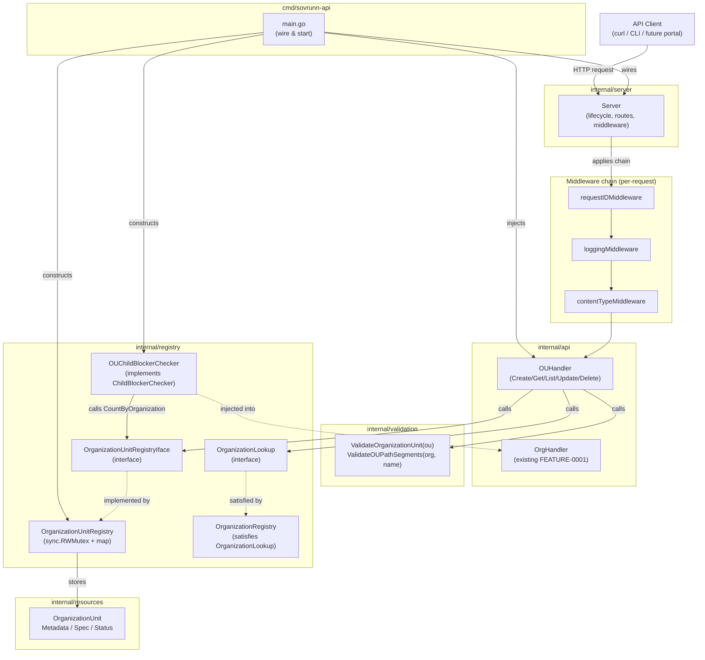

# Design Document — FEATURE-0002 OrganizationUnit Resource

## Overview

FEATURE-0002 implements the `OrganizationUnit` resource as a delegated governance boundary under an
`Organization` in Sovrunn. It is the second resource in the Phase 1 governance hierarchy:

```
Organization
  -> OrganizationUnit
      -> Tenant (future)
          -> Project (future)
```

**Scope boundary.** This feature covers `OrganizationUnit` only. Tenant, Project, nested
OrganizationUnit hierarchies, persistent storage, Kubernetes CRDs, ServiceOps, the Operation
framework implementation, UI, AI agent execution, SDE runtime transformation, auth/RBAC, and
billing are explicitly out of scope.

**Key design decisions:**

- `stdlib net/http` only — no third-party HTTP router or framework.
- Composite identity: `spec.organizationName + metadata.name` (key format: `"organizationName/name"`).
- `spec.organizationName` is immutable after creation.
- `OrganizationUnitRegistry` is storage-only — no dependency on `OrganizationRegistry`.
- Parent Organization existence checks happen in the API/service layer via injected `OrganizationLookup` interface.
- Registry methods accept `context.Context` as first parameter.
- Deep copies on all registry CRUD paths (maps and slices).
- Organization delete blocked when OrganizationUnits reference it (wired into `ChildBlockerChecker`).
- Go 1.21-compatible routing: `/v1/organization-units` and `/v1/organization-units/` patterns.
- No `bodyLimitMiddleware` — `http.MaxBytesReader` applied inside `safeDecodeOrganizationUnit`.
- `json.Decoder.DisallowUnknownFields()` for unknown field rejection.
- Status key detected and rejected before typed decode.
- PUT requires body `metadata.name` AND `spec.organizationName` present and matching path.
- `UpdateOrganizationUnit` returns `(resources.OrganizationUnit, error)` — handler uses returned value directly.

---

## Architecture

### Component Interaction Diagram



### Request Flow — POST /v1/organization-units

```
1. Client sends POST /v1/organization-units with JSON body
2. requestIDMiddleware → loggingMiddleware → contentTypeMiddleware → handler
3. OUHandler.HandleCollection dispatches to Create
4. safeDecodeOrganizationUnit (MaxBytesReader, status detection, DisallowUnknownFields)
5. ValidateOrganizationUnit (metadata.name + spec.organizationName DNS-label checks)
6. orgLookup.GetOrganization (verify parent exists)
7. registry.CreateOrganizationUnit (stores deep copy with composite key)
8. writeJSON(201, ou) with server-set apiVersion, kind, status.phase
```

---

## Components and Interfaces

### Package Responsibility Table

| Package | Responsibility | Key Exports (FEATURE-0002 additions) |
|---|---|---|
| `internal/resources` | OrganizationUnit struct with JSON tags | `OrganizationUnit`, `OrganizationUnitSpec`, `OrganizationUnitStatus`, `OUAPIVersion`, `OUKind` |
| `internal/registry` | Thread-safe OU storage; OU blocker | `OrganizationUnitRegistryIface`, `OrganizationUnitRegistry`, `OrganizationLookup`, `OUChildBlockerChecker` |
| `internal/validation` | Pure validation for OU fields | `ValidateOrganizationUnit()`, `ValidateOUPathSegments()` |
| `internal/api` | HTTP handler functions for OU CRUD | `OUHandler`, `NewOUHandler()` |
| `internal/server` | Updated `New()` to accept `*api.OUHandler` and register OU routes | Updated `New()` signature |
| `cmd/sovrunn-api` | Wiring: OU registry, blocker, handler | Updated `main()` |

---

## Data Models

### internal/resources — OrganizationUnit struct definitions

```go
// internal/resources/organizationunit.go

package resources

// OrganizationUnit is a delegated governance boundary under an Organization.
// It follows the canonical metadata/spec/status shape.
type OrganizationUnit struct {
    APIVersion string                 `json:"apiVersion"`
    Kind       string                 `json:"kind"`
    Metadata   Metadata               `json:"metadata"`
    Spec       OrganizationUnitSpec   `json:"spec"`
    Status     OrganizationUnitStatus `json:"status"`
}

// OrganizationUnitSpec is the desired-state payload for an OrganizationUnit.
// OrganizationName is required and immutable after creation.
type OrganizationUnitSpec struct {
    OrganizationName string `json:"organizationName"`
    Description      string `json:"description,omitempty"`
}

// OrganizationUnitStatus is system-owned observed state.
// Clients must NOT submit status in create/update requests.
type OrganizationUnitStatus struct {
    Phase   string `json:"phase"`
    Message string `json:"message,omitempty"`
}

// APIVersion and Kind constants for OrganizationUnit.
const (
    OUAPIVersion = "platform.sovrunn.io/v1alpha1"
    OUKind       = "OrganizationUnit"
)
```

**Notes:**
- `Metadata` is reused from the existing `internal/resources/organization.go` (already defines `Name`, `DisplayName`, `Labels`, `Annotations`).
- `OrganizationUnitStatus.Phase` valid values: `"Active"`, `"Inactive"`, `"Deleting"`, `"Failed"` — same constants as Organization (`PhaseActive`, etc.).
- The server always sets `apiVersion` and `kind` on responses; client-submitted values are ignored.

### Example JSON representation

```json
{
  "apiVersion": "platform.sovrunn.io/v1alpha1",
  "kind": "OrganizationUnit",
  "metadata": {
    "name": "ministry-health",
    "displayName": "Ministry of Health",
    "labels": {"env": "prod"},
    "annotations": {}
  },
  "spec": {
    "organizationName": "nic",
    "description": "Health ministry delegated boundary"
  },
  "status": {
    "phase": "Active",
    "message": ""
  }
}
```

---

## Files to Create/Modify

> **File naming:** Use the repository's existing Go file naming style. If existing files use
> underscores for multi-word resource files (e.g., `organization_unit.go`), prefer
> `internal/resources/organization_unit.go` and `internal/validation/organization_unit.go`.
> If the repository already uses non-underscore names (e.g., `organizationunit.go`), keep
> that style. Consistency with the existing repo matters more than either naming convention.

### New Files

| File | Purpose |
|---|---|
| `internal/resources/organizationunit.go` | `OrganizationUnit`, `OrganizationUnitSpec`, `OrganizationUnitStatus` structs; `OUAPIVersion`, `OUKind` constants |
| `internal/registry/ou_registry.go` | `OrganizationUnitRegistryIface` interface, `OrganizationUnitRegistry` concrete struct, `deepCopyOrganizationUnit`, `CountByOrganization` |
| `internal/registry/ou_blocker.go` | `OUChildBlockerChecker` struct implementing `ChildBlockerChecker` |
| `internal/validation/organizationunit.go` | `ValidateOrganizationUnit`, `ValidateOUPathSegments` |
| `internal/api/ou_handler.go` | `OUHandler` struct, `HandleCollection`, `HandleItem`, route dispatch, CRUD methods |
| `internal/api/ou_decode.go` | `safeDecodeOrganizationUnit` function |
| `internal/registry/ou_registry_test.go` | Unit tests for OU registry CRUD |
| `internal/registry/ou_registry_property_test.go` | Property-based tests for OU registry |
| `internal/registry/ou_registry_race_test.go` | Concurrency stress test |
| `internal/validation/organizationunit_test.go` | Unit tests for OU validation |
| `internal/validation/organizationunit_property_test.go` | Property-based tests for OU validation |
| `internal/api/ou_handler_test.go` | HTTP handler tests for OU endpoints |

### Modified Files

| File | Change |
|---|---|
| `cmd/sovrunn-api/main.go` | Wire `OrganizationUnitRegistry`, `OUHandler`, `OUChildBlockerChecker`; pass blocker to `OrgHandler` |
| `internal/server/server.go` | Accept `*api.OUHandler` in `New()`; register `/v1/organization-units` and `/v1/organization-units/` routes |

---

## OrganizationUnitRegistry Design

### Interface

```go
// internal/registry/ou_registry.go

package registry

import (
    "context"

    "github.com/sanjeevksaini/sovrunn/internal/resources"
)

// OrganizationUnitRegistryIface is the storage contract for OrganizationUnit
// resources. The registry is storage-only and does NOT depend on
// OrganizationRegistry. Parent existence checks are the handler's job.
type OrganizationUnitRegistryIface interface {
    CreateOrganizationUnit(ctx context.Context, ou resources.OrganizationUnit) (resources.OrganizationUnit, error)
    GetOrganizationUnit(ctx context.Context, orgName, name string) (resources.OrganizationUnit, error)
    ListOrganizationUnits(ctx context.Context) ([]resources.OrganizationUnit, error)
    UpdateOrganizationUnit(ctx context.Context, orgName, name string, ou resources.OrganizationUnit) (resources.OrganizationUnit, error)
    DeleteOrganizationUnit(ctx context.Context, orgName, name string) error
    CountByOrganization(ctx context.Context, orgName string) (int, error)
}
```

### Concrete Implementation

```go
// OrganizationUnitRegistry is the Phase 1 in-memory implementation.
// All public methods are safe for concurrent use.
type OrganizationUnitRegistry struct {
    mu    sync.RWMutex
    store map[string]resources.OrganizationUnit // key: "orgName/name"
}

// NewOrganizationUnitRegistry returns a ready-to-use registry.
func NewOrganizationUnitRegistry() *OrganizationUnitRegistry {
    return &OrganizationUnitRegistry{
        store: make(map[string]resources.OrganizationUnit),
    }
}

// compositeKey builds the map key from orgName and name.
func compositeKey(orgName, name string) string {
    return orgName + "/" + name
}
```

### deepCopyOrganizationUnit

```go
// deepCopyOrganizationUnit returns a fully independent copy of ou,
// duplicating Labels and Annotations maps so callers cannot mutate
// the registry's internal state.
func deepCopyOrganizationUnit(ou resources.OrganizationUnit) resources.OrganizationUnit {
    cp := ou
    if ou.Metadata.Labels != nil {
        cp.Metadata.Labels = make(map[string]string, len(ou.Metadata.Labels))
        for k, v := range ou.Metadata.Labels {
            cp.Metadata.Labels[k] = v
        }
    }
    if ou.Metadata.Annotations != nil {
        cp.Metadata.Annotations = make(map[string]string, len(ou.Metadata.Annotations))
        for k, v := range ou.Metadata.Annotations {
            cp.Metadata.Annotations[k] = v
        }
    }
    return cp
}
```

### Registry Methods (pseudocode)

**CreateOrganizationUnit:**
```
1. Lock()
2. key := compositeKey(ou.Spec.OrganizationName, ou.Metadata.Name)
3. if store[key] exists → return zero, ErrAlreadyExists
4. stored := deepCopyOrganizationUnit(ou)
5. store[key] = stored
6. Unlock()
7. return deepCopyOrganizationUnit(stored), nil
```

**GetOrganizationUnit:**
```
1. RLock()
2. key := compositeKey(orgName, name)
3. if !exists → return ErrNotFound
4. return deepCopyOrganizationUnit(store[key]), nil
5. RUnlock()
```

**ListOrganizationUnits:**
```
1. RLock()
2. items := make([]OrganizationUnit, 0, len(store))
3. for each entry → append deepCopy
4. sort.Slice(items): by Spec.OrganizationName ascending, then Metadata.Name ascending
5. RUnlock()
6. return items, nil
```

**UpdateOrganizationUnit:**
```
1. Lock()
2. key := compositeKey(orgName, name)
3. if !exists → return ErrNotFound
4. Preserve from stored: Metadata.Name, Spec.OrganizationName, Status, APIVersion, Kind
5. Apply from input: Metadata.DisplayName, Metadata.Labels, Metadata.Annotations, Spec.Description
6. stored = deepCopyOrganizationUnit(merged)
7. store[key] = stored
8. Unlock()
9. return deepCopyOrganizationUnit(stored), nil
```

**DeleteOrganizationUnit:**
```
1. Lock()
2. key := compositeKey(orgName, name)
3. if !exists → return ErrNotFound
4. delete(store, key)
5. Unlock()
6. return nil
```

**CountByOrganization:**
```
1. RLock()
2. count := 0
3. for each entry: if entry.Spec.OrganizationName == orgName → count++
4. RUnlock()
5. return count, nil
```

### Sentinel Errors

Reuses existing `ErrNotFound` and `ErrAlreadyExists` from `internal/registry/registry.go`.

---

## Parent Organization Lookup Design

### OrganizationLookup Interface

```go
// internal/registry/ou_registry.go (or a shared interface file)

// OrganizationLookup is a narrow interface for verifying parent
// Organization existence. The existing OrganizationRegistry already
// satisfies this interface via its GetOrganization method.
type OrganizationLookup interface {
    GetOrganization(ctx context.Context, name string) (resources.Organization, error)
}
```

**Design rationale:** The `OrganizationUnitRegistry` remains storage-only. The `OUHandler`
receives an `OrganizationLookup` dependency at construction time. Before calling
`CreateOrganizationUnit`, the handler calls `orgLookup.GetOrganization(ctx, spec.organizationName)`.
If it returns `ErrNotFound`, the handler returns HTTP 400 with `VALIDATION_FAILED` and
`field = "spec.organizationName"`.

The existing `*OrganizationRegistry` satisfies `OrganizationLookup` without any code changes
because it already exposes `GetOrganization(ctx, name) (Organization, error)`.

---

## REST API Handler Design

### OUHandler struct

```go
// internal/api/ou_handler.go

package api

import (
    "net/http"
    "strings"

    "github.com/sanjeevksaini/sovrunn/internal/registry"
    "github.com/sanjeevksaini/sovrunn/internal/resources"
    "github.com/sanjeevksaini/sovrunn/internal/validation"
)

// OUHandler holds dependencies for OrganizationUnit CRUD endpoints.
type OUHandler struct {
    registry  registry.OrganizationUnitRegistryIface
    orgLookup registry.OrganizationLookup
}

// NewOUHandler constructs an OUHandler.
func NewOUHandler(
    reg registry.OrganizationUnitRegistryIface,
    orgLookup registry.OrganizationLookup,
) *OUHandler {
    return &OUHandler{registry: reg, orgLookup: orgLookup}
}
```

### HandleCollection (POST/GET)

```go
// HandleCollection dispatches POST → Create and GET → List.
func (h *OUHandler) HandleCollection(w http.ResponseWriter, r *http.Request) {
    switch r.Method {
    case http.MethodPost:
        h.Create(w, r)
    case http.MethodGet:
        h.List(w, r)
    default:
        writeError(w, r, http.StatusMethodNotAllowed, resources.ErrCodeValidationFailed,
            "method not allowed", "", "")
    }
}
```

### HandleItem (GET/PUT/DELETE)

```go
// HandleItem dispatches GET → Get, PUT → Update, DELETE → Delete.
// Extracts orgName/name from path using strings.TrimPrefix + strings.Split.
func (h *OUHandler) HandleItem(w http.ResponseWriter, r *http.Request) {
    remainder := strings.TrimPrefix(r.URL.Path, "/v1/organization-units/")
    if remainder == "" || remainder == r.URL.Path {
        writeError(w, r, http.StatusNotFound, resources.ErrCodeResourceNotFound,
            "organization unit not found", "", "")
        return
    }

    parts := strings.Split(remainder, "/")
    if len(parts) != 2 || parts[0] == "" || parts[1] == "" {
        writeError(w, r, http.StatusNotFound, resources.ErrCodeResourceNotFound,
            "organization unit not found", "", "")
        return
    }
    orgName := parts[0]
    name := parts[1]

    switch r.Method {
    case http.MethodGet:
        h.Get(w, r, orgName, name)
    case http.MethodPut:
        h.Update(w, r, orgName, name)
    case http.MethodDelete:
        h.Delete(w, r, orgName, name)
    default:
        writeError(w, r, http.StatusMethodNotAllowed, resources.ErrCodeValidationFailed,
            "method not allowed", "", "")
    }
}
```

### Path parsing detail

```
URL: /v1/organization-units/nic/ministry-health
  remainder = "nic/ministry-health"
  parts = ["nic", "ministry-health"]   (len == 2, both non-empty → valid)
  orgName = "nic", name = "ministry-health"
  → then validate each segment for DNS-label format; return 400 if invalid

URL: /v1/organization-units/nic
  remainder = "nic"
  parts = ["nic"]   (len != 2)
  → 404

URL: /v1/organization-units/
  remainder = ""
  → 404 (bare path)

URL: /v1/organization-units/nic/ministry-health/extra
  remainder = "nic/ministry-health/extra"
  parts = ["nic", "ministry-health", "extra"]   (len != 2)
  → 404
```

### Handler: Create (POST /v1/organization-units)

```
1. Decode JSON body with safeDecodeOrganizationUnit()
   (applies http.MaxBytesReader 1 MiB; rejects if "status" key present;
    uses DisallowUnknownFields to reject unrecognised fields)
2. If decode error → writeError(400/413/415, VALIDATION_FAILED)
3. ValidateOrganizationUnit(ou) → []FieldError
4. If errors → writeValidationErrors(w, r, errs)
5. orgLookup.GetOrganization(ctx, ou.Spec.OrganizationName)
6. If ErrNotFound → writeError(400, VALIDATION_FAILED,
       field="spec.organizationName", message="referenced organization does not exist")
7. If other error → writeError(500, INTERNAL_ERROR)
8. Force: ou.APIVersion = OUAPIVersion, ou.Kind = OUKind, ou.Status.Phase = PhaseActive
9. created, err := registry.CreateOrganizationUnit(ctx, ou)
10. If ErrAlreadyExists → writeError(409, RESOURCE_ALREADY_EXISTS)
11. If other error → writeError(500, INTERNAL_ERROR)
12. // TODO(FEATURE-0005): emit Operation record — type: CreateOrganizationUnit
13. writeJSON(201, created)
```

### Handler: Get (GET /v1/organization-units/{organizationName}/{name})

```
1. ValidateOUPathSegments(orgName, name) → []FieldError
2. If errors → writeValidationErrors(w, r, errs)
3. registry.GetOrganizationUnit(ctx, orgName, name)
4. If ErrNotFound → writeError(404, RESOURCE_NOT_FOUND)
5. If other error → writeError(500, INTERNAL_ERROR)
6. writeJSON(200, ou)
```

### Handler: List (GET /v1/organization-units)

```
1. registry.ListOrganizationUnits(ctx) — returns sorted slice
2. If error → writeError(500, INTERNAL_ERROR)
3. writeJSON(200, {"items": items}) — items is [] when empty
```

### Handler: Update (PUT /v1/organization-units/{organizationName}/{name})

```
1. ValidateOUPathSegments(orgName, name)
2. If errors → writeValidationErrors(w, r, errs)
3. Decode JSON body with safeDecodeOrganizationUnit()
4. If decode error → writeError(400/413/415, ...)
5. If body.Metadata.Name == "" → writeError(400, VALIDATION_FAILED,
       field="metadata.name", message="metadata.name is required in request body")
6. If body.Metadata.Name != name → writeError(400, VALIDATION_FAILED,
       field="metadata.name", message="metadata.name in body must match path")
7. If body.Spec.OrganizationName == "" → writeError(400, VALIDATION_FAILED,
       field="spec.organizationName", message="spec.organizationName is required in request body")
8. If body.Spec.OrganizationName != orgName → writeError(400, VALIDATION_FAILED,
       field="spec.organizationName", message="spec.organizationName in body must match path")
9. ValidateOrganizationUnit(ou)
10. If errors → writeValidationErrors(w, r, errs)
11. updated, err := registry.UpdateOrganizationUnit(ctx, orgName, name, ou)
12. If ErrNotFound → writeError(404, RESOURCE_NOT_FOUND)
13. If other error → writeError(500, INTERNAL_ERROR)
14. // TODO(FEATURE-0005): emit Operation record — type: UpdateOrganizationUnit
15. writeJSON(200, updated)
```

### Handler: Delete (DELETE /v1/organization-units/{organizationName}/{name})

```
1. ValidateOUPathSegments(orgName, name)
2. If errors → writeValidationErrors(w, r, errs)
3. registry.DeleteOrganizationUnit(ctx, orgName, name)
4. If ErrNotFound → writeError(404, RESOURCE_NOT_FOUND)
5. If other error → writeError(500, INTERNAL_ERROR)
6. // TODO(FEATURE-0005): emit Operation record — type: DeleteOrganizationUnit
7. w.WriteHeader(204) — no body
```

---

## Validation Design

### ValidateOrganizationUnit

```go
// internal/validation/organizationunit.go

package validation

import (
    "github.com/sanjeevksaini/sovrunn/internal/resources"
)

// ValidateOrganizationUnit is a pure function that validates all user-authored
// fields of an OrganizationUnit. Returns all FieldErrors found in a single call.
// Returns nil if the resource is valid.
//
// Validates:
//   - metadata.name: required, DNS-label format, max 63 chars
//   - spec.organizationName: required, DNS-label format, max 63 chars
//
// Does NOT perform cross-registry parent existence checks (that is the handler's job).
// Does NOT accept context.Context because it performs no I/O or cancellation-aware work.
func ValidateOrganizationUnit(ou resources.OrganizationUnit) []resources.FieldError {
    var errs []resources.FieldError
    errs = append(errs, validateOUName(ou.Metadata.Name)...)
    errs = append(errs, validateOrganizationName(ou.Spec.OrganizationName)...)
    if len(errs) == 0 {
        return nil
    }
    return errs
}

// validateOUName validates metadata.name with the same DNS-label rules.
func validateOUName(name string) []resources.FieldError {
    return validateName(name) // reuse existing validateName from organization.go
}

// validateOrganizationName validates spec.organizationName with DNS-label rules.
func validateOrganizationName(orgName string) []resources.FieldError {
    if orgName == "" {
        return []resources.FieldError{{
            Field:   "spec.organizationName",
            Message: "organizationName is required",
        }}
    }
    if len(orgName) > 63 {
        return []resources.FieldError{{
            Field:   "spec.organizationName",
            Message: "organizationName must not exceed 63 characters",
        }}
    }
    if !dnsLabelRe.MatchString(orgName) {
        return []resources.FieldError{{
            Field:   "spec.organizationName",
            Message: "organizationName must be a valid DNS label: lowercase alphanumeric and hyphens, no leading/trailing hyphens",
        }}
    }
    return nil
}
```

### ValidateOUPathSegments

```go
// ValidateOUPathSegments validates both path segments (orgName and name)
// extracted from a URL path. Used by Get, Update, and Delete handlers
// before the registry lookup. Context-free because it performs no I/O.
//
// Field-name mapping: path validation errors must use the correct public field names:
//   - invalid name path segment → error.field = "metadata.name"
//   - invalid orgName path segment → error.field = "spec.organizationName"
// Do not return a generic or incorrect field name for the organizationName segment.
func ValidateOUPathSegments(orgName, name string) []resources.FieldError {
    var errs []resources.FieldError
    if nameErrs := validateName(name); len(nameErrs) > 0 {
        errs = append(errs, nameErrs...)
    }
    if orgErrs := validateOrganizationName(orgName); len(orgErrs) > 0 {
        errs = append(errs, orgErrs...)
    }
    if len(errs) == 0 {
        return nil
    }
    return errs
}
```

### DNS-label Reuse

The existing `dnsLabelRe` regex and `validateName` function in `internal/validation/organization.go`
are reused directly. The `validateName` function must be made package-internal-accessible (it already
is, since it's unexported but in the same package). Both `organizationunit.go` and `organization.go`
live in the same `validation` package.

---

## Safe JSON Decoding Design

### safeDecodeOrganizationUnit

```go
// internal/api/ou_decode.go

package api

// safeDecodeOrganizationUnit applies http.MaxBytesReader, detects whether the
// JSON request body contains the key "status" (rejecting immediately if so),
// then decodes into the typed OrganizationUnit struct using DisallowUnknownFields.
//
// Sequence:
//   1. r.Body = http.MaxBytesReader(w, r.Body, 1<<20)   // 1 MiB limit
//   2. Read the body bytes (respecting the limit).
//   3. If read error is *http.MaxBytesError → return errBodyTooLarge (maps to 413)
//   4. If body is empty → return errEmptyBody (maps to 400)
//   5. Decode raw bytes into map[string]json.RawMessage to detect top-level keys.
//   6. If "status" key is present in the map → return errStatusFieldPresent
//      (maps to 400, field="status"). Any value including null, {}, or non-empty triggers this.
//   7. Decode raw bytes into typed OrganizationUnit struct using json.NewDecoder
//      with DisallowUnknownFields(). Unknown fields are rejected automatically.
//   8. If *json.SyntaxError or *json.UnmarshalTypeError → return errMalformedJSON (maps to 400)
//   9. If io.EOF (empty body) → return errEmptyBody (maps to 400)
//  10. If json.Decoder returns "unknown field" error → return errUnknownField (maps to 400)
//  11. Return the decoded OrganizationUnit.
func safeDecodeOrganizationUnit(w http.ResponseWriter, r *http.Request) (resources.OrganizationUnit, error)
```

**Key differences from `safeDecodeOrganization`:**
- Decodes into `resources.OrganizationUnit` instead of `resources.Organization`.
- Same error sentinel values (`errBodyTooLarge`, `errStatusFieldPresent`, `errMalformedJSON`, `errEmptyBody`, `errUnknownField`) are reused.
- Same `mapDecodeError` function is reused for error → HTTP status mapping.
- `http.MaxBytesReader` is applied inside this function — there is no body-limit middleware.

---

## Error Mapping Table

| Registry error / condition | HTTP Status | `error.code` | `error.field` | Notes |
|---|---|---|---|---|
| `ErrAlreadyExists` | 409 | `RESOURCE_ALREADY_EXISTS` | — | POST duplicate composite key |
| `ErrNotFound` | 404 | `RESOURCE_NOT_FOUND` | — | GET / PUT / DELETE on missing OU |
| `[]FieldError` non-empty | 400 | `VALIDATION_FAILED` | first field | Validation failure |
| JSON syntax / type error | 400 | `VALIDATION_FAILED` | — | Malformed request body |
| Body exceeds 1 MiB | 413 | `VALIDATION_FAILED` | — | `http.MaxBytesError` |
| Content-Type mismatch | 415 | `VALIDATION_FAILED` | — | Checked in `contentTypeMiddleware` |
| `status` key present in body | 400 | `VALIDATION_FAILED` | `status` | Any value triggers rejection |
| `metadata.name` absent/empty in PUT | 400 | `VALIDATION_FAILED` | `metadata.name` | Required in body for PUT |
| `metadata.name` body ≠ path | 400 | `VALIDATION_FAILED` | `metadata.name` | Immutability enforcement |
| `spec.organizationName` absent/empty in PUT | 400 | `VALIDATION_FAILED` | `spec.organizationName` | Required in body for PUT |
| `spec.organizationName` body ≠ path | 400 | `VALIDATION_FAILED` | `spec.organizationName` | Immutability enforcement |
| Parent Organization not found | 400 | `VALIDATION_FAILED` | `spec.organizationName` | Cross-registry check |
| Any unexpected `error` | 500 | `INTERNAL_ERROR` | — | No internal details in response |

---

## Organization Deletion Blocker Integration

### OUChildBlockerChecker

```go
// internal/registry/ou_blocker.go

package registry

import (
    "context"
)

// OUChildBlockerChecker implements ChildBlockerChecker for OrganizationUnit.
// It queries the OrganizationUnitRegistry to check whether any OUs reference
// the Organization being deleted.
type OUChildBlockerChecker struct {
    ouRegistry OrganizationUnitRegistryIface
}

// NewOUChildBlockerChecker constructs the blocker.
func NewOUChildBlockerChecker(ouReg OrganizationUnitRegistryIface) *OUChildBlockerChecker {
    return &OUChildBlockerChecker{ouRegistry: ouReg}
}

// BlockedByChildren returns a BlockedBy entry if any OrganizationUnits
// reference the given Organization. Returns empty slice if none found.
func (c *OUChildBlockerChecker) BlockedByChildren(
    ctx context.Context, orgName string,
) ([]BlockedBy, error) {
    count, err := c.ouRegistry.CountByOrganization(ctx, orgName)
    if err != nil {
        return nil, err
    }
    if count > 0 {
        return []BlockedBy{{Kind: "OrganizationUnit", Count: count}}, nil
    }
    return nil, nil
}
```

### Integration with Organization Delete

The existing `OrgHandler.Delete` method already calls `h.blocker.BlockedByChildren(ctx, name)`.
In FEATURE-0001, `NoopChildBlockerChecker` was injected. In FEATURE-0002, `main.go` replaces
it with `OUChildBlockerChecker`:

```go
// cmd/sovrunn-api/main.go (FEATURE-0002 change)
ouRegistry := registry.NewOrganizationUnitRegistry()
ouBlocker := registry.NewOUChildBlockerChecker(ouRegistry)
orgHandler := api.NewOrgHandler(reg, ouBlocker) // replace NoopChildBlockerChecker
```

### Composite Blocker Design (future FEATURE-0003+)

When FEATURE-0003 (Tenant) adds another blocker, the design uses a composite pattern:

```go
// CompositeChildBlockerChecker chains multiple ChildBlockerChecker implementations.
// For FEATURE-0002, only OUChildBlockerChecker is used directly.
// This composite is introduced in FEATURE-0003 when a second blocker is needed.
```

For FEATURE-0002, the single `OUChildBlockerChecker` is passed directly to `OrgHandler`.
No composite is needed yet.

---

## Server Wiring

### Updated main.go

```go
// cmd/sovrunn-api/main.go — FEATURE-0002 additions

func main() {
    configPath := flag.String("config", "configs/sovrunn-api.local.yaml", "path to config file")
    flag.Parse()

    cfg, err := config.Load(*configPath)
    if err != nil {
        log.Printf("startup error: %v", err)
        os.Exit(1)
    }

    // Organization registry (FEATURE-0001)
    orgRegistry := registry.NewOrganizationRegistry()

    // OrganizationUnit registry (FEATURE-0002)
    ouRegistry := registry.NewOrganizationUnitRegistry()

    // OU blocker replaces NoopChildBlockerChecker for Organization delete
    ouBlocker := registry.NewOUChildBlockerChecker(ouRegistry)

    // Organization handler — now uses real blocker
    orgHandler := api.NewOrgHandler(orgRegistry, ouBlocker)

    // OrganizationUnit handler — orgRegistry satisfies OrganizationLookup
    ouHandler := api.NewOUHandler(ouRegistry, orgRegistry)

    readiness := &health.ReadinessState{}
    bootstrapHandler := api.NewBootstrapHandler(cfg, readiness)

    srv := server.New(cfg, orgHandler, ouHandler, bootstrapHandler, readiness)

    if err := srv.Start(); err != nil {
        log.Printf("server error: %v", err)
        os.Exit(1)
    }
}
```

### Updated server.New signature

```go
// internal/server/server.go — updated signature

func New(
    cfg config.Config,
    org *api.OrgHandler,
    ou *api.OUHandler,         // NEW: FEATURE-0002
    bootstrap *api.BootstrapHandler,
    readiness *health.ReadinessState,
) *Server
```

### Route Registration

```go
// Inside server.New() — add OU routes

mux.Handle("/v1/organization-units", chain(http.HandlerFunc(ou.HandleCollection)))
mux.Handle("/v1/organization-units/", chain(http.HandlerFunc(ou.HandleItem)))
```

The middleware chain (`requestID → logging → contentType → handler`) is applied identically to
Organization and OrganizationUnit routes. Logging runs before Content-Type checks so that 415
responses are still logged.

---

## Operation TODO Placeholders

The following exact comment strings must appear in the handler methods at the point where
a future Operation record will be created:

**OUHandler.Create** — after successful `registry.CreateOrganizationUnit` and before `writeJSON(201, ou)`:
```go
// TODO(FEATURE-0005): emit Operation record — type: CreateOrganizationUnit
```

**OUHandler.Update** — after successful `registry.UpdateOrganizationUnit` and before `writeJSON(200, updated)`:
```go
// TODO(FEATURE-0005): emit Operation record — type: UpdateOrganizationUnit
```

**OUHandler.Delete** — after successful `registry.DeleteOrganizationUnit` and before `w.WriteHeader(204)`:
```go
// TODO(FEATURE-0005): emit Operation record — type: DeleteOrganizationUnit
```

These placeholders SHALL NOT import the `internal/operation/` package or call any Operation
creation code. They are code comments only.

---

## Test Design

### Dual Testing Approach

Unit tests cover specific examples, error paths, and edge cases. Property-based tests verify
universal properties across wide, randomized input spaces. Both are required.

### Property-Based Testing Library

Use Go's built-in `testing/quick` package (stdlib, no external dep). Each property test runs
a minimum of **100 iterations** (`testing/quick.Config{MaxCount: 100}`).

Tag format for each property test:
```go
// Feature: organizationunit-resource, Property N: <property_text>
```

### Unit Test Coverage (example-based)

| Package | Test scenarios |
|---|---|
| `internal/validation` | Valid OU names (a-z, 0-9, hyphens), empty name rejected, uppercase rejected, spaces rejected, >63 chars rejected, leading/trailing hyphen rejected, empty spec.organizationName rejected, invalid spec.organizationName format rejected, valid spec.organizationName passes |
| `internal/registry` | Create stores OU, duplicate composite key → `ErrAlreadyExists`, same name under different orgs succeeds, Get returns stored OU by composite key, Get non-existent → `ErrNotFound`, List returns all sorted by orgName then name, List empty → `[]`, Update modifies mutable fields, Update non-existent → `ErrNotFound`, Delete removes OU, Delete non-existent → `ErrNotFound`, CountByOrganization returns correct count |
| `internal/api` | POST 201 valid with existing parent org, POST 409 duplicate, POST 400 invalid name, POST 400 missing spec.organizationName, POST 400 non-existent parent org, POST 400 status field present, POST 400 bad JSON, POST 413 oversized body, POST 415 wrong content-type, GET 200 exists with full shape, GET 404 missing, GET 400 invalid path segments, GET list 200 sorted, GET list 200 empty, PUT 200 valid update, PUT 404 missing, PUT 400 metadata.name mismatch, PUT 400 spec.organizationName mismatch, PUT 400 status field, DELETE 204 success, DELETE 404 missing, DELETE 400 invalid path |
| `internal/registry` (blocker) | Org delete with OUs → 409 DELETE_BLOCKED, Org delete with zero OUs → 204 |

### Property Test Implementations

#### Property 1 — Valid DNS-label names accepted by validator (testing/quick)

```go
// Feature: organizationunit-resource, Property 1: ValidateOrganizationUnit accepts all valid DNS-label names
func TestProperty_ValidateOU_ValidNames(t *testing.T) {
    // Generator produces strings that match ^[a-z0-9]([-a-z0-9]*[a-z0-9])?$ with len 1-63.
    // Builds OrganizationUnit with valid metadata.name and valid spec.organizationName.
    // quick.Check verifies: no FieldError with Field="metadata.name" or "spec.organizationName"
}
```

#### Property 2 — Invalid names rejected by validator (testing/quick)

```go
// Feature: organizationunit-resource, Property 2: ValidateOrganizationUnit rejects invalid names
func TestProperty_ValidateOU_InvalidNames(t *testing.T) {
    // Generator produces: empty strings, strings with uppercase letters,
    // strings with spaces, strings starting/ending with hyphens,
    // strings > 63 chars, strings with special characters.
    // Places invalid name in metadata.name with valid spec.organizationName.
    // quick.Check verifies: at least one FieldError with Field="metadata.name"
}
```

#### Property 3 — Create/Get round trip preserves data (testing/quick)

```go
// Feature: organizationunit-resource, Property 3: Create then Get is a data-preserving round trip
func TestProperty_OURegistry_CreateGetRoundTrip(t *testing.T) {
    // Generator produces valid OrganizationUnit values with random names/orgNames.
    // quick.Check verifies: get after create returns same Metadata.Name,
    //   Spec.OrganizationName, Spec.Description, and correct APIVersion/Kind/Status.Phase.
}
```

#### Property 4 — Deep copy immutability (testing/quick)

```go
// Feature: organizationunit-resource, Property 4: Registry returns value copies — stored state is immutable to callers
func TestProperty_OURegistry_GetReturnsValueCopy(t *testing.T) {
    // Generator produces valid OU values with non-nil Labels, Annotations.
    // quick.Check verifies: mutating maps of returned struct does not affect subsequent Get.
}
```

#### Property 5 — List sorted by organizationName then name (testing/quick)

```go
// Feature: organizationunit-resource, Property 5: List returns OUs sorted by organizationName then name
func TestProperty_OURegistry_ListSortedOrder(t *testing.T) {
    // Generator produces sets of 2-20 random valid OU names across multiple orgs.
    // quick.Check verifies: all adjacent pairs satisfy sort order
    //   (orgName ascending, then name ascending within same org).
}
```

#### Property 6 — Update preserves immutable system fields (testing/quick)

```go
// Feature: organizationunit-resource, Property 6: Update preserves immutable system fields
func TestProperty_OURegistry_UpdatePreservesSystemFields(t *testing.T) {
    // Generator produces a stored OU + random update payload.
    // quick.Check verifies: metadata.name, spec.organizationName, and status unchanged after update.
}
```

#### Property 7 — Duplicate composite key returns ErrAlreadyExists (testing/quick)

```go
// Feature: organizationunit-resource, Property 7: Create is idempotent in error
func TestProperty_OURegistry_DuplicateCreateError(t *testing.T) {
    // Generator produces valid OU values.
    // quick.Check verifies: creating same composite key twice returns ErrAlreadyExists
    //   on second call and original entry is unchanged.
}
```

### Race Detection

```go
// internal/registry/ou_registry_race_test.go

func TestOURegistry_ConcurrentAccess(t *testing.T) {
    // Launches 10+ goroutines performing concurrent Create, Get, List, Update,
    // Delete, and CountByOrganization operations on the same registry instance.
    // Must pass with zero race reports under `go test -race`.
}
```

### Blocker Integration Test

```go
// internal/api/ou_handler_test.go (or internal/registry/ou_blocker_test.go)

func TestOrgDeleteBlockedByOU(t *testing.T) {
    // Setup: create Organization "nic", create OrganizationUnit "ministry-health" under "nic"
    // Action: DELETE /v1/organizations/nic
    // Assert: 409 DELETE_BLOCKED with "OrganizationUnit" in message
}

func TestOrgDeleteAllowedWhenNoOUs(t *testing.T) {
    // Setup: create Organization "empty-org", no OUs
    // Action: DELETE /v1/organizations/empty-org
    // Assert: 204
}
```

---

## Correctness Properties

*A property is a characteristic or behavior that should hold true across all valid executions of a
system — essentially, a formal statement about what the system should do. Properties serve as the
bridge between human-readable specifications and machine-verifiable correctness guarantees.*

### Property 1: ValidateOrganizationUnit accepts all valid DNS-label names

*For any* string `name` that matches `^[a-z0-9]([-a-z0-9]*[a-z0-9])?$` and has length between 1
and 63 inclusive, and *for any* string `orgName` that also satisfies the same pattern and length
constraint, calling `ValidateOrganizationUnit` with those values in `metadata.name` and
`spec.organizationName` SHALL return a result containing zero `FieldError` entries.

**Validates: Requirements 2.4, 3.2**

---

### Property 2: ValidateOrganizationUnit rejects invalid names

*For any* string `name` that is either empty, contains characters outside `[a-z0-9-]`, starts or
ends with a hyphen, or exceeds 63 characters, calling `ValidateOrganizationUnit` with that name in
`metadata.name` (and a valid `spec.organizationName`) SHALL return a `[]FieldError` that contains
at least one entry with `Field = "metadata.name"`.

**Validates: Requirements 2.1, 2.2, 2.3**

---

### Property 3: Create then Get is a data-preserving round trip

*For any* valid `OrganizationUnit` value `ou` (with valid `metadata.name` and
`spec.organizationName`), after `registry.CreateOrganizationUnit(ctx, ou)` succeeds, calling
`registry.GetOrganizationUnit(ctx, ou.Spec.OrganizationName, ou.Metadata.Name)` SHALL return an
`OrganizationUnit` whose `Metadata.Name`, `Spec.OrganizationName`, `Spec.Description`,
`Metadata.DisplayName`, `Metadata.Labels`, `Metadata.Annotations`, `APIVersion`, `Kind`, and
`Status.Phase` all equal the values stored at create time.

**Validates: Requirements 1.1, 1.5, 1.7, 4.1, 12.1, 17.3**

---

### Property 4: Registry returns value copies — stored state is immutable to callers

*For any* stored `OrganizationUnit` `ou`, a value returned by `GetOrganizationUnit` or an element
in the slice returned by `ListOrganizationUnits` is a deep copy: mutating any map field
(`Labels`, `Annotations`) of the returned value SHALL NOT change the value returned by a
subsequent call to `GetOrganizationUnit` with the same composite key.

**Validates: Requirements 7.4, 12.4, 12.5**

---

### Property 5: List returns OrganizationUnits sorted by organizationName then name

*For any* non-empty set of `OrganizationUnit` values stored in the registry,
`ListOrganizationUnits` SHALL return a `[]OrganizationUnit` such that for every adjacent pair
`items[i]` and `items[i+1]`, either `items[i].Spec.OrganizationName < items[i+1].Spec.OrganizationName`,
or `items[i].Spec.OrganizationName == items[i+1].Spec.OrganizationName` AND
`items[i].Metadata.Name < items[i+1].Metadata.Name` (strict ascending composite order).

**Validates: Requirements 8.3, 12.10, 17.4**

---

### Property 6: Update preserves immutable system fields

*For any* stored `OrganizationUnit` with orgName `O`, name `N`, and status `S`, calling
`UpdateOrganizationUnit` with any valid update payload SHALL result in
`GetOrganizationUnit(O, N)` returning an `OrganizationUnit` where
`Metadata.Name == N`, `Spec.OrganizationName == O`, and `Status == S` (the pre-update values).

Mutable fields (`Metadata.DisplayName`, `Metadata.Labels`, `Metadata.Annotations`,
`Spec.Description`) may differ, but immutable and system-owned fields must be identical to
their pre-update values.

**Validates: Requirements 3.5, 9.1, 9.4, 9.10**

---

### Property 7: Duplicate composite key returns ErrAlreadyExists (idempotent error)

*For any* valid `OrganizationUnit` value, creating it successfully and then attempting to create
the same composite key (`spec.organizationName/metadata.name`) again SHALL return
`ErrAlreadyExists` on the second call. The original entry SHALL remain unchanged — a subsequent
`GetOrganizationUnit` returns the value from the first create.

**Validates: Requirements 4.3, 12.9, 17.5**

---

## Error Handling

### writeError / writeJSON reuse

The existing `writeError` and `writeJSON` helper functions in `internal/api/response.go` are
reused by the `OUHandler` without modification. They handle:
- Setting `Content-Type: application/json`
- Setting `X-Sovrunn-Request-ID` header
- Encoding `APIErrorEnvelope` JSON

### writeValidationErrors reuse

The existing `writeValidationErrors` function in `internal/api/org_handler.go` is reused.
It must be extracted to `internal/api/response.go` (or kept accessible to both handlers
in the same package). Do not duplicate validation error response logic in `OUHandler` —
both `OrgHandler` and `OUHandler` must call the same shared function.

### Internal errors

When a registry method returns an error that is neither `ErrNotFound` nor `ErrAlreadyExists`,
the handler logs `error_code=INTERNAL_ERROR` and `request_id` at ERROR level (no raw error
string in the response body) and returns HTTP 500.

### Body decode errors

Same error inspection pattern as Organization:
- `*http.MaxBytesError` → 413, VALIDATION_FAILED
- `errStatusFieldPresent` → 400, VALIDATION_FAILED, field="status"
- `errEmptyBody` → 400, VALIDATION_FAILED, "request body is required"
- `errUnknownField` → 400, VALIDATION_FAILED, "unknown field in request body"
- Default → 400, VALIDATION_FAILED, "malformed JSON"

---

## Testing Strategy

### Dual Testing Approach

- **Unit tests**: Verify specific examples, edge cases, and error conditions.
- **Property tests**: Verify universal properties across all inputs using `testing/quick`.
- Together they provide comprehensive coverage: unit tests catch concrete bugs, property tests
  verify general correctness across wide input spaces.

### Property-Based Testing Library

Use Go's built-in `testing/quick` package (stdlib, zero external dependency).

**Configuration:**
- Minimum 100 iterations per property test: `testing/quick.Config{MaxCount: 100}`
- Each property test tagged with: `// Feature: organizationunit-resource, Property N: <title>`

### Unit Testing Balance

Unit tests focus on:
- Specific examples demonstrating correct behavior (happy paths)
- Integration points (handler → registry, handler → orgLookup)
- Edge cases and error conditions (invalid JSON, oversized body, content-type mismatch)
- Blocker integration (org delete blocked by OUs)

Property tests focus on:
- Universal properties that hold for all valid inputs
- Comprehensive input coverage through randomization
- Invariants: sort order, deep copy, round-trip, immutability, idempotent errors

### Race Detection

All registry tests and API handler tests are executed with:
```bash
go test -race ./...
```

The test suite includes a stress-test function (`TestOURegistry_ConcurrentAccess`) that
launches 10+ goroutines performing concurrent Create, Get, List, Update, Delete, and
CountByOrganization calls on the same registry instance. It must pass with zero race reports.

### Verification Commands

```bash
make fmt
make vet
make test
go test -race ./...
make build
```

---

## Non-Goals

The following are explicitly out of scope for FEATURE-0002:

1. **Tenant, Project, or nested OrganizationUnit hierarchies** — future features.
2. **Persistent storage** — Kubernetes CRDs, PostgreSQL, or any durable backend.
3. **Authentication, authorization, or RBAC** — no auth middleware or token validation.
4. **Operation framework implementation** — only placeholder comments.
5. **ServiceOps, plugin execution, or AI agent execution** — future phases.
6. **UI, SDE runtime transformation, or billing** — not in Phase 1 scope.
7. **Child-resource blocker checks on OrganizationUnit delete** — future Tenant blockers.
8. **`delegatedAdminGroups`** or governance policy fields beyond `spec.description`.
9. **List filtering** (e.g., `?organizationName=nic`) — all OUs returned; filtering is future.
10. **Pagination** — list returns all stored OUs without pagination.
11. **Nested OU hierarchy** (parentOrganizationUnitRef) — not in FEATURE-0002.

---

## Design Questions/Assumptions (Resolved)

### Q1: Parent Organization existence check location

**Resolution:** Inject `OrganizationLookup` interface into `OUHandler` (API/service layer).
The `OrganizationUnitRegistry` remains storage-only with no dependency on `OrganizationRegistry`.
This keeps the registry layer pure and testable independently.

### Q2: Composite blocker for Organization delete

**Resolution:** For FEATURE-0002, the single `OUChildBlockerChecker` is passed directly to
`OrgHandler` as the `ChildBlockerChecker` argument. No composite pattern is needed yet.
When FEATURE-0003 (Tenant) adds another blocker, a `CompositeChildBlockerChecker` that iterates
a `[]ChildBlockerChecker` slice will be introduced at that time. This avoids premature
abstraction while keeping the extension point clear.

### Q3: OrganizationLookup interface — new type or existing?

**Resolution:** Define `OrganizationLookup` as a new narrow interface in the `registry` package.
The existing `*OrganizationRegistry` already satisfies it (duck typing) because it has
`GetOrganization(ctx context.Context, name string) (resources.Organization, error)`. No adapter
code is needed.

### Q4: UpdateOrganizationUnit return value

**Resolution:** `UpdateOrganizationUnit` returns `(resources.OrganizationUnit, error)`. The
handler uses the returned value directly in `writeJSON(200, updated)`. This matches the
Organization pattern.

### Q5: validateName accessibility

**Resolution:** Both `organization.go` and `organizationunit.go` live in the same `validation`
package. The unexported `validateName` function is directly accessible to both files. No
export or refactoring needed.

