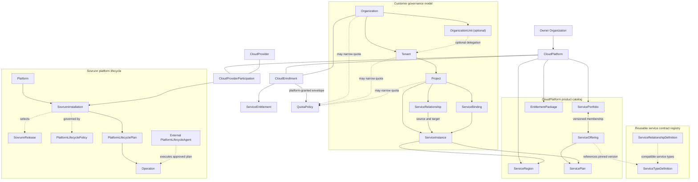
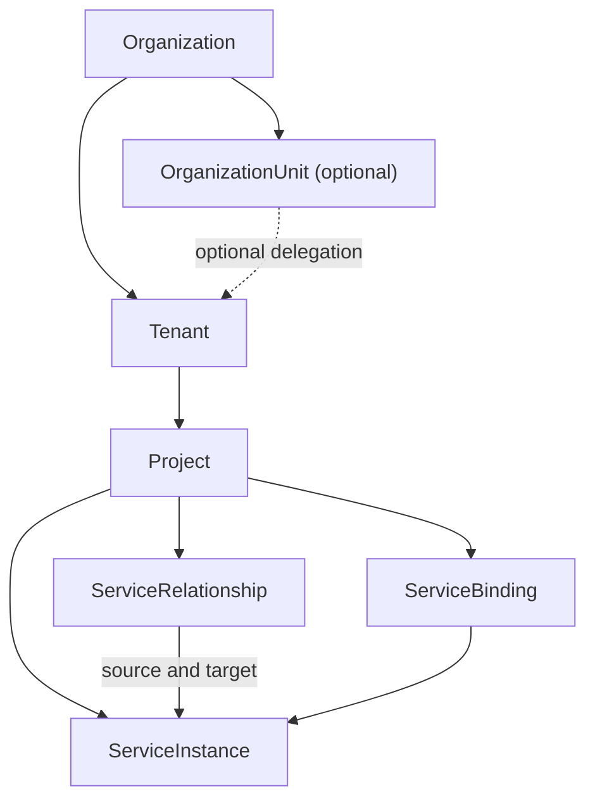
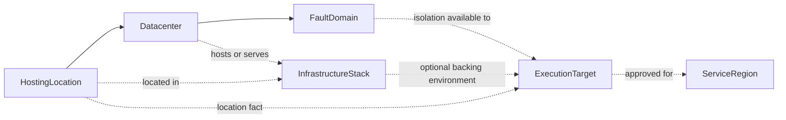
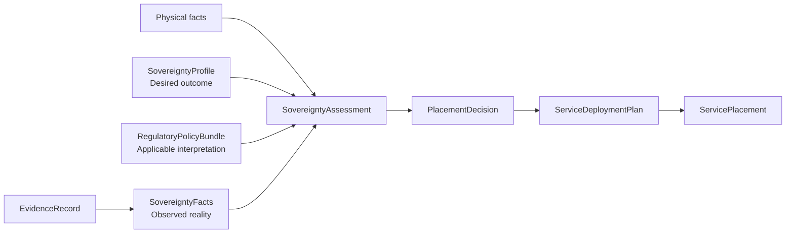
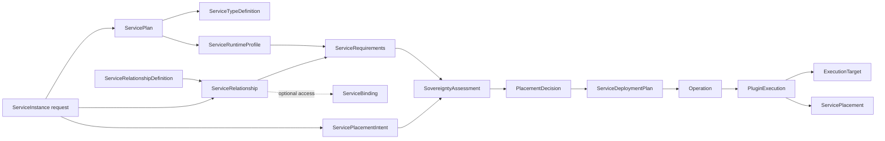

# Sovrunn Finalized Data Model

**Status:** Architecture-owner approved canonical conceptual baseline — repository integration and feature-level API specifications pending
**Version:** 1.7
**Date:** 4 August 2026
**Scope:** CloudPlatform products, CloudProvider supply participation, customer governance, hosting topology, sovereignty, service placement, managed-service lifecycle, Sovrunn platform lifecycle, execution and customer visibility

## 1. Purpose

Sovrunn is a sovereign cloud-native service platform. A `CloudPlatform` is the customer-facing cloud product, owned by exactly one `Organization`; one or more independent `CloudProvider`s realize that product through governed participation and isolated Sovrunn installations over infrastructure they own, operate or contract. Sovrunn productizes that infrastructure as governed application, data, AI and infrastructure services.

Sovrunn owns the service product, governance, sovereignty assessment, placement decision and lifecycle experience. It reuses existing datacenters, infrastructure stacks, schedulers, operators, compute, storage, networking, identity and observability.

This document fixes the semantic boundaries and relationships of the model. Field names and API packaging remain subject to feature-level design, but later specifications must preserve these meanings and invariants.

The companion [Final Canonical Contract Catalog](sovrunn-final-canonical-contract-catalog.md) defines scope, resource profile, writers, `spec`/`status` ownership, mutability, lifecycle, deletion, visibility, invariants and skeletal YAML for every canonical concept.

Consequential boundaries are formalized in the [Final Canonical ADR Package](sovrunn-final-canonical-adrs/README.md), and the complete model is exercised by the [Yotta–Department of Posts PostgreSQL Reference Flow](sovrunn-postgresql-reference-flow.md).

API refinement: `SovereigntyFacts` and `ServiceRequirements` remain conceptual labels; their singular API kinds are `SovereigntyFactSet` and `ServiceRequirementSet`. `SovereigntyAssessment` and `PlacementDecision` are implemented as registered FEATURE-0013 `DecisionRecord` profiles rather than competing decision envelopes. `ServiceOffering` supersedes the Phase 1 global `ServiceClass` as CloudPlatform product identity, reusable technical semantics move into `ServiceTypeDefinition`, `EffectiveGovernanceContext` supersedes the planned `EffectivePolicyContext` term, and the existing `ServiceBinding` remains the customer access boundary.

## 2. Core design principles

1. **Service-first:** customers request managed service outcomes, not backend resources or implementation-specific APIs.
2. **Simple by default:** the normal customer journey is service, plan, region and optional outcome profiles. Advanced controls appear only when needed.
3. **Meaningful customer choice:** customers may require or prefer locations, datacenters, latency relationships, resilience and sovereignty outcomes.
4. **Provider-packaged complexity:** providers publish reusable service, placement, governance and sovereignty profiles instead of configuring every customer independently.
5. **Reuse infrastructure:** Sovrunn registers and qualifies existing execution environments; it does not own or replace them.
6. **Implementation-neutral core:** backend-specific constructs remain behind service plugins and execution adapters.
7. **Evidence-backed sovereignty:** physical location, desired sovereignty, applicable policy, observed facts, evidence and assessment remain separate.
8. **Continuous evaluation:** sovereignty and operational eligibility are reassessed when relevant policy, evidence or infrastructure facts change.
9. **Zero trust:** identity is verified explicitly, access is denied by default, authority is least-privileged and privileged access is time-bound and audited.
10. **Relationship rather than ownership:** an owner `Organization` owns a `CloudPlatform`; an independent `CloudProvider` participates through `CloudProviderParticipation`; a customer `Organization` consumes it through `CloudEnrollment`. None of these relationships creates ownership of the customer or provider organization.
11. **Extensible by data:** countries, industries, laws, sovereignty dimensions and infrastructure implementations are added through versioned data, profiles, policy bundles, plugins and adapters—not core-code conditionals.
12. **Extensible by service contract:** a new managed-service family adds a versioned `ServiceTypeDefinition`, runtime profile and plugin/adapter implementation; it does not add service-specific fields or branches to the core workflow.
13. **Implementation-neutral relationships:** core models relationships, requirements, decisions and lifecycle; service plugins and execution adapters alone translate them into implementation-native objects.
14. **Independently recoverable control plane:** Sovrunn manages its own release and lifecycle intent, but installation, upgrade and disaster recovery must remain executable through an external lifecycle agent when the Sovrunn control plane is unavailable.
15. **Single external lifecycle authority:** accepted installation lifecycle intent is committed to one independently recoverable authoritative repository; the Sovrunn API is a request and safe-projection surface, not a second source of truth.
16. **Directed compatibility:** release transitions and recovery paths are explicitly published and verified; version proximity never implies compatibility.
17. **Externally announced, internally fenced maintenance:** infrastructure operators announce native maintenance while Sovrunn alone controls target availability projections, placement fencing and service-impact orchestration.
18. **One-way canonical migration:** breaking alpha corrections use a coordinated cutover with immutable mappings and no dual desired-state authority.

## 3. Model overview



The cloud owner, provider and customer boundaries remain independent. Participation authorizes a provider to realize a CloudPlatform; enrollment authorizes a customer to consume it. Each installation serves exactly one participation. The operator-facing platform lifecycle is separate from both customer services and the externally owned infrastructure on which Sovrunn runs.

## 4. Concept classification

Not every concept should become an independently managed API resource. Resource lifecycle and visibility are separate classification axes: a resource can, for example, be both an immutable record and customer-facing.

### 4.1 Resource profiles

| Profile | Meaning | Examples |
|---|---|---|
| Managed resource | Durable desired state with its own identity, authorization and lifecycle | `SovrunnInstallation`, `CloudPlatform`, `CloudProvider`, `CloudProviderParticipation`, `Organization`, `CloudEnrollment`, `ExecutionTarget`, `Membership`, `RoleAssignment`, `ServiceInstance`, `ServiceRelationship`, `ServiceBinding` |
| Versioned definition | Referenced contract that is mutable in draft, immutable when published and independently retired or superseded | `SovrunnRelease`, `PlatformLifecyclePolicy`, `RoleDefinition`, `ServicePlan`, `ServiceTypeDefinition`, `ServiceRelationshipDefinition`, `ServiceRuntimeProfile`, `ServiceCompositionDefinition`, `GovernanceProfile`, `SovereigntyProfile`, `RegulatoryPolicyBundle` |
| Observed external resource | Normalized observation of externally owned facts, with provenance and freshness | `SovereigntyFactSet` and qualified target observations |
| Immutable record | System-produced append-only result of resolution, evaluation or planning | `PlatformLifecyclePlan`, `PlatformDependencySnapshot`, `EffectiveGovernanceContext`, `ServiceRequirementSet`, `ServicePlacement`, `ServiceDeploymentPlan`; material `AuthorizationDecision`, `SovereigntyAssessment` and `PlacementDecision` outcomes use profiled `DecisionRecord` instances |
| Long-running operation | Accepted request whose request fields become immutable while system-owned status progresses to a terminal state | `PrivilegedAccessRequest`, `AccessReview`, `Operation`, `PluginExecution` |
| Embedded value | Parent-owned data with no independent identity or lifecycle | `ServicePlacementIntent` within a `ServiceInstance` request |

### 4.2 Visibility boundaries

| Boundary | Meaning | Examples |
|---|---|---|
| Customer-facing | Safe contract or projection available to authorized customers | `ServiceOffering`, `ServicePlan`, `ServiceInstance`, `ServiceRelationship`, `ServiceBinding`, `ServicePlacement`, safe `DecisionRecord` projections |
| Cloud-owner-facing | Product and governance view available to authorized CloudPlatform administrators | Catalogs, enrollments, entitlements, provider participation and aggregate assurance summaries |
| Provider-facing | Operational supply view available to authorized CloudProvider operators | Registered targets, realization mappings, operations, maintenance and assurance summaries |
| Platform-operator-facing | Safe lifecycle, release, compatibility, backup and health view for authorized Sovrunn platform operators | `SovrunnInstallation`, `SovrunnRelease`, `PlatformLifecyclePolicy`, `PlatformHealth` and platform-targeted `Operation` projections |
| Internal execution | Protected orchestration state not exposed as a customer contract | `ServiceRequirementSet`, `ServiceDeploymentPlan`, `PluginExecution`, protected target handles |
| Governance-only | Policy, evidence and assessment detail restricted to qualified governance roles | `EffectiveGovernanceContext`, policy bundles, evidence and full decision rationale |
| Audit-facing | Append-only security and operational history exposed only through authorized audit views | `AuditEvent` and retained decision/operation history |

Feature specifications may package a contract as a resource or subresource, but must not change its semantic ownership.

## 5. CloudPlatform product, provider supply and reusable contract model

### 5.1 `CloudPlatform`, `CloudProvider` and participation

`CloudPlatform` is the named customer-facing cloud product and governance boundary. It is owned by exactly one `Organization`, which publishes the catalog, enrolls customers and establishes platform-wide governance.

`CloudProvider` is the independent operator supplying execution environments. It registers and operates hosting topology, execution targets, maintenance notices, realization mappings and provider-scoped operating policy. Contracting a provider does not make it a child of the CloudPlatform owner.

`CloudProviderParticipation` joins exactly one `CloudPlatform` and one `CloudProvider`. It records scope of supply, effective period, eligible locations and portfolios, responsibilities, protected agreement references and provider-selection eligibility. Each `SovrunnInstallation` serves exactly one participation and therefore one CloudPlatform and one CloudProvider.

**The CloudPlatform owns or publishes:**

- service regions, portfolios, offerings and plans;
- entitlement packages, commercial policies and support tiers;
- approved governance, sovereignty and placement profiles;
- platform-approved service and placement profiles.

**The participating CloudProvider owns or registers:**

- hosting facts and approved execution targets;
- realization mappings, maintenance intent and provider operating policies;
- service plugins and adapters approved for its participation.

**Does not own:**

- customer organizations;
- infrastructure merely because it is registered in Sovrunn;
- country or legal sovereignty definitions.

`CloudProvider` is used instead of the generic name `Provider` because the latter is ambiguous across identity, infrastructure, service and capability-provider contexts. `CloudPlatform` is not a synonym: it is the product customers consume, while `CloudProvider` is a supply participant.

### 5.2 Reusable service contracts

`ServiceTypeDefinition` and `ServiceRelationshipDefinition` belong to a reusable contract registry. They may be published by the Sovrunn platform, a `CloudPlatform`, a `CloudProvider` or an approved ecosystem authority. CloudPlatform products reference pinned contract versions; inclusion in a product catalog does not transfer contract ownership.

| Contract | Canonical purpose | Essential relationships |
|---|---|---|
| `ServiceTypeDefinition` | Versioned implementation-neutral contract for one managed-service family, including parameter, action, status, binding, usage-meter and compatibility schemas | Referenced by offerings, runtime profiles and compatible plugins |
| `ServiceRelationshipDefinition` | Versioned implementation-neutral contract for a directed relationship between service families | Defines source/target type selectors, parameter schema, requirement resolver, applicable decision profiles, binding compatibility and lifecycle defaults |

### 5.3 CloudPlatform product resources

| Resource | Canonical purpose | Essential relationships |
|---|---|---|
| `ServiceRegion` | Customer-selectable service geography mapped through eligible provider participations to approved hosting locations and execution targets | Belongs to one `CloudPlatform`; maps to one or more eligible targets without exposing sensitive topology |
| `ServicePortfolio` | Curated versioned bundle of offerings, profiles and assurance requirements; may represent a general, technology, AI, sovereign or industry cloud | Belongs to one `CloudPlatform`; references offerings through versioned membership; an offering may appear in several portfolios |
| `ServiceOffering` | Customer-consumable managed outcome such as Application Service, PostgreSQL, Kafka, GPU workspace or governed VM | References exactly one pinned `ServiceTypeDefinition` version and exposes one or more plan versions; may be referenced by several portfolios |
| `ServicePlan` | Versioned selectable realization and commercial tier | References its offering, a runtime profile, supported regions, limits and required profiles; published versions are immutable and active instances pin a version |
| `EntitlementPackage` | Reusable provider template for granting catalog access, regions, limits and support | Applied during enrollment; generates or constrains service entitlements |

### 5.4 Industry and domain clouds

An industry cloud is a `ServicePortfolio`, not a new provider type or a hard-coded resource kind.

```yaml
kind: ServicePortfolio
metadata:
  name: financial-services-cloud
spec:
  portfolioClass: industry
  domains: [financial-services]
  markets: [IN]
  offeringRefs:
    - managed-postgresql
    - managed-kafka
    - regulatory-data-vault
  mandatoryGovernanceProfileRefs:
    - financial-services-production
  mandatorySovereigntyProfileRefs:
    - india-regulated-data
```

### 5.5 IaaS exposed through Sovrunn

IaaS may be offered through the same customer model:

```text
ServicePortfolio → ServiceOffering → ServicePlan → ServiceInstance
```

A governed VM, network, volume or Kubernetes cluster is a service outcome implemented by an appropriate management plugin and target adapter. Sovrunn should expose stable intent and lifecycle APIs rather than leaking the complete native API of OpenStack, AWS, OCI or another backend. Deliberate advanced passthrough may be offered as a separate plan, but is not the default platform contract.

## 6. CloudPlatform–customer relationship

### 6.1 `CloudEnrollment`

The durable commercial and governance relationship through which a `CloudPlatform` authorizes a customer `Organization` to consume its services.

It records:

- cloud-platform and organization references;
- customer classification and verification state;
- status and validity;
- contractual and support references;
- applied entitlement packages;
- default commercial, governance or sovereignty context where appropriate.

It must not contain customer projects, service instances or IAM-role hierarchies.

```yaml
kind: CloudEnrollment
metadata:
  name: acme-bank-bharat-cloud
spec:
  cloudPlatformRef: bharat-cloud
  organizationRef: acme-bank
  customerClass: regulated-financial-institution
  entitlementPackageRefs:
    - financial-services-production
  supportTier: premium
status:
  state: active
```

An organization can enroll with multiple CloudPlatforms. A CloudPlatform can enroll multiple organizations. A new portfolio grant from the same CloudPlatform does not require a second enrollment. Provider eligibility and assignment are evaluated separately through `CloudProviderParticipation` and placement policy.

### 6.2 Entitlement and quota

| Resource | Question answered | Rule |
|---|---|---|
| `ServiceEntitlement` | What may this organization consume? | Grants portfolios, offerings, plans, regions and applicable restrictions under an enrollment |
| `QuotaPolicy` | How much may it consume? | Enforces quantity, rate, capacity or cost limits independently from entitlement; may apply at CloudPlatform, Organization, Tenant or Project scope |

The enrollment establishes the CloudPlatform-granted entitlement and quota envelope. Organization, Tenant and Project policies may subdivide or narrow that envelope but cannot expand it. Provider capacity and operational eligibility are independent inputs to placement and never enlarge the customer grant.

## 7. Customer governance model



| Resource | Purpose | Simplicity rule |
|---|---|---|
| `Organization` | Durable customer ownership and governance boundary for an individual or legal entity | Individual registration creates a Personal Organization automatically |
| `OrganizationUnit` | Optional grouping and administrative delegation within an organization | Never mandatory; does not create a new provider enrollment or security tenancy by itself |
| `Tenant` | Primary customer security, service and data-isolation boundary | A default tenant is created for simple customers |
| `Project` | Everyday workspace for an application, environment or workload | A default project is created during simple onboarding |
| `ServiceInstance` | Customer-owned representation of a managed service outcome | Exposes service lifecycle and safe placement/assurance status, not backend resources |
| `ServiceRelationship` | Directed governed relationship between two independently meaningful ServiceInstances | Exposes outcome, lifecycle and safe rationale; implementation objects remain hidden |
| `ServiceBinding` | Per-consumer access relationship to a ready managed service | Exposes safe connection metadata and a typed `SecretRef`; never embeds credentials |

### 7.1 Individual customer onboarding

An individual does not need to create a fictional company:

```text
Personal Organization
  └── Default Tenant
        └── Default Project
              └── ServiceInstance
```

The CloudPlatform applies an individual entitlement package through `CloudEnrollment`. It may become active immediately for approved self-service classes or remain pending until required identity, payment or eligibility checks complete. The hierarchy can remain hidden in the normal user interface until the customer needs team, environment or governance separation.

### 7.2 Enterprise example

```text
Organization: Acme Bank
  ├── Tenant: Production
  │     └── Project: payments-production
  │           └── ServiceInstance: payments-postgresql
  └── Tenant: Non-Production
        └── Project: developer-sandbox
```

## 8. Identity and access model

| Concept | Canonical purpose | Required behavior |
|---|---|---|
| `PrincipalRef` | Stable reference to a human, workload or system identity from an identity provider | Use issuer and subject; email is not durable identity |
| `Membership` | Records belonging to a provider or organization context | Grants no permission by itself |
| `RoleDefinition` | Defines permissions using Sovrunn actions | Must not expose backend IAM roles as the customer authorization model |
| `RoleAssignment` | Binds principal, role, scope, validity and conditions | Explicit, least-privileged, scoped and revocable |
| `PrivilegedAccessRequest` | Requests just-in-time elevated authority | Strong authentication, approval, expiry and complete audit |
| `AccessReview` | Periodically validates continued need for access | Stale or unjustified access is revoked |

### 8.1 Persona realization and authorization

A persona describes job intent, responsibilities and a user journey. It is non-normative documentation, not an API resource, identity type or authorization input. One persona may map to several role templates, and one principal may hold different roles at different scopes.

```text
Persona
  describes job intent, responsibilities and user journey
  non-normative; not an API resource
        ↓ maps to
RoleDefinition
  defines permitted canonical Sovrunn actions and conditions
  may be supplied as a versioned default template
        ↓ applied through
RoleAssignment
  binds PrincipalRef + pinned RoleDefinition version + governed scope
  includes validity period and optional conditions
        ↓ evaluated by
AuthorizationDecision
  evaluates principal, canonical action, target resource, scope,
  assignment, conditions, current policy and time
        ↓ recorded through
material DecisionRecord profile and/or AuditEvent
```

Default roles may be packaged for common platform, CloudProvider and customer journeys, but they are not permanent core enums. Providers and customers may create narrower roles from the canonical Sovrunn action vocabulary. Published role-template versions are immutable; changing permissions creates a new version and assignments do not silently acquire it.

`AuthorizationDecision` is the conceptual result of policy evaluation, not a competing generic API envelope. Material, denied or privileged decisions use an applicable `DecisionRecord` profile when required by policy; all authorization activity produces an appropriately protected audit outcome.

### 8.2 Zero-trust invariants

- Deny by default and authorize every operation at the target resource and repository boundary.
- Give every user, controller, plugin and adapter a distinct identity.
- Use the smallest practical role, scope and validity period.
- Require stronger authentication and separation of duties for sensitive operations.
- Use target-scoped, short-lived execution credentials where the backend permits.
- Never provide target credentials to managed-service customers.
- Record authorization, approval, execution and material policy decisions immutably.
- Authorization depends only on authenticated identity, canonical Sovrunn actions, scoped role assignments, applicable conditions and current policy—not persona names, UI labels or organizational job titles.

## 9. Governance policy model

| Contract or record | Purpose |
|---|---|
| `GovernanceProfile` | Curated compositional package covering security, data placement, backup, cost, approvals, audit and evidence; it may require or constrain a separate SovereigntyProfile but does not own sovereignty semantics |
| `ProfileAssignment` | Applies a versioned profile to CloudProvider, portfolio, organization, tenant, project or service scope |
| `EffectiveGovernanceContext` | Immutable resolution of applicable profiles, entitlements, restrictions and approved exceptions for one decision or operation |
| `ApprovalPolicy` | Defines actions requiring approval, qualified approvers and separation-of-duties rules |
| `ApprovalRequest` | Records the request, rationale, reviewers, decision and validity |
| `ExceptionGrant` | Narrow, time-bound deviation from an explicitly exceptionable control, with compensating controls and evidence |
| `DecisionRecord` | Explains why a request was allowed, denied or constrained and records the policy versions used |
| `AuditEvent` | Records actor, action, scope, time, result and correlation |

### 9.1 Policy resolution

- Allowed sets intersect.
- Prohibitions accumulate.
- Stronger minimum assurance requirements win.
- Shorter evidence-freshness limits win.
- Customer scopes may narrow provider permission but may not enlarge it.
- An exception may override only a control explicitly marked exceptionable.
- Unresolved conflicts or missing mandatory evidence deny the operation.

## 10. Physical hosting facts and execution-target model

Physical topology is registered as a graph of facts and references, not as an ownership hierarchy. `ExecutionTarget` is a realization boundary associated with relevant facts; it is not itself a mandatory child of the physical topology.



| Resource | Definition | Ownership rule |
|---|---|---|
| `HostingLocation` | Normalized physical geography for hosting and processing, including country, subdivision, locality and optional coordinates or classifications | External geographic fact registered in Sovrunn |
| `Datacenter` | Physical facility or equivalent hosting site | Operated by a provider or third party; never owned merely because Sovrunn records it |
| `FaultDomain` | Meaningful failure-isolation boundary used for resilience | Declared by the provider or discovered from the backend |
| `InfrastructureStack` | Existing platform that can host Sovrunn-managed services, such as OpenShift, Kubernetes, OpenStack, AWS or OCI | Externally operated and registered for integration; used only when the target is infrastructure-backed |
| `ExecutionTarget` | Provider-approved, adapter-addressable realization boundary against which Sovrunn can execute service lifecycle actions | May represent an infrastructure platform, external managed-service API, edge environment, remote control plane or future federated endpoint; uses narrow credentials |

`HostingLocation` is preferred over `Country` because country is one important attribute of geography, not the complete location model. The resource can also describe state, province, locality, seismic classification and other physical facts without turning them into fixed core hierarchy levels.

```yaml
kind: ExecutionTarget
metadata:
  name: openshift-delhi-production
spec:
  realizationPattern: InfrastructurePlatform
  backingEnvironmentRef:
    apiVersion: topology.sovrunn.io/v1alpha1
    kind: InfrastructureStack
    name: openshift-delhi-1
  hostingLocationRef: india-delhi
  datacenterRef: delhi-dc-1
  faultDomainRefs: [zone-a, zone-b]
  adapterRef: openshift-adapter
  credentialRef: target-credential-delhi-prod
  approvedServicePortfolioRefs:
    - financial-services-cloud
```

### 10.1 No mandatory `ResourcePool`

`ResourcePool` is not part of the mandatory Sovrunn core model. Native platforms already own capacity groups, schedulers and allocation semantics. Sovrunn selects qualified `ExecutionTarget` instances and supplies implementation-specific placement instructions through adapters.

If a provider needs logical segmentation, an optional backend partition reference or provider-authored `ServicePlacementProfile` may refer to native constructs. Sovrunn must not recreate the native scheduler or claim ownership of backend capacity.

An `ExecutionTarget` references an `InfrastructureStack` only when it is infrastructure-backed. It does not require one when lifecycle actions are performed against an approved external service API, edge control plane or federated endpoint. Its realization pattern and optional backing-environment reference are governed, namespaced and versioned extension values. The customer contract remains unchanged.

### 10.2 External infrastructure lifecycle coordination

Sovrunn does not install, upgrade or repair the underlying infrastructure merely because it is registered. `InfrastructureMaintenanceNotice` is the CloudProvider-scoped request for scheduled, emergency, updated or cancelled maintenance. Only an authenticated InfrastructureOperator delegated by the target's provider relationship, or a trusted adapter identity, may announce it. Only the `ExecutionTargetLifecycleController` writes target availability status.

Qualification and availability are separate axes. The normal availability sequence is:

```text
Available
  → DrainPending
  → Draining
  → InMaintenance
  → Requalifying
  → Available
```

Unplanned failure may enter `Unavailable`; failed validation may enter `Degraded` or `Restricted`. Cancellation and provider completion never return a target directly to Available: required facts, health, connectivity, evidence and sovereignty must first be refreshed and re-qualified.

Notice acceptance increments `maintenanceEpoch` and issues a fence token. Placement decisions and plans pin target UID, expected generation, qualification/evidence snapshot and epoch. DrainPending and later states deny new placement. Every externally consequential PluginExecution step validates the current fence and fails closed when stale.

The CloudPlatform owner may impose a separate restriction through existing governance and decision contracts but cannot impersonate the infrastructure operator or clear provider maintenance. The infrastructure operator owns the native maintenance action; Sovrunn owns placement suspension, service-impact assessment, governed keep/failover/migrate/stop actions, audit and requalification. Safe customer projections communicate impact without exposing sensitive topology.

## 11. Sovereignty model

### 11.1 Separation of concerns



| Contract or record | Purpose | Core content |
|---|---|---|
| `SovereigntyProfile` | Desired sovereignty outcomes | Requirements for workload, data, backups, keys, administration, control planes, dependencies and evidence |
| `RegulatoryPolicyBundle` | Signed, versioned and effective-dated executable interpretation of applicable requirements | Sources, scope, rules, jurisdiction/sector applicability, approvals and supersession |
| `SovereigntyFacts` | Normalized observed facts about a target, control plane, dependency or deployed service | Dimension, value, subject, provenance, observation time and freshness |
| `EvidenceRecord` | Immutable proof supporting facts or assessment | Source, collector, integrity, collected/valid times and trust level |
| `SovereigntyAssessment` | Evidence-backed evaluation of a subject against a profile and policy bundles | Inputs and versions, findings, outcome, rationale and validity period |

A `RegulatoryPolicyBundle` is an approved platform interpretation, not legislation and not legal advice. Qualified legal, security and compliance authorities must validate production bundles.

### 11.2 Sovereignty dimensions

Profiles may constrain:

- workload execution location;
- primary data storage and processing location;
- backup, replica and disaster-recovery location;
- encryption-key location, custody and control;
- administrative, operator and support access;
- control-plane and dependency location or control;
- portability, exit and disconnected-operability requirements;
- evidence source, assurance level and maximum age.

New dimensions are introduced through a governed dimension registry and versioned policy/profile schemas. Country-specific or sector-specific logic must not be hard-coded into placement or orchestration workflows.

### 11.3 Continuous sovereignty

Assessment occurs:

1. during candidate qualification;
2. before placement;
3. before execution;
4. after deployment;
5. when relevant policy, ownership, access, key-management, dependency, target or evidence facts change;
6. periodically according to evidence-freshness requirements.

Out-of-date evidence does not silently remain valid. A changed or indeterminate outcome creates an explainable customer status and a governed remediation, migration, reassessment or exception workflow.

### 11.4 Platform sovereignty composition

The same sovereignty model applies to the Sovrunn control plane. The assessment subject is the exact `SovrunnInstallation`, not merely its hosting target. An immutable `PlatformDependencySnapshot` pins every dependency able to control, observe, change, decrypt, execute or recover that installation, including:

- control-plane execution targets and data stores;
- external lifecycle repository and `PlatformLifecycleAgent`;
- signed artifact registry and provenance services;
- identity, privileged-administration and support paths;
- key-management and secret systems;
- backup and recovery repositories;
- telemetry, audit and evidence systems;
- AI services or external processors with access to protected platform data.

Each dependency has current `SovereigntyFactSet` and `EvidenceRecord` inputs. A platform `SovereigntyAssessment` references the exact installation, dependency snapshot, profile and policy versions. Missing, stale or unacceptable evidence yields `Indeterminate` or `Unsatisfied`; it must not be inferred from the control plane's country alone.

Where a service requires a platform-sovereignty outcome, a current satisfactory platform assessment is a prerequisite to target eligibility, service placement and execution. A changed dependency, administrator path, key custody arrangement, repository, processor, location or evidence validity triggers reassessment and governed restriction or remediation.

## 12. Customer-facing service model

The default customer experience is intentionally small:

```text
Project
  → ServiceOffering
  → ServicePlan
  → ServiceRegion
  → optional placement, resilience and sovereignty choices
  → ServiceInstance
  → optional ServiceRelationship to another ServiceInstance
  → optional per-consumer ServiceBinding
```

| Customer concept | Customer control | Internal resolution |
|---|---|---|
| `ServiceRegion` | Required, preferred or prohibited service geography | Eligible hosting locations, datacenters and execution targets |
| Datacenter choice | Optional explicit facility selection when the provider exposes it | Targets associated with that datacenter |
| `ServicePlacementProfile` | Provider-packaged HA, latency, co-location and disaster-recovery outcome | Fault-domain spread, target combinations and native placement instructions |
| `SovereigntyProfile` | Desired data, workload, key, administration and evidence outcome | Policy evaluation against current facts and evidence |
| `ServicePlacementIntent` | Required, preferred, prohibited or provider-managed geography, facility, co-location, separation, latency, HA and DR constraints among component roles within one requested service or placement set | Inputs to requirements, sovereignty assessment and placement; does not express dependency or consumption semantics between independently managed services |
| `ServicePlacement` | Customer-safe record of actual region, optional datacenter, resilience and sovereignty outcome | Projection of the placement decision and assessment without credentials or sensitive topology |
| `ServiceRelationship` | Required or optional dependency, consumption or integration between ServiceInstances | Validated against a ServiceRelationshipDefinition and resolved into requirements, decisions and lifecycle actions |
| `ServiceBinding` | Request, rotate or revoke access for an explicit user/workload consumer | Safe endpoint metadata plus a typed SecretRef; secret values remain in the approved secret store |

Customers may make meaningful location and latency choices without selecting infrastructure stacks, fault-domain identifiers, adapters, credentials or backend-native primitives. A provider can make the simple path safer by packaging validated HA, DR, latency and sovereignty combinations as reusable profiles.

## 13. Internal service-realization model



| Contract or record | Function | Customer exposure |
|---|---|---|
| `ServiceTypeDefinition` | Versioned extension contract defining typed parameters, lifecycle actions, safe status, binding forms, usage meters and compatibility rules for a service family | Its customer-safe schema and documentation are visible through offerings and plans |
| `ServiceRelationshipDefinition` | Versioned relationship contract defining compatible service types, parameters, requirement resolution, decision profiles and lifecycle defaults | Customer-safe relationship choices may be exposed by an offering or provider profile |
| `ServiceRuntimeProfile` | Versioned, implementation-neutral realization model selected by a plan | Hidden; behavior summarized in the plan |
| `ServiceRelationship` | Directed runtime relationship between actual source and target ServiceInstances | Required/optional intent, safe phase and rationale are customer-visible; native realization is hidden |
| `ServiceRequirements` | Resolved capability, topology, capacity, latency, resilience, governance and sovereignty needs | Only meaningful constraints are shown |
| `ServicePlacementIntent` | Customer-required, preferred, prohibited or provider-managed placement constraints within one requested service or placement set | Supplied as part of the service request; independent service dependencies use `ServiceRelationship` |
| `SovereigntyAssessment` | Determines whether candidate placement satisfies sovereignty outcomes | Outcome and safe rationale visible |
| `PlacementDecision` | Selects one or more compatible targets and records rejected alternatives, reasons and constraints | Projected through `ServicePlacement` |
| `ServiceDeploymentPlan` | Immutable executable realization plan | Lifecycle summary only |
| `Operation` | Tracks provision, update, scale, backup, restore, rotate, upgrade, failover or delete | Safe status, progress and errors visible |
| `PluginExecution` | Records service-plugin or adapter execution against an approved target | Internal; safe status projected |
| `ServicePlacement` | Customer-safe projection of actual placement and sovereignty result | Customer-visible |
| `ServiceBinding` | Grants one authorized consumer governed access to the ready service | Customer-visible only to authorized principals; secrets remain in the secret store |

### 13.1 Decision and execution gates

1. Authenticate the principal and authorize the project action.
2. Confirm active `CloudEnrollment` and eligible `CloudProviderParticipation` candidates.
3. Confirm service, plan, region and profile entitlement.
4. Validate quota separately from entitlement.
5. Resolve an immutable `EffectiveGovernanceContext`.
6. Validate applicable ServiceRelationshipDefinitions and derive `ServiceRequirements` from plan, request, active relationships and effective governance.
7. Evaluate sovereignty and required relationship DecisionRecord profiles with current facts and evidence.
8. Identify healthy `ExecutionTarget` candidates satisfying topology, latency and resilience constraints.
9. Persist the explainable `PlacementDecision`.
10. Generate an immutable `ServiceDeploymentPlan`.
11. Execute through versioned plugins and adapters with least-privileged credentials.
12. Reconcile actual service and relationship state and publish `ServicePlacement`, service health and safe assurance status.
13. On an authorized binding request, issue consumer-specific access through a `ServiceBinding` containing only safe connection metadata and a typed `SecretRef`; binding success alone never proves relationship eligibility.

### 13.2 Multi-target realization

A single service may require multiple execution targets. `PlacementDecision` therefore selects a compatible set, not necessarily one target. Cross-target requirements may cover co-location, latency, independent failure domains, backup separation, connectivity and data movement.

```yaml
kind: ServiceInstance
metadata:
  name: payments-postgresql
spec:
  servicePlanRef: postgres-regulated-ha
  placementIntent:
    requiredServiceRegions: [india-north]
    preferredDatacenters: [delhi-dc-1]
    servicePlacementProfileRef: single-region-ha
    sovereigntyProfileRef: india-regulated-data
    componentPlacementConstraints:
      - roles: [runtime, primary-data]
        objective: colocated-low-latency
      - roles: [primary-data, backup-data]
        objective: independent-failure-domain
```

### 13.3 Composite-service definition

Multi-target realization is distinct from multi-service composition. A composite product may use an optional versioned `ServiceCompositionDefinition` referenced by its runtime profile. It declares component roles, dependency edges, required outputs, failure policy and lifecycle ordering without exposing backend objects.

- A component with independent customer ownership, entitlement, billing, access or lifecycle is represented by a child `ServiceInstance`.
- A component that is only an implementation detail remains internal to the runtime profile, deployment plan and plugin.
- Parent deletion, upgrade and rollback must define child impact explicitly; implicit cascading is prohibited.
- Instantiating an independently meaningful dependency creates a directed `ServiceRelationship` pinned to the declared `ServiceRelationshipDefinition` version.
- `ServiceBinding` may subsequently grant authorized access for a consumer, but it never substitutes for the dependency relationship or its eligibility decision.
- Outputs passed between components use typed references and authorized bindings, never copied credentials.

```yaml
kind: ServiceCompositionDefinition
metadata:
  name: governed-digital-application-v1
spec:
  version: v1
  components:
    - {role: application, serviceTypeRef: application-runtime-v1}
    - {role: database, serviceTypeRef: managed-postgresql-v1, independentlyManaged: true}
    - {role: messaging, serviceTypeRef: managed-kafka-v1, independentlyManaged: true}
  dependencies:
    - {from: application, to: database, relationshipDefinitionRef: private-service-consumption-v1, required: true}
    - {from: application, to: messaging, relationshipDefinitionRef: event-publication-v1, required: true}
  failurePolicy: CompensateCreatedComponents
```

### 13.4 Service-to-service relationship model

Relationships between independently managed services use four separate contracts:

| Contract | Responsibility |
|---|---|
| `ServiceRelationshipDefinition` | Defines which service families may relate, the directed semantics, typed parameter schema, requirement resolver, DecisionRecord profiles, compatible bindings and lifecycle defaults |
| `ServiceRelationship` | Records the actual directed relationship between source and target ServiceInstances and the customer/provider-approved intent |
| `ServiceBinding` | Supplies authorized consumer identity, endpoint and SecretRef access; does not prove eligibility, placement or connectivity |
| `ServiceRequirementSet` and `DecisionRecord` | Resolve and decide implementation-neutral latency, placement, resilience, data-movement, governance, sovereignty or other relationship obligations |

```yaml
kind: ServiceRelationshipDefinition
metadata:
  name: private-service-consumption-v1
spec:
  version: v1
  allowedSourceServiceTypeRefs:
    - compute.virtual-machine-v1
    - application.runtime-v1
  allowedTargetServiceTypeRefs:
    - database.postgresql-v1
  parameterSchemaRef: private-service-consumption-parameters-v1
  requirementResolverRef: private-service-consumption-resolver-v1
  decisionProfileRefs: [relationship-eligibility-v1]
  supportedBindingTypeRefs: [database-client-identity-v1]
  lifecycleDefaults:
    sourceReadiness: RequireRelationshipReady
    targetDeletion: RestrictWhileRequired
  publicationState: Published
---
kind: ServiceRelationship
metadata:
  name: application-consumes-postgresql
  scopeRef: {kind: Project, name: postal-applications}
spec:
  relationshipDefinitionRef: private-service-consumption-v1
  sourceServiceInstanceRef: application-vm
  targetServiceInstanceRef: application-postgresql
  required: true
  parameters:
    sourcePlacementProfileRef: application-zone
    targetPlacementProfileRef: data-zone
    relationshipProfileRef: private-low-latency
    maximumLatencyMs: 5
```

The parameters are validated against the exact relationship-definition schema; they are not an arbitrary property bag. Provider profiles express customer-meaningful outcomes such as application zone, data zone or private low latency. Plugins resolve those outcomes into requirements. Adapters alone translate approved plan steps into target-native constructs.

The canonical processing path is:

```text
ServiceRelationshipDefinition
  + ServiceRelationship
  + EffectiveGovernanceContext
      → ServiceRequirementSet
      → required DecisionRecord profiles
      → PlacementDecision
      → ServiceDeploymentPlan
      → PluginExecution
      → ExecutionTarget adapter
      → verified relationship status
      → optional ServiceBinding
```

#### Core anti-drift rule

Sovrunn core models service outcomes, relationships, requirements, decisions and lifecycle. It must not contain API types, fields, conditionals or workflow branches for AWS VPCs, OCI VCNs, OpenStack networks, Kubernetes NetworkPolicies or equivalent implementation-native constructs.

Implementation-native networking objects and identifiers are restricted to provider configuration, service plugins, execution adapters and protected execution records. They must not become customer or canonical core contracts.

Consequently, common network ancestry never proves connectivity. Relationship eligibility is established only through the registered resolver, normalized facts, applicable DecisionRecord profile and verified execution outcome. The same rule applies to identity, data, messaging, observability and other service relationships.

## 14. Sovrunn platform lifecycle model

This operator-facing lifecycle boundary completes Sovrunn's managed-service model without extending Sovrunn into infrastructure ownership. It governs the installation and recovery of the Sovrunn control plane itself while preserving externally operated substrates as qualified dependencies.

```text
SovrunnInstallation
  represents one deployed Sovrunn control plane
        ↓ selects
SovrunnRelease
  immutable versioned release and compatibility contract
        ↓ governed by
PlatformLifecyclePolicy
  upgrade channel, maintenance, backup and rollback requirements
        ↓ produces
PlatformLifecyclePlan
  immutable component, migration, validation and rollback plan
        ↓ executed through
Operation
  install, upgrade, rollback, backup, restore, rotate or decommission
        ↓ performed by
PlatformLifecycleAgent
  external operator or GitOps-based bootstrap mechanism
        ↓ publishes
PlatformHealth and assurance status
```

| Concept | Classification | Purpose |
|---|---|---|
| `SovrunnInstallation` | Managed resource | Desired and observed state of one deployed Sovrunn control plane serving exactly one CloudProviderParticipation |
| `PlatformDependencySnapshot` | Immutable record | Exact controlling, observing, decrypting, executing and recovery dependencies used for one platform-sovereignty assessment |
| `SovrunnRelease` | Versioned definition | Immutable version, component manifest, schema versions, migration metadata and compatibility requirements |
| `PlatformLifecyclePolicy` | Versioned definition | Upgrade channel, maintenance window, backup, approval, validation and rollback rules |
| `PlatformLifecyclePlan` | Immutable record | Exact component, migration, validation, backup and rollback sequence generated for one proposed platform change and pinned when that change is accepted |
| `Operation` | Existing long-running operation | Tracks install, upgrade, rollback, backup, restore, rotation, disaster-recovery test and decommission actions against a SovrunnInstallation |
| `PlatformHealth` | Platform-operator-safe projection | Current component health, readiness, release, backup, recovery and assurance status; not an independently managed resource |
| `PlatformLifecycleAgent` | System actor, not a customer or managed resource | Executes approved lifecycle work from outside the affected control plane when required |

The platform lifecycle reuses `Operation`, approval, evidence, decision, identity and audit contracts. It must not create a parallel authorization or operation framework. Release selection, lifecycle policy and accepted request are desired inputs; the lifecycle planner, agent and health controllers own their respective plans, execution status and observations.

### 14.1 Independently recoverable execution

```text
External bootstrap/operator plane
        ↓
Sovrunn control plane
        ↓
Managed customer services
```

Authoritative release artifacts, recovery configuration, backup metadata and the minimum credentials required for restoration must remain recoverable outside the installation they protect. A failed or unavailable Sovrunn control plane must not be required to complete its own restore or rollback. The `PlatformLifecycleAgent` uses a distinct system identity, short-lived scoped authority and immutable audit correlation; it executes an approved plan but cannot grant itself policy, approval or release-publishing authority.

### 14.2 External lifecycle authority and recovery stores

The canonical boundary requires one logically external, independently recoverable authority for accepted platform lifecycle intent. Its physical implementation is replaceable. The first vertical slice uses a signed GitOps lifecycle repository; a future dedicated lifecycle service may replace Git without changing the canonical resources or semantics.

```text
External authoritative lifecycle repository
  accepted desired installation state
  accepted lifecycle Operation identity
  pinned plan, policy and approval references
  generation, fencing token and activation event

Signed artifact registry
  immutable Sovrunn release artifacts and provenance

External secret manager
  lifecycle-agent and recovery credentials

Immutable backup repository
  control-plane backups and restore metadata

Sovrunn API
  authenticated request interface and operator-safe projection
```

Only the authoritative lifecycle repository may activate desired installation state. Artifact, secret and backup repositories remain authoritative for their own contents; none is a second lifecycle-intent authority. The Sovrunn API may accept requests, authorize them, construct projections and report progress, but it must not maintain a competing desired-release record.

### 14.3 Operation-first change and atomic acceptance

Direct mutation of `SovrunnInstallation.desiredReleaseRef` is prohibited. A release or other disruptive lifecycle change starts as an `Operation` request containing the target action, target release where applicable, expected installation generation and an idempotency key.

```text
1. Authenticate and authorize request
2. Validate expected installation generation and current release
3. Validate target release and compatibility
4. Generate an immutable candidate PlatformLifecyclePlan
5. Obtain required approval against that exact plan
6. Revalidate health, policy, approval and input freshness
7. Atomically activate accepted Operation and desired state
8. External PlatformLifecycleAgent reconciles the change
9. Verify outcome and publish safe status
```

One authoritative transaction or signed repository commit activates all of the following together:

```text
Operation phase = Accepted
SovrunnInstallation.desiredReleaseRef = target release
SovrunnInstallation.activeOperationRef = accepted Operation
PlatformLifecyclePlanRef = exact immutable plan
PlatformLifecyclePolicyRef = exact published policy version
ApprovalRequestRef = exact approval
expectedInstallationGeneration = validated generation
fencingToken = new unique execution token
activation event/outbox record = ready for lifecycle agent
```

Atomic acceptance does not imply atomic external execution. Execution remains asynchronous, idempotent, checkpointed and fenced. Only one disruptive lifecycle Operation may be active for an installation. Retries reuse the request's idempotency identity; conflicting generation, active-operation or fencing state is rejected. `desiredReleaseRef`, `currentReleaseRef`, `lastStableReleaseRef` and `activeOperationRef` remain distinct.

A failed change does not silently rewrite desired state. Rollback, restore or forward recovery is an explicit, correlated superseding `Operation`, chosen according to the release compatibility contract and lifecycle policy.

### 14.4 Directed release compatibility and recovery

Every permitted release transition is an explicit directed `ReleaseCompatibilityContract` from one exact `SovrunnRelease` to another. Semantic-version proximity does not imply compatibility. Missing, expired, withdrawn or unverified compatibility prohibits Operation acceptance.

The contract covers:

- API and stored-resource read/write schemas and migrations;
- component protocols and configuration schemas;
- plugins and adapters;
- DecisionProfile and typed-result schemas;
- CLI, portal, SDK and automation clients subject to policy;
- PlatformLifecycleAgent and lifecycle-plan schemas;
- event and audit formats; and
- backup/restore formats, encryption and key requirements.

| Recovery mode | Meaning |
|---|---|
| `InPlaceSupported` | Verified direct return to the previous release without restoring platform state |
| `RestoreRequired` | Direct downgrade forbidden; restore the pinned verified pre-change backup using a compatible release and RecoveryRepository |
| `ForwardRecoveryOnly` | Prior state cannot be restored safely; apply a validated forward repair or superseding release |

`rollbackProhibitedAfterMigration` is an irreversible checkpoint constraint, not another recovery action. It identifies the exact plan step after which in-place rollback is forbidden and must be paired with `RestoreRequired` or `ForwardRecoveryOnly`.

### 14.5 Typed platform-lifecycle references

| Contract | Classification | Semantic responsibility |
|---|---|---|
| `ComponentManifest` | Published immutable versioned definition | Exact components, artifact digests, versions, dependencies, rollout order, schema/config requirements and health checks |
| `ArtifactProvenanceRecord` | Immutable EvidenceRecord profile | Source revision, builder, attestation, signatures, SBOM, digest binding, vulnerability-policy result and validity |
| `MaintenanceWindow` | Published immutable versioned definition | Time zone, recurrence/bounded interval, duration, notice, blackout, emergency and approval rules |
| `RecoveryRepository` | Managed external-system registration | Type, location, sovereignty, encryption, integrity, retention, restore formats, SecretRefs and qualification; never raw credentials |
| `ValidationGateDefinition` | Published immutable versioned definition | Evaluator, typed inputs, phase, success/failure, timeout, criticality, retry and evidence output |
| `ReleaseCompatibilityContract` | Published immutable versioned definition | Directed release edge, compatibility dimensions, failure-phase recovery and irreversible boundary |

### 14.6 Platform lifecycle boundary

The platform lifecycle module manages Sovrunn software and state, including installation, release compatibility, controlled configuration/schema migration, internal certificate and secret rotation, backup, restore, HA/DR validation and decommissioning. It does not take ownership of the lifecycle of OpenShift, Kubernetes, OpenStack, AWS, OCI, datacenter facilities or equivalent external substrates.

## 15. Canonical relationships and cardinalities

| Source | Relationship | Target | Cardinality and rule |
|---|---|---|---|
| owner `Organization` | owns | `CloudPlatform` | One-to-many; each CloudPlatform has exactly one owner Organization |
| `CloudPlatform` | contracts through | `CloudProviderParticipation` | One-to-many; each participation references exactly one independent CloudProvider |
| `CloudProvider` | supplies through | `CloudProviderParticipation` | One-to-many; a provider may participate in several CloudPlatforms only through separate participation and installation boundaries |
| `CloudProviderParticipation` | is served by | `SovrunnInstallation` | Exactly one active production installation per CloudPlatform + CloudProvider + environment initially; HA replicas form one logical installation |
| `PlatformDependencySnapshot` | snapshots dependencies for | `SovrunnInstallation` | Exactly one installation revision and complete dependency closure per assessment input; immutable and retained with the decision |
| platform `SovereigntyAssessment` | evaluates | installation/profile/policy/dependency/evidence snapshot | Exactly one immutable evaluation context; current satisfactory outcome is required wherever the selected service profile mandates platform sovereignty |
| `Platform` | registers | `SovrunnInstallation` | One-to-many; each installation has stable identity, one participation and independently governed lifecycle |
| `SovrunnInstallation` | selects | `SovrunnRelease` | Exactly one accepted desired pinned version, one observed current version and one last-stable version when established; desired change is activated only through an accepted governed Operation |
| `SovrunnInstallation` | applies | `PlatformLifecyclePolicy` | Exactly one approved effective version; applicable mandatory controls may narrow but never weaken the selected policy |
| `PlatformLifecyclePlan` | plans change for | `SovrunnInstallation` | Exactly one installation and one proposed desired release/action context; immutable after creation and exactly pinned if the Operation is accepted |
| `Operation` | executes against | `SovrunnInstallation` | Zero-to-many over time but at most one active disruptive Operation; acceptance atomically binds desired state, exact plan/policy/approval, expected generation and fencing token |
| `SovrunnRelease` | transitions through | `ReleaseCompatibilityContract` | Every permitted from/to transition has one exact published directed contract; absence prohibits activation |
| `PlatformLifecyclePlan` | pins | typed lifecycle references | Exact ComponentManifest, provenance, MaintenanceWindow, RecoveryRepository, validation gates, compatibility contract and recovery behavior |
| `InfrastructureMaintenanceNotice` | affects | `ExecutionTarget` | One-to-many targets within the announcer's provider authority; acceptance creates a new maintenance epoch and fence |
| `CloudPlatform` | publishes | `ServiceRegion` | One-to-many |
| `CloudPlatform` | publishes | `ServicePortfolio` | One-to-many |
| `ServicePortfolio` | contains | `ServiceOffering` | Many-to-many is allowed |
| `ServiceOffering` | realizes | `ServiceTypeDefinition` | Exactly one pinned version; several providers may publish distinct offerings from the same type definition |
| `ServiceOffering` | exposes | `ServicePlan` | One-to-many |
| `CloudProvider` | registers | `ExecutionTarget` | One-to-many; registration does not imply infrastructure ownership |
| `CloudPlatform` | enrolls through | `CloudEnrollment` | One-to-many |
| customer `Organization` | enrolls through | `CloudEnrollment` | One-to-many; permits choice among CloudPlatforms without making the organization a child of the owner |
| `CloudEnrollment` | grants | `ServiceEntitlement` | One-to-many |
| `CloudEnrollment` | establishes | CloudPlatform-granted quota envelope | Zero-to-many `QuotaPolicy` grants; evaluated independently from entitlement |
| `Organization`, `Tenant` or `Project` | may apply | descendant `QuotaPolicy` | Zero-to-many; may subdivide or narrow but never enlarge the enrollment/CloudPlatform envelope |
| `Organization` | contains | `OrganizationUnit` | Zero-to-many |
| `Organization` | contains | `Tenant` | One-to-many; simple onboarding creates one |
| `Tenant` | contains | `Project` | One-to-many |
| `Project` | owns | `ServiceInstance` | One-to-many |
| source `Project` | owns | `ServiceRelationship` | One-to-many; each relationship connects exactly one source and one target ServiceInstance through a pinned definition version; a cross-Project target requires authorization at both ends |
| `Project` | owns | `ServiceBinding` | One-to-many; each binding references exactly one ServiceInstance and one consumer identity or workload |
| `ServiceInstance` | selects | `ServicePlan` | Exactly one active plan version at a time |
| `ServiceInstance` | expresses | `ServicePlacementIntent` | Zero or one embedded intent; provider defaults apply when omitted |
| `PlacementDecision` | selects | `ExecutionTarget` | One-to-many |
| `Operation` | invokes | `PluginExecution` | One-to-many |
| `ServiceRuntimeProfile` | may reference | `ServiceCompositionDefinition` | Zero or one composition definition version; independently governed components become child ServiceInstances |
| `ServiceRelationshipDefinition` | permits | source/target `ServiceTypeDefinition` pairs | Many-to-many through explicit versioned selectors and schema; direction is significant |
| `ServiceRelationship` | may use | `ServiceBinding` | Zero-to-many; access remains separately authorized, rotatable and revocable |
| `SovereigntyAssessment` | evaluates | subject/profile/policy/evidence snapshot | Exactly one immutable evaluation context |

Cross-Project relationships require authorization at both endpoints and reveal neither endpoint unless independently authorized. Cross-Organization relationships additionally require an approved sharing or supply contract. Cross-CloudProvider relationships additionally require an approved federation or service-supply contract. Until the applicable contract types are implemented and approved, those cross-boundary relationships are denied. No relationship is inferred from matching names, locations or topology.

## 16. Model invariants

1. Owner Organization, CloudPlatform, CloudProvider and customer Organization are distinct boundaries: ownership, supply participation and customer enrollment must never be conflated.
2. Consumption requires an active `CloudEnrollment` and applicable `ServiceEntitlement`; realization additionally requires an eligible `CloudProviderParticipation`.
3. Entitlement and quota are evaluated independently; descendant quota policies may narrow but never enlarge the CloudPlatform-granted envelope.
4. `OrganizationUnit` is optional and is not a tenant or provider-enrollment boundary.
5. A personal customer uses a Personal Organization rather than bypassing governance.
6. Physical geography never proves sovereignty by itself.
7. `InfrastructureStack` is a registered external hosting fact and `ExecutionTarget` is a provider-approved realization boundary; neither registration nor targeting implies that Sovrunn owns the underlying infrastructure or service.
8. Customer APIs never require adapter credentials or backend-native object identifiers for normal managed-service use.
9. Every placement is evaluated against an applicable sovereignty context before `PlacementDecision` and execution; the profile may be customer-selected or provider-managed.
10. Every decision records the exact profile, policy, fact and evidence versions used.
11. A `PlacementDecision` may select multiple targets and must evaluate cross-target constraints.
12. `ServiceDeploymentPlan` is immutable; a change creates a new plan or revision.
13. Plugins and adapters execute only through explicit, least-privileged and target-scoped authority.
14. Customer-visible placement is a safe projection and must not disclose sensitive topology or credentials.
15. Changed or stale sovereignty evidence triggers reassessment; prior success is not permanent certification.
16. Industry clouds are configured as portfolios and profiles, not hard-coded core resource types.
17. New backend implementations are added through plugins, adapters and normalized facts.
18. A mandatory `ResourcePool` or provider-wide infrastructure capability resource must not be reintroduced without a demonstrated requirement that cannot be satisfied by execution targets, profiles and backend adapters.
19. Every managed-service access grant is represented by a separately revocable `ServiceBinding`; raw credentials never appear in service, decision, operation or placement payloads.
20. Every new service family enters through a registered, immutable `ServiceTypeDefinition`; core `ServiceInstance`, decision and operation schemas must not acquire service-specific fields.
21. An `ExecutionTarget` is a realization boundary, not necessarily infrastructure; backend type must not alter the customer service contract.
22. Composite services distinguish independently governed child ServiceInstances from plugin-internal components and define lifecycle and compensation explicitly.
23. Every independently meaningful service-to-service dependency uses a pinned ServiceRelationshipDefinition and a directed ServiceRelationship; implementation-only component links remain internal.
24. ServiceBinding never substitutes for relationship eligibility, placement, connectivity or lifecycle evaluation.
25. Core schemas and workflows contain no implementation-native networking types, identifiers or conditional branches; those remain in provider configuration, plugins, adapters and protected execution records.
26. Shared topology or logical-network ancestry never proves connectivity or relationship eligibility.
27. Cross-Project relationships require authorization at both endpoints; cross-Organization and cross-CloudProvider relationships additionally require approved sharing, supply or federation contracts and are denied until those contracts exist.
28. Persona names, UI labels and organizational job titles never grant authority; authorization depends on authenticated identity, canonical actions, pinned scoped role assignments, applicable conditions and current policy.
29. Platform lifecycle actions reuse the canonical `Operation`, approval, decision, evidence and audit contracts; no parallel platform-only authorization or operation framework is permitted.
30. Installation, restore and rollback must remain executable through an independently recoverable `PlatformLifecycleAgent`; the affected Sovrunn control plane must not be the only holder of its recovery artifacts, metadata or authority path.
31. `PlatformLifecycleAgent` executes an approved immutable plan with scoped authority and cannot grant itself release-publishing, policy, approval or authorization-decision authority.
32. Underlying infrastructure lifecycle remains externally owned; normalized maintenance signals may drain an `ExecutionTarget`, block new placement and trigger governed keep, failover, migrate or stop actions, followed by re-qualification before reuse.
33. Accepted platform lifecycle intent has exactly one authoritative repository outside the protected SovrunnInstallation; the Sovrunn API is a request and projection surface, not a second authority.
34. Direct mutation of an installation's desired release is prohibited; every disruptive desired-state change begins with an authorized, idempotent platform-targeted `Operation`.
35. Operation acceptance and desired-state activation are one atomic transition binding the exact plan, policy, approval, expected installation generation, fencing token and activation event.
36. Atomic acceptance never implies atomic backend execution; lifecycle execution is asynchronous, idempotent, checkpointed, fenced and correlated to the accepted Operation.
37. At most one disruptive lifecycle Operation may be active for one SovrunnInstallation; stale generations and fencing tokens are rejected.
38. Desired, current and last-stable releases and the active Operation are distinct state; failure never silently rewrites desired state.
39. Rollback, restore and forward recovery are explicit correlated Operations governed by release compatibility and lifecycle policy.
40. Release compatibility is directional, exact and published; no transition or rollback is inferred from semantic versions.
41. `rollbackProhibitedAfterMigration` is an irreversible-boundary constraint and must resolve to RestoreRequired or ForwardRecoveryOnly after the boundary.
42. Every platform lifecycle reference is typed, immutable or independently lifecycle-managed as classified, and pins exact versions in an accepted plan.
43. Infrastructure operators announce native maintenance through InfrastructureMaintenanceNotice; only the target lifecycle controller writes ExecutionTarget availability state.
44. Qualification and availability are separate target axes; cancellation or maintenance completion cannot bypass requalification.
45. Maintenance acceptance increments the target epoch, and stale placement, plan or PluginExecution fences fail closed.
46. Breaking alpha migration prohibits dual write and dual authority; legacy read/import support is bounded, read-only and non-authoritative.
47. Immutable historical DecisionRecords and AuditEvents are not rewritten; append-only migration records preserve old-to-new identity and provenance.
48. After canonical cutover, obsolete kinds, scope values and desired-state endpoints are rejected rather than retained as permanent aliases.
49. Every `SovrunnInstallation` serves exactly one `CloudProviderParticipation`; one installation must never serve several CloudProviders or silently cross CloudPlatform boundaries.
50. Customer provider choice is explicit intent evaluated against participation, entitlement, policy, sovereignty and operational eligibility; automatic assignment is a governed placement decision, not hidden catalog ownership.
51. Platform sovereignty evaluates the exact installation and complete current dependency snapshot; control-plane geography alone never proves the outcome.
52. A required platform-sovereignty assessment must be current and satisfactory before placement or execution; dependency or evidence change triggers reassessment and fail-closed handling according to policy.

### 16.1 Coordinated alpha migration

The repository baseline migrates through one signed `CanonicalMigrationPlan` and retained `CanonicalMigrationRecord`; completed FEATURE-0001–0014 remain immutable implementation history. Dual write and dual authority are prohibited. A legacy importer or compatibility projection may be temporarily available only as read-only migration machinery.

```text
Draft
  → InventoryValidated
  → DryRunPassed
  → WriteFrozen
  → BackupVerified
  → Transformed
  → ReferencesVerified
  → CutoverActivated
  → ConformancePassed
  → Completed
```

Existing Provider records are classified rather than blindly renamed: customer-cloud ownership becomes owner Organization plus CloudPlatform; infrastructure operation becomes CloudProvider plus CloudProviderParticipation; an entity performing both roles receives both relationships with separate authority. Provider-prefixed topology maps deterministically to HostingLocation, Datacenter and FaultDomain. Global ServiceClass splits into ServiceTypeDefinition and one or more CloudPlatform-scoped ServiceOfferings. CloudProviderEnrollment becomes CloudEnrollment. Unimplemented ResourcePool and ProviderCapability placeholders are withdrawn without a runtime-data migration.

One-to-one transforms preserve UID where semantics are unchanged. Split transforms allocate linked UIDs through an immutable mapping. Historical DecisionRecords and AuditEvents remain in their original immutable representation or a read-only archive; new projections and migration records link them without rewriting history.

Cutover requires a deterministic replayable dry run, verified backup/restore, zero ambiguous authorities, zero unresolved references, no legacy desired-state writers, complete scope/authorization/catalog/topology/decision/audit conformance and a post-cutover drift scan. Recovery before and after the irreversible checkpoint follows the exact ReleaseCompatibilityContract.

## 17. Future-service extensibility model

### 17.1 Service-extension contract

A future service can be added without changing Sovrunn core only when its `ServiceTypeDefinition` supplies bounded, versioned references for:

| Contract surface | Purpose |
|---|---|
| Parameter schema | Customer-selectable inputs, defaults, limits and compatibility rules |
| Action schema | Supported lifecycle actions such as provision, update, scale, rotate, restore, invoke or retire |
| Status projection schema | Stable customer-safe state, health, version and outcome fields |
| Binding schema | Supported consumer identities, access modes, endpoints and SecretRef forms |
| Usage-meter schema | Named units, dimensions, aggregation and attribution rules; not prices |
| Runtime-profile compatibility | Compatible realization patterns, component roles and plugin versions |
| Upgrade contract | Supported version transitions, migration requirements and rollback semantics |

Service-specific values such as PostgreSQL major version, Kafka partitions, GPU model or DNS record type remain inside these governed schemas. They never become universal fields on `ServiceInstance`, `ServicePlan`, `PlacementDecision` or `Operation`.

### 17.2 Supported realization patterns

The registry may define patterns such as provisioned platform service, brokered external service, subscription, on-demand execution, composite service, edge service or federated service. These are governed extension values rather than a permanently closed core enum.

All patterns still pass through the same invariant sequence:

```text
Offering and plan
  → customer intent
  → governance and sovereignty evaluation
  → requirements and realization decision
  → operation/plugin execution
  → verified status
  → optional consumer binding
```

A brokered service may execute an API subscription rather than deploy software. An on-demand service may provision an endpoint whose invocations occur outside the management plane. These differences belong in the service contract and runtime profile, not in separate core workflows.

### 17.3 Reserved domain extension boundaries

The following concepts are deliberately reserved but are not mandatory core resources or MVP commitments:

| Domain | Reserved contracts | When promotion is justified |
|---|---|---|
| Governed data | `DataAsset`, `DataFlow`, customer-safe `DataPlacement` | Data is shared by multiple services, outlives a ServiceInstance, moves independently or requires its own sovereignty lifecycle |
| Metering and commercial records | `MeterDefinition`, immutable `UsageRecord`, `RatingPolicy`, immutable `ChargeRecord` | Providers need independently auditable usage and charging across multiple service families |
| External supply and federation | `ServiceSupplyRelationship`, federation agreement/target contracts | A published offering is realized by an independently accountable supplier or another Sovrunn CloudProvider |

Promotion requires an Architecture Decision Handoff, at least one end-to-end reference flow and evidence that the semantics cannot remain service-plugin-local. Raw telemetry is not a `UsageRecord`; a charge is not quota; an external supplier does not become the customer-facing CloudProvider.

### 17.4 Future-service admission test

A proposed service family is compatible with the core when it can answer all of these without changing core schemas:

1. What managed outcome is published (`ServiceOffering`)?
2. Which implementation-neutral service contract defines it (`ServiceTypeDefinition`)?
3. Which choices and promises form the plan (`ServicePlan`)?
4. What customer-owned state represents consumption (`ServiceInstance`)?
5. How is the outcome realized and, if needed, composed (`ServiceRuntimeProfile` and optional `ServiceCompositionDefinition`)?
6. What requirements and sovereignty obligations apply (`ServiceRequirementSet` and `EffectiveGovernanceContext`)?
7. Which approved realization boundaries may execute it (`ExecutionTarget`)?
8. How is lifecycle work planned, executed and verified (`ServiceDeploymentPlan`, `Operation`, `PluginExecution`)?
9. How is consumer access isolated (`ServiceBinding`)?
10. Which relationships to other services are allowed and evaluated (`ServiceRelationshipDefinition` and `ServiceRelationship`)?
11. Which usage, data or supply-chain extension contracts are required?

Failure of this test triggers architecture review. It does not justify an untyped property bag, vendor conditional or a parallel provisioning workflow.

## 18. Explicitly excluded or deferred concepts

| Concept | Decision |
|---|---|
| Generic top-level `Provider` | Replaced by `CloudProvider` to avoid overloaded meaning |
| `ProviderLocation` / `ProviderDatacenter` | Replaced by implementation-independent `HostingLocation` and `Datacenter` facts |
| `Country` as the topology root | Not used; country is an essential attribute of `HostingLocation` but not the whole physical model |
| Mandatory `ResourcePool` | Excluded from the core; native platforms retain scheduling and capacity semantics |
| `ProviderCapability` / `ResourcePoolCapability` | Excluded from the finalized core model; technical compatibility is derived through runtime requirements, normalized target facts and adapter qualification |
| Customer-selected `InfrastructureStack` | Not part of the normal customer API |
| Backend IAM roles as customer roles | Prohibited; Sovrunn exposes its own stable action vocabulary |
| `Persona` as an API kind or authorization attribute | Excluded; personas document job intent and journeys, while authority comes only from authenticated principals, canonical actions, scoped role assignments, conditions and policy |
| Sovereignty as a boolean or country label | Prohibited; sovereignty is multidimensional, evidence-backed, versioned and continuously assessed |
| Separate resource kinds for each industry cloud | Excluded; industry variation is expressed through portfolios, profiles, policies and plugins |
| Sovrunn-owned IaaS scheduler | Outside the product boundary |
| Sovrunn control plane represented as a customer `ServiceInstance` | Excluded; platform installation, release, recovery and health use the separate operator-facing platform lifecycle boundary |
| Self-recovery dependent only on the affected Sovrunn control plane | Prohibited; an external `PlatformLifecycleAgent` and recoverable external artifacts are required |
| Native VPC, VCN, subnet, route, security-group, NetworkPolicy or equivalent API kinds in core | Prohibited; only implementation-neutral profiles, relationship requirements and safe projections cross the core boundary |
| One mandatory billing, data-asset or federation subsystem in the MVP | Deferred; the extension boundaries are reserved and promoted only by demonstrated cross-service need |

## 19. Final canonical model

```text
Sovrunn platform lifecycle model
  Platform
    └── SovrunnInstallation
          ├── desired/current SovrunnRelease
          ├── PlatformLifecyclePolicy
          ├── immutable PlatformLifecyclePlan
          ├── canonical Operation
          ├── external PlatformLifecycleAgent
          └── PlatformHealth projection

Reusable service contract registry
  ServiceTypeDefinition
  ServiceRelationshipDefinition

CloudPlatform product and provider-supply model
  owner Organization
    └── CloudPlatform
    ├── ServiceRegion
    ├── ServicePortfolio ↔ versioned membership ↔ ServiceOffering
    │     └── ServiceOffering → pinned ServiceTypeDefinition version
    │           └── versioned ServicePlan → ServiceRuntimeProfile
    ├── EntitlementPackage
    ├── ServicePlacementProfile
    └── CloudProviderParticipation ↔ independent CloudProvider
          ├── dedicated SovrunnInstallation
          └── registered hosting facts and ExecutionTargets

CloudPlatform–customer relationship
  CloudPlatform ↔ CloudEnrollment ↔ customer Organization
                    ├── ServiceEntitlement
                    └── CloudPlatform-granted QuotaPolicy envelope

Customer governance model
  Organization
    ├── OrganizationUnit (optional)
    └── Tenant
          └── Project
                ├── optional narrower QuotaPolicy
                ├── ServiceInstance
                ├── ServiceRelationship → source + target ServiceInstances
                └── ServiceBinding → one ServiceInstance + one consumer

Identity and access model
  Persona (non-normative journey description)
      → maps to one or more default RoleDefinition templates
  PrincipalRef + Membership
      + pinned RoleDefinition + scoped RoleAssignment
      → optional PrivilegedAccessRequest
      → periodic AccessReview
      → AuthorizationDecision
          → material DecisionRecord profile and/or AuditEvent

Registered external hosting facts
  HostingLocation
  Datacenter
  FaultDomain
  InfrastructureStack

Realization boundary
  ExecutionTarget
    ├── optional InfrastructureStack backingEnvironmentRef
    ├── applicable location, facility, fault and assurance facts
    └── approved adapter and target-scoped authority

External infrastructure lifecycle coordination
  InfrastructureMaintenanceNotice
      → maintenance epoch + fence
      → ExecutionTarget DrainPending → Draining → InMaintenance → Requalifying
      → block new placement
      → assess affected services and relationships
      → keep / fail over / migrate / stop
      → re-qualify target before reuse

Governance model
  GovernanceProfile + ProfileAssignment
      → EffectiveGovernanceContext
  ApprovalPolicy → ApprovalRequest
  ExceptionGrant
  DecisionRecord
  AuditEvent

Sovereignty model
  Physical facts
  + SovereigntyProfile
  + RegulatoryPolicyBundle
  + SovereigntyFactSet
  + EvidenceRecord
      → DecisionRecord(profile: sovereignty-assessment)

Customer request and realization inputs
  ServiceInstance
  + pinned ServicePlan
  + ServiceRuntimeProfile
  + optional ServiceCompositionDefinition
  + embedded ServicePlacementIntent
  + active ServiceRelationships pinned to ServiceRelationshipDefinitions
  + EffectiveGovernanceContext
      → ServiceRequirementSet
      → required DecisionRecords
          ├── relationship eligibility
          ├── sovereignty assessment
          └── placement decision selecting one or more ExecutionTargets
      → ServiceDeploymentPlan
      → Operation
      → PluginExecution
      → ExecutionTarget
      → verified service and relationship state
      → customer-visible ServicePlacement
      → optional authorized ServiceBinding → safe endpoint + SecretRef

Implementation boundary
  Core: service outcomes + relationships + requirements + decisions + lifecycle
  Plugins: implementation-neutral service and relationship semantics
  Adapters: protected target-native translation and handles
  Platform lifecycle agent: externally recoverable execution of approved Sovrunn lifecycle plans
  Lifecycle authority: one external accepted-intent source; Sovrunn API is request/projection only
  Release compatibility: exact directed contract + typed references + explicit recovery mode

Reserved extension modules (not mandatory core)
  Governed data: DataAsset + DataFlow + DataPlacement
  Metering: MeterDefinition + UsageRecord + RatingPolicy + ChargeRecord
  Federation: ServiceSupplyRelationship + federation contracts
```

## 20. Final model statement

Sovrunn gives customers a simple, consistent cloud-native service experience while giving CloudProviders the governance, sovereignty, placement and lifecycle machinery needed to productize infrastructure they already operate or contract.

Sovrunn core owns the implementation-neutral lifecycle, governance and customer experience of managed services. An operator-facing platform lifecycle module manages Sovrunn installations and releases through an independently recoverable lifecycle agent. Underlying infrastructure remains externally operated; Sovrunn qualifies it and safely reacts to its lifecycle events.

The model separates:

- provider ownership from customer ownership;
- enrollment from hierarchy;
- entitlement from quota;
- physical geography from sovereignty;
- desired outcomes from observed facts;
- policy interpretation from evidence;
- evaluation from placement;
- planning from execution;
- managed-service lifecycle from Sovrunn control-plane lifecycle;
- Sovrunn platform lifecycle coordination from externally owned infrastructure lifecycle;
- platform desired state and approval from independently recoverable agent execution;
- authoritative accepted lifecycle intent from API request and projection state;
- atomic lifecycle acceptance from asynchronous, checkpointed external execution;
- directed release compatibility from unsafe version inference;
- native maintenance authority from Sovrunn target-state and placement authority;
- legacy migration evidence from new desired-state authority;
- service relationships from access bindings;
- implementation-neutral intent from target-native realization;
- customer visibility from sensitive backend details.

Those separations allow Sovrunn to evolve across providers, countries, industries, service families and future sovereignty rules without redesigning its core resource model.

---

**Architecture note:** This is a conceptual platform, product, governance and lifecycle model. API versions, storage schemas, reconciliation behavior and validation rules must be specified by individual features. Regulatory policy bundles and sector-specific controls require validation by qualified legal, security and compliance authorities before production use.
