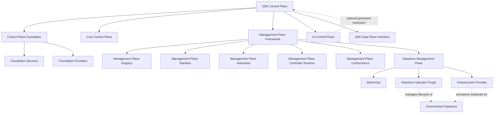

# SDE Control Plane Map

Document:
  ID: control-plane-map
  Title: SDE Control Plane Map
  Parent: architecture
  Owner: SDE Control Plane
  Layer: SDE Control Plane
  Type: Map
  Version: 1.1
  Status: Stable

Purpose:
  - Define the control-plane document graph
  - Define parent-child relationships
  - Define ownership boundaries
  - Define navigation for AI retrieval
  - Show Management Plane Framework and DMP pluggability explicitly
  - Prevent relationship inference from folder paths alone

Relationship Diagram:

Hierarchy:
  SDE Control Plane:
    Document: control-plane.md
    Children:
      - Control Plane Foundation
      - Core Control Plane
      - Management Plane Framework
      - Datastore Management Plane
      - Optional AI Control Plane
      - SDE Data Plane Interface

  Control Plane Foundation:
    Document: control-plane-foundation.md
    Children:
      - Foundation Services
      - Foundation Providers

  Foundation Services:
    Document: foundation-services/foundation-services.md
    Children:
      - Identity Service
      - Authorization Service
      - Tenant Management Service
      - Configuration Service
      - Policy Service
      - Secrets Service
      - Audit Service
      - Workflow Service
      - Eventing Service
      - Observability Service
      - Registry Framework
      - Plugin Framework

  Foundation Providers:
    Document: foundation-providers/foundation-providers.md
    Children:
      - Identity Provider
      - Authorization Provider
      - Tenant Management Provider
      - Configuration Provider
      - Policy Provider
      - Secrets Provider
      - Audit Provider
      - Workflow Provider
      - Eventing Provider
      - Observability Provider
      - Registry Provider
      - Plugin Provider

  Core Control Plane:
    Document: core-control-plane/core-control-plane.md
    Children:
      - Runtime Registry
      - Plugin Registry
      - Engine Registry
      - Capability Governance
      - Deployment Governance

  Management Plane Framework:
    Document: management-plane-framework/management-plane-framework.md
    Children:
      - Management Plane Registry
      - Management Plane Manifest
      - Management Plane Controller Runtime
      - Management Plane Admission
      - Management Plane Conformance

  Management Plane:
    Document: management-plane.md
    Role:
      - Compatibility and conceptual architecture document for pluggable management planes.

  Datastore Management Plane:
    Document: datastore-management-plane/datastore-management-plane.md
    Parent:
      - Management Plane Framework
    Children:
      - dstoreOps
      - Datastore Registry
      - Datastore Operator Registry
      - Infrastructure Provider Registry
      - Datastore Operator Plugin
      - Infrastructure Provider
      - Lifecycle Controllers

  AI Control Plane:
    Document: ai-control-plane.md
    Role:
      - Optional pluggable SDE Control Plane extension.
      - Scope intentionally deferred.

Node Definitions:
  SDE Control Plane:
    Meaning:
      - Management authority and governance plane for SDE.

  Management Plane Framework:
    Meaning:
      - Host framework that allows management domains to be added as governed, pluggable planes.

  Datastore Management Plane:
    Meaning:
      - First pluggable management plane, responsible for tenant-scoped Downstream Datastore lifecycle and operations.

  DMP Controller Runtime:
    Meaning:
      - Executable runtime that hosts and reconciles DMP resources and workflows.
      - Not the whole DMP.

  AI Control Plane:
    Meaning:
      - Optional pluggable extension for future AI-assisted control capabilities.

Reading Order:
  1. control-plane.md
  2. control-plane-foundation.md
  3. management-plane.md
  4. management-plane-framework/management-plane-framework.md
  5. core-control-plane/core-control-plane.md
  6. datastore-management-plane/datastore-management-plane.md
  7. ai-control-plane.md

Boundary Rules:
  - Folder hierarchy does not imply runtime dependency.
  - DMP is hosted through Management Plane Framework.
  - DMP is not the same as DMP Controller Runtime.
  - Core Control Plane governs platform metadata.
  - DMP governs datastore lifecycle.
  - SDE Data Plane governs request execution.
  - AI Control Plane must not bypass Control Plane governance.

Invariants:
  - SDE Control Plane owns authoritative state.
  - Management Plane Framework owns pluggable management plane hosting semantics.
  - DMP is the first pluggable management plane.
  - DMP powers dstoreOps.
  - Datastore Operator Plugins are invoked through DMP.
  - Infrastructure Providers are invoked through DMP.
  - SDE Data Plane must not invoke DMP lifecycle controllers.
  - SDE Runtime must not depend on DMP controllers.
