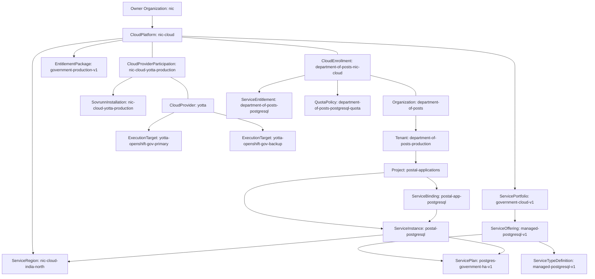
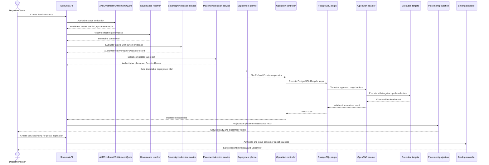

# Sovrunn PostgreSQL End-to-End Reference and Conformance Flow

**Scenario:** NIC CloudPlatform → Yotta CloudProvider participation → Department of Posts → Managed PostgreSQL 17 HA
**Status:** Normative target-architecture reference; production schemas and provider facts pending
**Version:** 1.2
**Date:** 4 August 2026

> The Yotta names, facilities, targets, controls and commercial relationships in this document are illustrative fixtures. They do not assert actual Yotta infrastructure, certifications, contracts or Department of Posts adoption. Production data must be provider-declared, independently qualified where required and legally/commercially authorized.

## 1. Purpose

This reference proves that the final canonical model can trace one customer request through governance, sovereignty, placement, planning, execution and customer-safe visibility without leaking backend complexity or creating a parallel decision model.

It is the architecture anchor for feature requirements and conformance tests. The scenario must remain executable as schemas and controllers are implemented.

## 2. Outcome under test

An authorized Department of Posts user requests:

- NIC Cloud Managed PostgreSQL, realized through an eligible provider;
- Government PostgreSQL HA plan;
- PostgreSQL major version 17;
- 1 TiB persistent encrypted storage;
- India North service region;
- single-region HA across at least two failure domains;
- independent approved backup site;
- India Government Data sovereignty outcome;
- provider-managed minor/security updates;
- customer-selected maintenance window.

Sovrunn must either produce a ready ServiceInstance with current evidence-backed placement visibility or fail closed with a stable, explainable reason and no unauthorized side effects.

## 3. Actors and authority

| Actor | Authority in this scenario |
|---|---|
| NIC CloudPlatform administrator | Publishes portfolio, offering, plan, region, entitlement package and profiles; manages customer enrollment |
| NIC contracting/governance authority | Governs Yotta participation and platform-wide constraints without impersonating provider operations |
| Yotta topology/integration administrator | Registers topology, stack, targets, adapter and credential references |
| Department of Posts organization administrator | Owns customer hierarchy and assignments permitted by enrollment |
| Postal Applications project user | Creates the ServiceInstance within role, entitlement and quota |
| Entitlement/quota service | Produces effective allow/limit results; does not place or execute |
| Policy resolver | Produces EffectiveGovernanceContext |
| Evidence collectors | Produce SovereigntyFactSet observations and EvidenceRecords |
| Sovereignty decision service | Produces authoritative DecisionRecord under `sovereignty-assessment-v1` |
| Placement decision service | Produces authoritative DecisionRecord under `placement-decision-v1` |
| Deployment planner | Produces immutable ServiceDeploymentPlan |
| Operation controller | Owns operation progress and orchestration |
| PostgreSQL plugin | Owns PostgreSQL lifecycle semantics |
| OpenShift adapter | Translates approved steps for the selected targets |
| Native execution platform | Performs detailed infrastructure scheduling |
| Placement projection controller | Produces customer-safe ServicePlacement |
| Binding controller | Issues, rotates and revokes per-consumer access; publishes only safe metadata and SecretRefs |
| Relationship controller | Resolves and reconciles implementation-neutral relationships between independently managed ServiceInstances |

No actor may write another actor’s authoritative fields or bypass an earlier gate.

## 4. Fixture graph



## 5. Required fixture inventory

| Fixture | Scope | Required state |
|---|---|---|
| `Organization/nic` | Platform | Active; CloudPlatform owner |
| `CloudPlatform/nic-cloud` | Organization/nic | Active |
| `CloudProvider/yotta` | Platform or approved owner Organization | Active |
| `CloudProviderParticipation/nic-cloud-yotta-production` | CloudPlatform/nic-cloud | Active and eligible |
| `SovrunnInstallation/nic-cloud-yotta-production` | Platform | Healthy; bound only to the Yotta participation |
| `PlatformDependencySnapshot/nic-cloud-yotta-platform-dependencies-001` | Platform | Current and complete |
| Platform sovereignty `DecisionRecord/nic-cloud-yotta-platform-sovereignty-001` | Platform | Satisfied and unexpired |
| `ServiceRegion/nic-cloud-india-north` | CloudPlatform/nic-cloud | Available |
| `ServicePortfolio/government-cloud-v1` | CloudPlatform/nic-cloud | Published |
| `ServiceTypeDefinition/managed-postgresql-v1` | Platform/approved publisher | Published; defines parameter, action, safe-status, binding, meter and upgrade schemas |
| `ServiceOffering/managed-postgresql-v1` | CloudPlatform/nic-cloud | Published |
| `ServicePlan/postgres-government-ha-v1` | CloudPlatform/nic-cloud | Published; supports PostgreSQL 16/17 |
| `EntitlementPackage/government-production-v1` | CloudPlatform/nic-cloud | Published |
| `Organization/department-of-posts` | Platform | Active/verified |
| `Tenant/department-of-posts-production` | Organization/department-of-posts | Active |
| `Project/postal-applications` | Tenant/department-of-posts-production | Active |
| `CloudEnrollment/department-of-posts-nic-cloud` | CloudPlatform/nic-cloud | Active |
| `ServiceEntitlement/department-of-posts-postgresql` | CloudPlatform/nic-cloud | Effective for plan and region |
| `QuotaPolicy/department-of-posts-postgresql-quota` | CloudPlatform/nic-cloud | At least one instance and 1 TiB available |
| `GovernanceProfile/government-production-v1` | CloudPlatform/nic-cloud | Published and assigned |
| `SovereigntyProfile/india-government-data-v1` | Approved publisher scope | Published |
| `RegulatoryPolicyBundle/india-government-cloud-baseline-2026-08` | Platform/CloudPlatform/qualified authority | Published, effective and legally validated |
| `ServicePlacementProfile/single-region-ha-v1` | CloudPlatform/nic-cloud | Published |
| `ServiceRuntimeProfile/postgres-ha-runtime-v1` | CloudPlatform/nic-cloud | Published |
| `ExecutionTarget/yotta-openshift-gov-primary` | CloudProvider/yotta | Qualified/Available |
| `ExecutionTarget/yotta-openshift-gov-backup` | CloudProvider/yotta | Qualified/Available |
| Target facts and evidence | Respective target scope | Fresh and integrity-valid |
| Validated connectivity assertion | Explicit later connectivity contract | Satisfies primary-to-backup data path; never inferred from topology |
| `ServiceBinding/postal-app-postgresql` | Project/postal-applications | Absent before readiness; created for an authorized workload after the ServiceInstance is Ready |

## 6. Customer request

```yaml
apiVersion: services.sovrunn.io/v1alpha1
kind: ServiceInstance
metadata:
  name: postal-postgresql
  scopeRef:
    apiVersion: core.sovrunn.io/v1alpha1
    kind: Project
    name: postal-applications
spec:
  servicePlanRef: postgres-government-ha-v1
  parameters:
    engineVersion: "17"
    storageGiB: 1024
    minorVersionPolicy: ProviderManaged
    maintenanceWindow:
      day: Sunday
      startTime: "02:00"
      timezone: Asia/Kolkata
  placementIntent:
    requiredServiceRegionRefs: [nic-cloud-india-north]
    preferredCloudProviderRefs: [yotta]
    preferredDatacenterRefs: [yotta-qualified-dc-a]
    placementProfileRef: single-region-ha-v1
    sovereigntyProfileRef: india-government-data-v1
```

Scalar `Ref`/`Refs` values abbreviate constrained typed references in this skeletal fixture.

## 7. Normative processing sequence



### Gate PG-01 — Decode and structural validation

Validate size, schema, duplicate/unknown fields and deterministic defaults. Unsupported or ambiguous input fails before references are resolved.

Expected outputs:

- accepted normalized request; or
- RFC 9457 problem with stable code and JSON Pointer path.

### Gate PG-02 — Identity and authorization

Authenticate the principal; resolve Project by UID; authorize `ServiceInstance.Create`; enforce no-existence disclosure.

Expected immutable accountability:

- request/correlation identity;
- allowed or denied authorization DecisionRecord/AuditEvent according to FEATURE-0013 recording policy.

### Gate PG-03 — Enrollment

Resolve the Project → Tenant → Organization chain and verify one active `department-of-posts-yotta` enrollment matching the selected plan’s CloudProvider.

Failure code: `ENROLLMENT_NOT_ACTIVE`.

### Gate PG-04 — Entitlement

Verify the effective grant includes portfolio, offering, exact plan version, ServiceRegion and required profiles.

Failure code: `NOT_ENTITLED`.

### Gate PG-05 — Quota reservation

Atomically reserve one PostgreSQL instance and required governed quota units. Reservation is idempotent and released if planning cannot proceed.

Failure code: `QUOTA_EXCEEDED`.

### Gate PG-06 — Plan and parameter validation

Validate PostgreSQL major version 17, storage size, maintenance window and all typed inputs against the pinned ServicePlan and referenced ServiceTypeDefinition versions. Verify that the runtime profile and PostgreSQL plugin declare compatibility with that exact service-type contract. Minor/security patch selection remains provider-managed.

Failure codes: `UNSUPPORTED_ENGINE_VERSION`, `PLAN_PARAMETER_INVALID`.

No PostgreSQL-specific field is added to the universal ServiceInstance, DecisionRecord or Operation schemas; all PostgreSQL semantics originate in the versioned service-type contract.

### Gate PG-07 — Effective governance

Resolve provider, portfolio, Organization, Tenant, Project and ServiceInstance assignments. Persist one immutable `EffectiveGovernanceContext` containing exact profile versions, restrictions and approved exceptions.

Resolution rules:

- allowed sets intersect;
- prohibitions accumulate;
- strongest minimum wins;
- shortest evidence age wins;
- unresolved conflict denies.

Failure code: `GOVERNANCE_CONTEXT_UNRESOLVED`.

### Gate PG-08 — Requirements resolution

Create immutable `ServiceRequirementSet/postal-postgresql-requirements-001` from the exact request, plan, runtime profile and governance context.

Minimum typed requirements:

```yaml
record:
  engineMajorVersion: "17"
  storageGiB: 1024
  encryptedPersistentStorage: Required
  publicNetworkAccess: Prohibited
  minimumFaultDomains: 2
  primaryBackupRelationship: IndependentApprovedSite
  maximumRuntimeDataLatencyMs: 5
  backupRetentionDays: 35
  pointInTimeRecovery: Required
```

### Gate PG-09 — Candidate discovery and fact freshness

Find targets approved for the pinned portfolio/plan and region. Load normalized target facts, adapter qualification, health, evidence and the explicit connectivity assertion required by cross-target backup.

Rules:

- topology ancestry never implies connectivity;
- health does not imply capacity guarantee;
- missing/stale mandatory facts remain Unknown and cannot be treated as satisfied.

Failure codes: `NO_CANDIDATE_TARGET`, `TARGET_FACTS_STALE`, `CONNECTIVITY_UNKNOWN`.

### Gate PG-09A — Platform-sovereignty prerequisite

For every candidate participation, resolve the exact `SovrunnInstallation`, its current `PlatformDependencySnapshot`, applicable platform sovereignty profile/policy and evidence-backed `DecisionRecord`. Because the government plan requires sovereign platform operation, an expired, incomplete, `Indeterminate` or unsatisfied result removes that participation from eligibility before service sovereignty and placement are evaluated.

Failure code: `PLATFORM_SOVEREIGNTY_NOT_SATISFIED`.

### Gate PG-10 — Sovereignty decision

The registered sovereignty evaluator produces bounded findings. The authorized decision service persists:

```yaml
apiVersion: decisions.sovrunn.io/v1alpha1
kind: DecisionRecord
metadata:
  name: postal-postgresql-sovereignty-001
  scopeRef: {apiVersion: core.sovrunn.io/v1alpha1, kind: Project, name: postal-applications}
record:
  profileRef: sovereignty-assessment-v1
  subjectRef: {apiVersion: services.sovrunn.io/v1alpha1, kind: ServiceInstance, name: postal-postgresql}
  effectiveContextRef: postal-postgresql-context-001
  evidenceSnapshotRef: postal-postgresql-evidence-001
  authority: Authoritative
  typedResult:
    outcome: Satisfied
    eligibleExecutionTargetRefs:
      - yotta-openshift-gov-primary
      - yotta-openshift-gov-backup
    validUntil: 2026-08-03T08:00:00Z
```

Failure code: `SOVEREIGNTY_NOT_SATISFIED` or `SOVEREIGNTY_INDETERMINATE`.

### Gate PG-11 — Placement decision

Evaluate individual targets and the selected set. Persist an authoritative DecisionRecord:

```yaml
apiVersion: decisions.sovrunn.io/v1alpha1
kind: DecisionRecord
metadata:
  name: postal-postgresql-placement-decision-001
  scopeRef: {apiVersion: core.sovrunn.io/v1alpha1, kind: Project, name: postal-applications}
record:
  profileRef: placement-decision-v1
  subjectRef: {apiVersion: services.sovrunn.io/v1alpha1, kind: ServiceInstance, name: postal-postgresql}
  requirementsRef: postal-postgresql-requirements-001
  sovereigntyDecisionRef: postal-postgresql-sovereignty-001
  authority: Authoritative
  typedResult:
    outcome: Selected
    assignments:
      - componentRoles: [PrimaryDatabase, StandbyDatabase, ConnectionPooler]
        executionTargetRef: yotta-openshift-gov-primary
        faultDomainRefs: [yotta-dc-a-zone-a, yotta-dc-a-zone-b]
      - componentRoles: [Backup]
        executionTargetRef: yotta-openshift-gov-backup
    reasons:
      - REQUIRED_REGION_SATISFIED
      - PREFERRED_DATACENTER_SATISFIED
      - FAULT_DOMAIN_SEPARATION_SATISFIED
      - INDEPENDENT_BACKUP_SITE_SATISFIED
```

Failure code: `NO_VALID_PLACEMENT_SET`.

### Gate PG-12 — Deployment planning

Generate an immutable plan only from final decisions:

```yaml
apiVersion: orchestration.sovrunn.io/v1alpha1
kind: ServiceDeploymentPlan
metadata:
  name: postal-postgresql-deployment-001
  scopeRef: {apiVersion: core.sovrunn.io/v1alpha1, kind: Project, name: postal-applications}
record:
  serviceInstanceRef: postal-postgresql
  requirementsRef: postal-postgresql-requirements-001
  placementDecisionRef: postal-postgresql-placement-decision-001
  pluginRef: postgresql-management-plugin-v1
  adapterRefs: [openshift-adapter-v1]
  steps:
    - {id: provision-secrets, action: SecretsProvision}
    - {id: provision-storage, action: StorageProvision, dependsOn: [provision-secrets]}
    - {id: deploy-primary, action: PostgreSQLDeployPrimary, dependsOn: [provision-storage]}
    - {id: deploy-standbys, action: PostgreSQLDeployStandbys, dependsOn: [deploy-primary]}
    - {id: configure-replication, action: PostgreSQLConfigureReplication, dependsOn: [deploy-standbys]}
    - {id: configure-backup, action: PostgreSQLConfigureBackup, dependsOn: [deploy-primary]}
    - {id: configure-observability, action: ObservabilityConfigure, dependsOn: [deploy-primary]}
    - {id: verify-service, action: PostgreSQLVerify, dependsOn: [configure-replication, configure-backup, configure-observability]}
```

Failure code: `DEPLOYMENT_PLAN_INVALID`.

### Gate PG-13 — Operation acceptance and execution

Create a Project-scoped Operation whose scope equals the ServiceInstance scope. The request is immutable after acceptance and uses a caller-supplied idempotency key.

Each plan step creates or links a `PluginExecution`. The PostgreSQL plugin owns database lifecycle semantics; the OpenShift adapter owns translation and protected backend handles. Target credentials are secret references and least-privileged.

Terminal outcomes:

```text
Succeeded
Failed retryable
Failed non-retryable
Cancelled if the action and current step safely support cancellation
```

### Gate PG-14 — Verification and reconciliation

The plugin verifies database readiness, PostgreSQL running version, replication, backup, point-in-time recovery configuration, monitoring and safe credential delivery. A successful API create without verified service readiness is not completion.

Failure code: `SERVICE_VERIFICATION_FAILED`.

### Gate PG-15 — Customer-safe projection

Create immutable `ServicePlacement`:

```yaml
apiVersion: placement.sovrunn.io/v1alpha1
kind: ServicePlacement
metadata:
  name: postal-postgresql-placement-001
  scopeRef: {apiVersion: core.sovrunn.io/v1alpha1, kind: Project, name: postal-applications}
record:
  serviceInstanceRef: postal-postgresql
  serviceRegionRef: nic-cloud-india-north
  selectedCloudProviderRef: yotta
  displayedDatacenters:
    - {displayName: Yotta-qualified DC-A, roles: [PrimaryDatabase, StandbyDatabase]}
    - {displayName: Yotta-qualified DC-B, roles: [Backup]}
  resilience:
    placementProfileRef: single-region-ha-v1
    faultDomainSeparation: Satisfied
    independentBackupSite: Satisfied
  sovereignty:
    sovereigntyProfileRef: india-government-data-v1
    outcome: Satisfied
    assessedAt: 2026-08-02T08:00:00Z
    validUntil: 2026-08-03T08:00:00Z
  database:
    requestedMajorVersion: "17"
    runningVersion: "17.x-provider-approved"
    minorVersionPolicy: ProviderManaged
  placementDecisionRef: postal-postgresql-placement-decision-001
```

The projection excludes credentials, namespaces, native object names, host identities, protected topology and rejected confidential candidates.

### Gate PG-16 — Managed-service access binding

After the ServiceInstance is Ready, an authorized project user or workload requests a `ServiceBinding` for one explicit consumer. The binding controller verifies Project authorization, ServiceInstance readiness and consumer identity, then invokes a credential-issuance/rotation Operation as required.

```yaml
apiVersion: services.sovrunn.io/v1alpha1
kind: ServiceBinding
metadata:
  name: postal-app-postgresql
  scopeRef: {apiVersion: core.sovrunn.io/v1alpha1, kind: Project, name: postal-applications}
spec:
  serviceInstanceRef: postal-postgresql
  consumerRef:
    kind: WorkloadIdentity
    name: postal-application
  accessMode: ReadWrite
status:
  phase: Ready
  endpoint: postal-postgresql.services.sovrunn.example
  secretRef:
    kind: Secret
    name: postal-app-postgresql-credentials
```

The binding never contains credential values. Each consumer receives a separately revocable identity/credential relationship; sharing one service-wide credential is non-conformant.

## 8. Positive conformance scenario

### PG-POS-001 — Provision PostgreSQL successfully

**Given** all fixtures are active/published, the caller is authorized, entitlement and quota allow the request, evidence is fresh, both targets are qualified and explicit connectivity is valid.
**When** the user creates the ServiceInstance with idempotency key `request-7f42`.
**Then:**

1. exactly one ServiceInstance is accepted;
2. one quota reservation is held and later committed;
3. one EffectiveGovernanceContext is persisted;
4. one ServiceRequirementSet is persisted;
5. final sovereignty and placement DecisionRecords are persisted with required audit obligations;
6. one immutable ServiceDeploymentPlan is created;
7. one Provision Operation reaches Succeeded;
8. all required PluginExecutions reach Succeeded;
9. ServiceInstance reaches Ready with running PostgreSQL major version 17;
10. one customer-safe ServicePlacement is visible;
11. no raw secret or protected backend handle crosses the customer boundary;
12. every object is correlated by request, operation, subject and exact contract versions.
13. an authorized binding request produces exactly one consumer-specific ServiceBinding;
14. the binding exposes only safe connection metadata and a typed SecretRef;
15. revoking that binding invalidates only that consumer's access without deleting the ServiceInstance.

## 9. Negative and degradation conformance matrix

| Test ID | Condition | Expected result | Required stable code | Side-effect rule |
|---|---|---|---|---|
| PG-NEG-001 | Caller lacks Project create authority | Deny safely | `AUTHORIZATION_DENIED` | No existence disclosure; no reservation |
| PG-NEG-002 | Enrollment Pending/Suspended | Deny | `ENROLLMENT_NOT_ACTIVE` | No ServiceInstance accepted |
| PG-NEG-003 | Plan or region not granted | Deny | `NOT_ENTITLED` | No quota consumed |
| PG-NEG-004 | Quota insufficient | Deny | `QUOTA_EXCEEDED` | Atomic reservation prevents oversubscription |
| PG-NEG-005 | PostgreSQL version 18 requested | Reject field | `UNSUPPORTED_ENGINE_VERSION` | No placement/evidence access |
| PG-NEG-006 | Required profile reference inaccessible | Deny safely | `REFERENCE_NOT_AUTHORIZED` | Target existence not disclosed |
| PG-NEG-007 | Governance profiles conflict | Deny | `GOVERNANCE_CONTEXT_UNRESOLVED` | Reservation released |
| PG-NEG-008 | Key-custody evidence stale | No authoritative allow | `SOVEREIGNTY_INDETERMINATE` | No deployment plan |
| PG-NEG-009 | Country matches but admin-control fact fails | Deny | `SOVEREIGNTY_NOT_SATISFIED` | Rejected rationale projected safely |
| PG-NEG-010 | Targets individually qualify but connectivity is Unknown | Deny set | `CONNECTIVITY_UNKNOWN` | No topology inference |
| PG-NEG-011 | Required two fault domains unavailable | Deny | `NO_VALID_PLACEMENT_SET` | No partial deployment |
| PG-NEG-012 | Preferred datacenter unavailable, alternative permitted | Continue with explained alternative | `PREFERENCE_NOT_SATISFIED` advisory | Customer projection states preference outcome |
| PG-NEG-013 | Required datacenter unavailable | Deny | `NO_VALID_PLACEMENT_SET` | Preference must not be silently treated as required or vice versa |
| PG-NEG-014 | Deployment-plan graph invalid/cyclic | Deny plan | `DEPLOYMENT_PLAN_INVALID` | No plugin execution |
| PG-NEG-015 | Adapter credential reference unavailable | Fail closed | `EXECUTION_CREDENTIAL_UNAVAILABLE` | Secret value never logged |
| PG-NEG-016 | Retryable plugin timeout | Retry idempotently | `EXECUTION_RETRYABLE` | No duplicate database/volume |
| PG-NEG-017 | Non-retryable PostgreSQL initialization failure | Compensate/stop | `SERVICE_PROVISION_FAILED` | Preserve evidence and operation history |
| PG-NEG-018 | Verification detects replication unhealthy | Operation fails/degrades | `SERVICE_VERIFICATION_FAILED` | Service must not be marked Ready |
| PG-NEG-019 | Same idempotency key and identical request replayed | Return same accepted result | `IDEMPOTENT_REPLAY` | Exactly one ServiceInstance/Operation |
| PG-NEG-020 | Same key with different payload | Reject | `IDEMPOTENCY_CONFLICT` | Original request unchanged |
| PG-NEG-021 | Evidence expires after Ready | Reassess | `ASSURANCE_REASSESSMENT_REQUIRED` | New decision/projection; do not rewrite old records |
| PG-NEG-022 | Selected target begins drain | Reassess/migrate per policy | `PLACEMENT_REASSESSMENT_REQUIRED` | No new placement on draining target |
| PG-NEG-023 | Caller cannot bind the ServiceInstance or consumer | Deny safely | `BINDING_AUTHORIZATION_DENIED` | No credential or endpoint disclosure |
| PG-NEG-024 | Binding implementation attempts to persist/return raw credential material | Reject/fail closed | `SECRET_BOUNDARY_VIOLATION` | Secret value never crosses the secret-store boundary |

## 10. Lifecycle extension scenarios

### PG-LIFE-001 — Minor/security update

Yotta selects an approved PostgreSQL 17 patch under ProviderManaged policy. Sovrunn creates an Update Operation and new deployment-plan revision if needed. Requested major version remains 17; actual running version changes in status/projection. Backup and health gates run before completion.

### PG-LIFE-002 — Major upgrade 17 → later supported version

Customer submits an explicit Upgrade Operation. Plan validation, extension compatibility, backup freshness, maintenance window, target compatibility, governance and sovereignty are reevaluated. A new ServiceRequirementSet, decisions and plan are created when affected. The old records remain immutable.

### PG-LIFE-003 — Backup and restore

Backup Operation verifies approved location, evidence and retention. Restore creates a distinct Operation and may require approval. A restore to a different target requires new sovereignty and placement decisions before execution.

### PG-LIFE-004 — Evidence/policy change

Changed policy or stale evidence produces a new sovereignty DecisionRecord and ServicePlacement projection. The governed response may be monitor, restrict operation, remediate, migrate or suspend according to policy. Prior success is never treated as permanent certification.

### PG-LIFE-005 — Delete

Delete Operation checks retention/legal hold, captures final backup if policy requires, removes managed runtime resources idempotently, revokes credentials and releases quota. Immutable decisions, evidence, plans, operations, audit and placement records follow retention policy rather than cascading with the ServiceInstance.

### PG-LIFE-006 — Bind, rotate and revoke access

Creating a binding issues consumer-specific access only after readiness and authorization. Rotation creates a governed Operation and changes the referenced secret version without placing secret values in Sovrunn resources. Revocation invalidates the consumer credential and finalizes the binding without affecting other bindings or the running PostgreSQL service.

## 11. Cross-service relationship extension scenario

### PG-REL-001 — Virtual-machine service privately consumes PostgreSQL

This scenario validates the relationship model without making infrastructure-native networking part of Sovrunn core.

**Given:**

- `ServiceInstance/application-vm` uses `ServiceTypeDefinition/compute-virtual-machine-v1`;
- `ServiceInstance/postal-postgresql` is Ready;
- provider-packaged logical profiles `application-zone`, `data-zone` and `private-low-latency` are authorized;
- `ServiceRelationshipDefinition/private-service-consumption-v1` permits the exact source/target service types and references `relationship-eligibility-v1`;
- the selected execution implementation has current normalized facts and an adapter capable of realizing the approved relationship obligations.

**When** the authorized user creates `ServiceRelationship/application-consumes-postgresql` with the VM as source, PostgreSQL as target and the three logical profiles as bounded parameters.

**Then:**

1. core authorizes both service references without disclosing inaccessible resources;
2. the exact relationship-definition version validates the parameters and contributes requirements to a new ServiceRequirementSet;
3. the relationship-eligibility DecisionRecord and any affected sovereignty/placement decisions complete before a relationship deployment plan is generated;
4. the plan contains implementation-neutral actions and obligations only;
5. the selected plugin and ExecutionTarget adapter translate those actions into protected native operations;
6. relationship status becomes Ready only after verified realization, not merely because both services share logical ancestry;
7. a separately authorized ServiceBinding supplies the VM workload identity with endpoint and SecretRef access;
8. the same ServiceRelationship payload succeeds through a second implementation adapter without changing customer or core fields;
9. no VPC, VCN, subnet, route, security-group, NetworkPolicy or native identifier appears in customer/core payloads, decisions, errors or audit summaries.

| Test ID | Condition | Expected result |
|---|---|---|
| `PG-REL-NEG-001` | Source or target reference unauthorized | Deny with no existence disclosure |
| `PG-REL-NEG-002` | Source/target type pair not allowed by definition | Reject `RELATIONSHIP_TYPE_INCOMPATIBLE` |
| `PG-REL-NEG-003` | Relationship parameters fail the pinned schema | Reject `RELATIONSHIP_PARAMETER_INVALID` |
| `PG-REL-NEG-004` | Logical zones share ancestry but eligibility evidence is absent | Remain Unknown/deny; never infer connectivity |
| `PG-REL-NEG-005` | Binding succeeds but relationship realization is unverified | Relationship must not become Ready |
| `PG-REL-NEG-006` | Adapter returns a native object identifier in a core/customer projection | Reject/redact and record `IMPLEMENTATION_BOUNDARY_VIOLATION` |
| `PG-REL-NEG-007` | Required relationship target deletion requested | Restrict deletion until the declared relationship lifecycle is resolved |

## 12. Decision, audit and operation linkage

Every successful authoritative decision accepts its required audit obligation atomically. The trace must support:

```text
requestId
  → ServiceInstance UID/generation
  → ServiceRelationship UID/generation and definition version (when applicable)
  → EffectiveGovernanceContext UID
  → ServiceRequirementSet UID
  → relationship-eligibility DecisionRecord UID (when applicable)
  → sovereignty DecisionRecord UID
  → placement DecisionRecord UID
  → ServiceDeploymentPlan UID
  → Operation UID
  → PluginExecution UIDs
  → AuditEvent UIDs
  → ServicePlacement UID
  → ServiceBinding UID
  → SecretRef identifier (never secret value)
```

Decision, audit and operation remain distinct. Telemetry is not audit, operation success is not policy authority, and projection is not the canonical decision.

## 13. Security and boundary acceptance

- Project authorization and scope are checked before provider/customer references are disclosed.
- Enrollment is CloudPlatform-scoped, provider participation is independently governed, and ServiceInstance is Project-scoped; cross-scope references require explicit domain authorization.
- Customer payloads contain no ExecutionTarget, credential or protected backend identifier.
- ServiceRelationship payloads contain implementation-neutral profile/parameter references only; native network objects and identifiers remain adapter-protected.
- Canonical evidence and DecisionRecords use purpose-specific projections.
- Plugin and adapter authority is target-, action- and operation-scoped.
- Secret values never appear in metadata, status, errors, decisions, plans, audit messages or logs.
- AI may explain an authorized projection but cannot approve, place, modify a plan or execute.
- Every external input is bounded, strictly decoded and validated before use.

## 14. Traceability to architecture decisions

| Reference-flow area | Governing ADRs |
|---|---|
| NIC Cloud ownership, Yotta participation and installation isolation | `ADH-2026-020`, `ADH-2026-037` |
| Department of Posts enrollment with NIC Cloud | `ADH-2026-021`, `ADH-2026-037` |
| Grants and limits | `ADH-2026-022` |
| Government Cloud catalog | `ADH-2026-023`, `ADH-2026-027`, `ADH-2026-032` |
| Future-service extension contract | `ADH-2026-031`, `ADH-2026-032` |
| Governance resolution | `ADH-2026-033` |
| Location and sovereignty | `ADH-2026-024`, `ADH-2026-026`, `ADH-2026-031` |
| Existing infrastructure and target execution | `ADH-2026-025` |
| Sovereignty and placement decisions | `ADH-2026-026` |
| Platform sovereignty and dependency closure | `ADH-2026-038` |
| Multi-target HA/backup | `ADH-2026-028` |
| Customer placement view | `ADH-2026-029` |
| Definition versions and upgrades | `ADH-2026-027` |
| Managed-service access | `ADH-2026-034` |
| Implementation-neutral service relationships | `ADH-2026-035` |

## 15. Feature-level details intentionally deferred

The reference fixes semantics but leaves these to approved feature design:

- exact API groups, collection routes and storage representation;
- complete typed-reference expansion in every fixture;
- exact status phases/condition types and reason-code registry allocation;
- parameter-schema representation;
- quota metric/reservation transaction implementation;
- policy language or engine adapter;
- evidence payload storage and cryptographic format;
- connectivity contract owned by the appropriate later feature;
- ServiceRelationshipDefinition schema registry, resolver packaging and supported relationship-type publication workflow;
- placement solver algorithm and scoring;
- deployment-plan DAG serialization details;
- PostgreSQL operator/distribution selection;
- OpenShift object templates and protected backend handles;
- persistence, queues and controller technology.

No deferred item may change ownership, ordering, authority, scope, mutability or customer/provider boundaries fixed by the canonical model.

## 16. Architecture completion criteria

The PostgreSQL reference flow is complete when:

- all fixture schemas validate through the canonical API grammar;
- PG-POS-001 passes end to end;
- PG-NEG-001 through PG-NEG-024 pass with stable codes and side-effect rules;
- PG-LIFE-001 through PG-LIFE-006 have approved operation/state designs;
- sovereignty and placement register FEATURE-0013 profiles and pass adoption gates;
- no ResourcePool/provider-wide capability or topology-derived connectivity is introduced;
- exact input versions and immutable trace linkage are queryable;
- provider, customer, internal, plugin and adapter projections pass leakage tests;
- ServiceBinding issuance, rotation and revocation pass SecretRef-only and per-consumer isolation tests;
- PG-REL-001 and PG-REL-NEG-001 through `007` pass on two implementations without implementation-native core fields;
- the same customer ServiceInstance contract succeeds on a second qualified ExecutionTarget implementation without changing customer fields.
- a materially different service family can be added through its own ServiceTypeDefinition without changing the universal ServiceInstance, decision or operation schemas.

---

**Legal and factual boundary:** RegulatoryPolicyBundle content, government eligibility, service assurances and Yotta topology/evidence require qualified legal, security, compliance, commercial and provider validation before any production or external claim.
